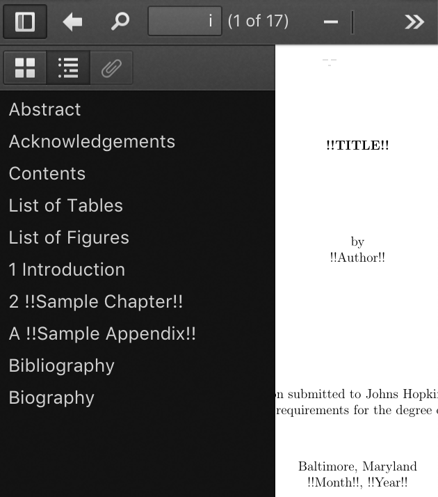
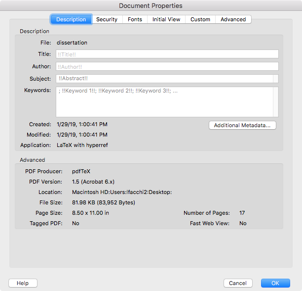

<aside markdown="1">
**Pre-requisites:** [LaTeX](https://www.latex-project.org).  
[Download the LaTeX source](dissertation.tex). [See the generated PDF](dissertation.pdf).
</aside>

You want to start writing your dissertation in [LaTeX](https://www.latex-project.org)<label class="margin-note"><input type="checkbox"><span markdown="1">Think again! See [§ Appendix: My Approach to LaTeX](#appendix-my-approach-to-latex).</span></label> following the [Johns Hopkins University Library Formatting Guidelines for Electronic Theses & Dissertations (ETD)](https://www.library.jhu.edu/library-services/electronic-theses-dissertations/formatting-guidelines-checklist/)<label class="margin-note"><input type="checkbox"><span markdown="1">You may use parts of the template in this article even if you are writing a dissertation for another university, because the guidelines tend to be similar. Or you may read the article just for the underlying philosophy on how to approach LaTeX—in particular, see [§ Appendix: My Approach to LaTeX](#appendix-my-approach-to-latex).</span></label> but the library does not support LaTeX officially, and they do not provide a template.<label class="margin-note"><input type="checkbox"><span markdown="1">Extra-officially, they approved the PDF generated by the template in this article.</span></label> All they do is refer to this [unofficial template by Brian Weitzner](https://github.com/weitzner/jhu-thesis-template), of which there are some variants, for example, [Keisuke Sakaguchi’s version](https://github.com/keisks/jhu-thesis-template-nlp) that fixes formatting issues and adds support for citations in the style of the *Association for Computational Linguistics* (ACL).

But you must not just use these templates as black-boxes, because they cannot do everything for you. You are still responsible for reading and following the Formatting Guidelines yourself. First, because the Formatting Guidelines specify what you should write: what sections to include, how long some of these sections should be, and so forth. Second, because you may need something that the templates do not support, for example, citations in the style of a particular research area. Third, because the Formatting Guidelines may change.

Unfortunately, you may run into trouble if you treat these templates as white-boxes and try to understand what they are doing. Like LaTeX itself, they can be obscure and full of historical baggage—their changelogs include patches that are almost ten years old! Any time you spend fiddling with LaTeX would be better spent writing.<label class="margin-note"><input type="checkbox"><span markdown="1">Maybe I should be writing my dissertation instead of this article.</span></label>

To help you, this article provides a minimal LaTeX template that I started from scratch with the following philosophy:

- **Optimize for Writer Happiness**. Keep it simple, use plain LaTeX when possible, and avoid shiny new things that distract from writing. A happy writer is writing, not fiddling with LaTeX.
- **Keep a Single File**. In the spirit of keeping things simple, the whole template is a single file. You will appreciate this if your LaTeX editor does not have a built-in file browser, for example, [TeXShop](https://pages.uoregon.edu/koch/texshop/).<label class="margin-note"><input type="checkbox"><span markdown="1">See [§ Appendix: My Approach to LaTeX](#appendix-my-approach-to-latex) for my recommendation on what I think is a better LaTeX editor that *does* include a file browser.</span></label>
- **Show the Work**. This template is a white-box that you must understand and adapt. Every line in the template is explained in this article.

Compiling
=========

You may follow this article by [downloading the LaTeX source](dissertation.tex) or by copying the snippets below one by one. You may compile the LaTeX source with the help of your LaTeX editor, or on the command-line with the usual LaTeX routine:

```console
$ pdflatex dissertation.tex
$ bibtex dissertation
$ pdflatex dissertation.tex
$ pdflatex dissertation.tex
```

The multiple passes correct the citations and the (forward) cross-references.

Document Class
==============

We use the `book` document class from plain LaTeX:

<div class="code-block" markdown="1">
`dissertation.tex`
```latex
\documentclass[12pt, oneside]{book}
```
</div>

The `book` document class conforms to several Formatting Guidelines:

- Consistent font throughout the dissertation.
- Consistent heading styles.
- Roman numerals<label class="margin-note"><input type="checkbox"><span markdown="1">i, ii, iii, iv, …</span></label> as page numbers on the front matter and Arabic numerals<label class="margin-note"><input type="checkbox"><span markdown="1">1, 2, 3, 4, …</span></label> as page numbers on the rest of the dissertation.
- Font size differing by two points between body and footnotes.

We use the `12pt` option to increase the body font size from the default 10pt to 12pt. This is optional, because the Formatting Guidelines would allow the default 10pt, but a bigger font results in shorter lines, which [are more comfortable to read](https://practicaltypography.com/line-length.html).<label class="margin-note"><input type="checkbox"><span markdown="1">Perhaps a better approach would have been to increase the margins instead of the font size, but the Formatting Guidelines would not allow it, see [§ Margins](#margins).</span></label>

We use the `oneside` option so that left- and right-hand side pages are treated the same. Without this option, facing pages could have different margins to accommodate for binding, and chapters would start only on a right-hand-side page, which could result in undesired blank pages.

External Files
==============

We want to **Keep a Single File**, but there are tools that expect other files to exist. Most notably, [BibTeX](http://www.bibtex.org) (which we use to [manage citations](#bibliography)) expects a `.bib` file, and the [`pdfx` package](https://ctan.org/pkg/pdfx) (which we use to [generate a PDF/A](#pdfa)) expects a `.xmpdata` file.

To work with these tools and still follow our philosophy, we declare external files embedded in the LaTeX source. When LaTeX processes the source, it creates files in the filesystem with the contents we provide. Plain LaTeX is capable of doing this with the `filecontents` and `filecontents*` environments, for example:

<div class="code-block" markdown="1">
An example of the `filecontents*` environment. **Do not include in `dissertation.tex`.**
```latex
\begin{filecontents*}{external-file.txt}
The contents of the external file.
\end{filecontents*}
```
</div>

Upon encountering the snippet above, LaTeX creates a file called `external-file.txt` with the text “`The contents of the external file.`”.

The difference between `filecontents` and `filecontents*` is that a file created with `filecontents` also includes a preamble with an explanation of how it was created, while a file created with `filecontents*` does not, which is what we want in most cases.

But the `filecontents` and `filecontents*` environments provided by plain LaTeX have two issues. First, if a file with the given name already exists, then it is not overwritten. Second, the `filecontents` and `filecontents*` environments can only appear in the preamble.<label class="margin-note"><input type="checkbox"><span markdown="1">The preamble is the part of the LaTeX source before `\begin{document}`.</span></label>

We want the external files to be overwritten when we modify the LaTeX source, and we want to declare external files even after the preamble, so we use the [`filecontents` package](https://ctan.org/pkg/filecontents) to redefine the `filecontents` and `filecontents*` environments and fix these issues:

```latex
\usepackage{filecontents}
```

PDF/A
=====

The Formatting Guidelines specify that you must provide a PDF/A, which is a special kind of PDF meant for archival. A PDF/A is special in two ways: first, it includes metadata useful for indexing and searching, for example, the title and author, a table of contents, a mapping between glyphs in the dissertation and their corresponding Unicode code points, and so forth; and second, a PDF/A is self-contained. This second requirement means we cannot use extended PDF features, for example, compression, and embedded audio, movies and JavaScript; and it also means that we need to embed everything necessary to reproduce the dissertation in the future, for example, the fonts.

We use the `pdfx` package to produce a PDF/A:<label class="margin-note"><input type="checkbox"><span markdown="1">The `!!` delimit placeholders that you must replace.</span></label>

```latex
\begin{filecontents*}{\jobname.xmpdata}
\Title{!!Title!!}
\Author{!!Author!!}
\Language{en-US}
\Keywords{!!Keyword 1!!\sep !!Keyword 2!!\sep !!Keyword 3!!\sep ...}
\Subject{!!Abstract!!}
\end{filecontents*}
\usepackage[a-1b]{pdfx}
\hypersetup{hidelinks, bookmarksnumbered}
\usepackage{tocbibind}
```

First, we must provide the metadata that `pdfx` cannot extract from the dissertation automatically, including title, author, language, keywords, and subject (abstract).<label class="margin-note"><input type="checkbox"><span markdown="1">The `pdfx` package cannot extract these metadata automatically even though they may appear elsewhere in the dissertation, because it cannot predict where they are. But `pdfx` extracts most metadata required by a PDF/A automatically, for example, a table of contents and glyph mappings. You may want to specify other metadata fields (see the [`pdfx` package documentation](http://mirrors.ctan.org/macros/latex/contrib/pdfx/pdfx.pdf)).</span></label> The `pdfx` package expects these metadata to be in an [external file](#external-files), so we use the `filecontents*` environment. The name of the file must be the same as the name of the LaTeX source, and the extension must be `.xmpdata`. We write `\jobname` instead of hard-coding the name `dissertation`<label class="margin-note"><input type="checkbox"><span markdown="1">Our template is called `dissertation.tex`.</span></label> so we do not have to change this line if we rename the LaTeX source.

If a metadata field contains multiple values, for example, keywords and maybe even author, then the multiple values must be separated by `\sep`.

We use the `a-1b` option when requiring the `pdfx` package to indicate which kind of PDF/A we want. There are many variants of PDF/A, and we choose `a-1b` because it is less strict and because it is the one mentioned in the Formatting Guidelines.

* * *

The last two lines in the snippet above are optional, but they are good practices.

<aside markdown="1">
<figure markdown="1">
{:width="315" height="357"}
<figcaption markdown="1">
A PDF viewer showing some results of `hyperref`: the page number shows i instead of 1, and the table of contents appears as bookmarks on the left column.
</figcaption>
</figure>
</aside>

The line starting with `\hypersetup` configures the [`hyperref` package](https://ctan.org/pkg/hyperref) that was included by `pdfx`. The `hyperref` package has several responsibilities. First, it makes some parts of the dissertation clickable, for example, entries in the [table of contents](#table-of-contents), references and [citations](#bibliography). Second, it maps PDF pages to dissertation pages, for example, PDF page 1 maps to dissertation page i. Third, it adds bookmarks corresponding to the table of contents that you can see on the left-column in most PDF viewers.

We use the `hidelinks` option with `\hypersetup` so `hyperref` does not change the appearance of the clickable areas—by default `hyperref` would outline them with colored boxes.

We use the `bookmarksnumbered` option with `\hypersetup` so `hyperref` includes the chapter and section numbers in the bookmarks corresponding to the table of contents.

Finally, we include the [`tocbibind` package](https://ctan.org/pkg/tocbibind) for the bibliography to be listed in the table of contents.

* * *

The `pdfx` package produces a PDF that declares itself as PDF/A but that may still violate some PDF/A rules, for example, it does not check that the images in the dissertation do not include any transparency. So before you submit your dissertation to the library, validate it with the **Preflight** feature in [Adobe Acrobat DC](https://acrobat.adobe.com/)<label class="margin-note"><input type="checkbox"><span markdown="1">You must use the paid version (Adobe Acrobat DC) because the free version ([Adobe Acrobat Reader DC](https://get.adobe.com/reader/)) does not include **Preflight** and cannot validate a PDF/A. There are other tools for PDF/A validation, including some that are free, but you should prefer Adobe Acrobat DC because these other tools may give inconsistent results and Adobe Acrobat DC is the industry standard.</span></label> using the profile called **Convert to PDF/A-1b**. You may also use **Preflight** to fix small issues in the PDF/A.

You could also forego this entire section and use **Preflight** to convert a regular PDF produced by LaTeX into a PDF/A. This would produce a PDF/A that follow the letter of the PDF/A requirements, but not their spirit, because it would [include low-quality metadata](https://www.mathstat.dal.ca/~selinger/pdfa/).

The PDF/A produced by the template is this article passes the **Preflight** validation and includes high-quality metadata:

<figure markdown="1">
{:width="287" height="220"}
<figcaption markdown="1">
The **Preflight** feature in Adobe Acrobat DC validating the PDF/A generated by the template in this article.
</figcaption>
</figure>

<figure markdown="1">
{:width="306" height="294"}
<figcaption markdown="1">
The **Properties** window in Adobe Acrobat DC showing the high-quality metadata.
</figcaption>
</figure>

Margins
=======

We set the margins with the [`geometry` package](https://ctan.org/pkg/geometry):

```latex
\usepackage[top = 1in, right = 1in, bottom = 1in, left = 1.5in]{geometry}
```

According to the Formatting Guidelines, the top, right, and bottom margins must be 1\", but the left margin may be either 1\" or 1.5\". A left margin of 1\" is appropriate if you distribute your dissertation digitally only, while a left margin of 1.5\" is appropriate if you print your dissertation as well as distributing it digitally, because it leaves more space for the binding. I recommend a left margin of 1.5\" even if you do not plan on printing your dissertation because it results in shorter lines that are more comfortable to read, as discussed in [§ Document Class](#document-class).

Line Spacing
============

We use the [`setspace` package](https://ctan.org/pkg/setspace) to set double spacing in the body text, as specified by the Formatting Guidelines to allow for readers to write comments inline:

```latex
\usepackage[doublespacing]{setspace}
```

The `setspace` package follows the Formatting Guidelines and does not set double spacing in some parts of the dissertation that do not need it, for example, the footnotes.

Page Style
==========

We use the `plain` page style, which follows the Formatting Guidelines and includes page numbers centralized in the bottom margin.<label class="margin-note"><input type="checkbox"><span markdown="1">The `plain` page style also removes the headers indicating the current chapter and other information, which would otherwise appear in every page of a dissertation using the [`book` document class](#document-class). If you want these headers, or want more control over headers and footers in general, see the [`fancyhdr` package](https://ctan.org/pkg/fancyhdr).</span></label>

```latex
\pagestyle{plain}
```

Begin Document
==============

We begin the dissertation and declare the start of the front matter, which switches page numbers to Roman numerals and prevents chapters from being numbered:

```latex
\begin{document}

\frontmatter
```

Title Page
==========

The first page in the dissertation is the Title Page:

```latex
\begin{center}
  \begin{singlespace}
    \vspace*{0.5in}

    \textbf{\uppercase{!!Title!!}}

    \vspace*{1in}

    by
    
    !!Author!!

    \vspace*{1.5in}

    A dissertation submitted to Johns Hopkins University\\in conformity with the requirements for the degree of Doctor of Philosophy

    \vspace*{0.5in}

    Baltimore, Maryland
    
    !!Month!!, !!Year!!
  \end{singlespace}
\end{center}

\thispagestyle{empty}
\clearpage
```

We use the `center` environment to centralize the text and the `singlespace` environment to disable the [double spacing](#line-spacing) for the Title Page.<label class="margin-note"><input type="checkbox"><span markdown="1">**Fun fact:** The Formatting Guidelines specify that certain parts of the Title Page should be single spaced but provide an example in which these parts are double spaced!</span></label>

We use `\vspace*`<label class="margin-note"><input type="checkbox"><span markdown="1">Regular `\vspace`s would not work in some places because LaTeX could choose to discard them, for example, at the top of the page.</span></label> to add the vertical spaces specified in the Formatting Guidelines. The first `\vspace*` is special because it combines with the [top margin](#margins): the 0.5\" space plus the 1\" top margin add to a total of 1.5\", as specified in the Formatting Guidelines.

For the title, we combine `\textbf` (bold) and `\uppercase`. The Formatting Guidelines specify that the title must be uppercase, and making it bold is optional, but looks good.

In the statement (“A dissertation submitted […]”), we use `\\` to force a line break before a preposition and prevent an awkward line break elsewhere. Do the same to your dissertation title if necessary.

The date must correspond to when you submit the dissertation to the library.

We use the `empty` page style for the Title Page. The Title Page still counts toward the page count<label class="margin-note"><input type="checkbox"><span markdown="1">The next page is page ii.</span></label> but the page number is not printed at the bottom.

Finally, we insert a page break with `\clearpage`. This is optional, because the [next page](#abstract-and-preface) is the beginning of a chapter, which already inserts a page break in the [`book` document class](#document-class). But it is a good measure that signals to the reader of the LaTeX source that the Title Page is over, and it prevents issues if you change the next page such that it does not insert a page break, for example, to write a dedication.

* * *

We could have included a copyright notice in the Title Page, but we did not because it is optional and copyright holds even without it.

We must not use the default strategy for making title pages in LaTeX with `\title`, `\author`, `\date` and `\maketitle`, because the format would be incorrect and the Title Page would not count toward the page count. This last issue is also the reason why we must not use the `titlepage` environment.

Abstract and Preface
====================

The abstract is a regular chapter, and the preface in this template is just **Acknowledgements**, which is another regular chapter:

```latex
\chapter{Abstract}

\begin{itemize}
  \item A statement of the problem or theory.
  \item Procedure or methods.
  \item Results.
  \item Conclusions.
  \item Not more than 350 words.
\end{itemize}

\paragraph{Readers:} !!Name 1!! (advisor); !!Name 2!!; !!Name 3!!.

\chapter{Acknowledgements}
```

Table of Contents
=================

We use the regular LaTeX Table of Contents, List of Tables and List of Figures:

```latex
\tableofcontents
\listoftables
\listoffigures
```

Main Matter
===========

We declare the beginning of the main matter. This resets the page numbers, which are counted with Arabic numbers for the rest of the dissertation. Also, chapters in the main matter are numbered. The main matter starts with an introduction, continues with regular chapters for the body of the dissertation, and ends on an appendix with more chapters:

```latex
\mainmatter

\chapter{Introduction}

Example of citation: \cite{REMOVE-ME}

\chapter{!!Sample Chapter!!}

\appendix

\chapter{!!Sample Appendix!!}
```

Back Matter
===========

After the [appendices](#main-matter), we declare the beginning of the back matter:

```latex
\backmatter
```

Chapters in the back matter are not numbered.

Bibliography
============

We manage the bibliography with BibTeX. BibTeX expects the bibliography database to be declared in a `.bib` file, but we want to follow the principle of **Keeping a Single File**, so we define the bibliography database as an [external file](#external-files):

```latex
\begin{filecontents*}{\jobname.bib}
@inproceedings{REMOVE-ME,
  title = {!!Sample Citation!!},
} 
\end{filecontents*}
```

We name the file after the current `\jobname` instead of hard-coding the name `dissertation`, as [we did when defining the metadata for PDF/A](#pdfa).

Next, we set the `plain` bibliography style, which uses numbers for citations:

```latex
\bibliographystyle{plain}
```

Finally, we include the bibliography that refers to the file we created above:

```latex
\bibliography{\jobname}
```

Biography
=========

The last item in your dissertation must be a short biographical sketch, which we include as a regular chapter, and then we end the document:

```latex
\chapter{Biography}

\begin{itemize}
  \item Date and location of birth.
  \item Salient facts of academic training and experience in teaching and research.
\end{itemize}

\end{document}
```

Appendix: My Approach to LaTeX
==============================

Avoid LaTeX
-----------

LaTeX is old and full of quirks, the ecosystem is fragmented and packages often conflict, the documentation is hard to navigate, and the learning curve is steep and may not be worth the benefits.

LaTeX supporters will tell you that LaTeX documents look better than the competition—particularly when it comes to mathematics—and that LaTeX allows you to focus on the content and forget about the design. I believe these arguments may have held when TeX was created over 40 years ago, but although LaTeX supporters repeat them ever since, times have changed. Word processors including [macOS Pages](https://www.apple.com/pages/) and [Microsoft Word](https://products.office.com/en-us/word) can produce stunning documents, and the equation editor in Pages even supports LaTeX input. Also, word processors have paragraph styles that separate content from design.

I would go further and contend that separating content and design too much may be a bad idea in the first place. In high-quality documents, content and design should inform one another.<label class="margin-note"><input type="checkbox"><span markdown="1">See, for example, [Edward Tufte’s books](https://www.edwardtufte.com/).</span></label> Also, writing in something that resembles a publishable document is more comfortable than in piles of LaTeX macros. And any time you may save from procrastinating on design you will loose from procrastinating on LaTeX—I know I have.

The only acceptable excuse to use LaTeX is *someone made me*. LaTeX is the *lingua franca* of some academic circles: your collaborators may use LaTeX,<label class="margin-note"><input type="checkbox"><span markdown="1">That is my excuse for using LaTeX on my dissertation.</span></label> or you may need to submit to a venue that only provides LaTeX templates or accepts LaTeX submissions.

When LaTeX is inevitable, treat it is a necessary evil and keep things simple and boring. Avoid shiny new things that end up being time sinks,<label class="margin-note"><input type="checkbox"><span markdown="1">Believe me, I lost days reading the thousands of pages of manuals for some of these tools.</span></label> for example, [`memoir`](https://ctan.org/pkg/memoir), [KOMA-Script](https://ctan.org/pkg/koma-script), [ConTeXt](https://wiki.contextgarden.net/Main_Page), [TikZ](https://ctan.org/pkg/pgf), [PGFPlots](http://pgfplots.sourceforge.net), [Beamer](https://ctan.org/pkg/beamer), [BibLaTeX](https://ctan.org/pkg/biblatex), and [Biber](http://biblatex-biber.sourceforge.net). Stick with the tried-and-true parts of the LaTeX ecosystem and you will have a better time finding help—and with LaTeX you will need all the help you can get!

Do not fall into the trap of using LaTeX for everything in your document. It may be less productive and the results may not be as good. Instead of drawing illustrations and diagrams in TikZ, use [Inkscape](https://inkscape.org)—it can even export to LaTeX. Instead of plotting graphs with PGFPlots, use [macOS Numbers](https://www.apple.com/numbers/) or [Excel](https://products.office.com/en-us/excel). Pay attention to details including fonts and sizes so that the final document looks consistent. If you need mathematical formulas in these other programs, use [LaTeXiT](https://www.chachatelier.fr/latexit/).

And above all, *avoid Beamer*! Prefer [macOS Keynote](https://www.apple.com/keynote/) and [PowerPoint](https://products.office.com/en-us/powerpoint). Beamer is even worse than PowerPoint in promoting the so-called [bad cognitive style of PowerPoint](https://www.edwardtufte.com/tufte/powerpoint).<label class="margin-note"><input type="checkbox"><span markdown="1">Slides filled with bullet-points and chartjunk.</span></label>

Finally, avoid programming in TeX. TeX it is a terrible programming language! If your macros are non-trivial, write programs in a better programming language to output LaTeX for you, for example, use [Pollen](https://pollenpub.com).

Live with LaTeX
---------------

First, install a big TeX distribution: [MacTeX](http://www.tug.org/mactex/) (macOS), [TeX Live](https://tug.org/texlive/) (Linux) or [MiKTeX](https://miktex.org) (Windows). These distributions are huge—several gigabytes in size—because they include everything you may ever need: different TeX engines, fonts, all packages in [CTAN](https://ctan.org) along with their documentation, and so forth. You may find other lighter distributions, but if you install them you may be missing packages and fail to compile the LaTeX sources from your collaborators or the snippets you find on the web.

Next, update your TeX installation frequently. Update in the middle of every year when the TeX distributions release a new version. You may even use the [TeX Live Utility](https://amaxwell.github.io/tlutility/) or the [TeX Live package manager](https://www.tug.org/texlive/tlmgr.html) to update CTAN packages every few months.

For writing, the TeX distributions may include a LaTeX editor, for example, MacTeX includes [TeXShop](https://pages.uoregon.edu/koch/texshop/). While these LaTeX editors work well and require no setup, I recommend [Visual Studio Code](https://code.visualstudio.com) with the [LaTeX Workshop](https://marketplace.visualstudio.com/items?itemName=James-Yu.latex-workshop) extension, because it includes autocompletion, a file browser, [Git](https://git-scm.com) integration, and so forth. LaTeX supporters may prefer [Emacs](https://www.gnu.org/software/emacs/) with the [AUCTeX](https://www.gnu.org/software/auctex/) package, but I believe these are time sinks that you better avoid.<label class="margin-note"><input type="checkbox"><span markdown="1">I am speaking from experience, because I used Emacs for years.</span></label>

To learn LaTeX, read the parts of the [Wikibook](https://en.wikibooks.org/wiki/LaTeX) that may be relevant to you. Avoid other books that are too deep to be useful for beginners, including the official LaTeX documentation, by Leslie Lamport; *The LaTeX Companion*; and *The TeXbook*, by Donald E. Knuth.

To navigate the documentation, look for symbols with [Detexify](http://detexify.kirelabs.org/classify.html) and open the documentation for a package on the command-line with `texdoc`. In particular, `texdoc latex2e` is a good quick LaTeX reference.

To manage citations, use [Zotero](https://www.zotero.org) and export to BibTeX.

Next Level: Unicode and Different Fonts
---------------------------------------

The only fancy LaTeX feature that I allow myself to use is a different TeX engine: [LuaTex](http://www.luatex.org). I use LuaTeX because I need to write my LaTeX source in Unicode, and I need to load fonts that support unusual Unicode code points.<label class="margin-note"><input type="checkbox"><span markdown="1">For example, I frequently need characters like the following: `⇒`, `ℓ`, `⊥`, and so forth.</span></label> The plain TeX engine is frozen and will never have anything beyond basic support for Unicode and modern fonts, a basic support that may break [PDF/A](#pdfa) compatibility.

If you have similar needs, or if you just want to use a font that is not Computer Modern—the default LaTeX font that is already overused in academia—start by switching from the plain TeX engine to LuaTeX. On the command-line this may be as simple as calling the `lulatex` executable instead of `pdflatex`. You can instruct LaTeX Workshop (and other LaTeX editors) to use LuaTeX by including the following snippet as the first lines in your LaTeX source:<label class="margin-note"><input type="checkbox"><span markdown="1">When we select a different TeX engine we also have to be explicit about BibTeX being our bibliography manager.</span></label>

```latex
% !TEX program = lualatex
% !BIB program = bibtex
```

With the LuaTeX engine you can use the [`fontspec`](https://ctan.org/pkg/fontspec) and [`unicode-math`](https://ctan.org/pkg/unicode-math) packages to select different fonts. For example, select a combination of [Charter](https://practicaltypography.com/charter.html) (serif), [`Iosevka`](http://typeof.net/Iosevka/) (monospaced) and [Asana Math](https://ctan.org/pkg/asana-math) (mathematics) by adding the following snippet to the LaTeX source preamble:<label class="margin-note"><input type="checkbox"><span markdown="1">This snippet expects the fonts Charter and `Iosevka` to be available on a folder called `fonts/` along with the LaTeX source. Asana Math comes with the TeX distribution.</span></label>

```latex
\usepackage{fontspec, unicode-math}
\setmainfont{Charter}[
  Path           = fonts/,
  UprightFont    = charter-regular.ttf,
  ItalicFont     = charter-italic.ttf,
  BoldFont       = charter-bold.ttf,
  BoldItalicFont = charter-bolditalic.ttf
]
\setmonofont{Iosevka}[
  Path           = fonts/,
  UprightFont    = iosevka-regular.ttf,
  ItalicFont     = iosevka-italic.ttf,
  BoldFont       = iosevka-bold.ttf,
  BoldItalicFont = iosevka-bolditalic.ttf
]
\setmathfont{Asana-Math.otf}
```

Charter is a good font choice that I borrowed from the [Racket documentation](https://docs.racket-lang.org), which was designed by a typographer, [Matthew Butterick](https://practicaltypography.com/about-matthew-butterick.html). `Iosevka` is a good font choice because it is the only one that satisfies the following criteria: it is monospaced; it is aesthetically pleasing; it is free; and it supports a wide variety of Unicode code points, which is necessary to typeset most of the code I write.<label class="margin-note"><input type="checkbox"><span markdown="1">You are reading a combination of Charter and `Iosevka` right now.</span></label> And Asana Math is the best match for Charter among the fonts supported by the `unicode-math` package.
