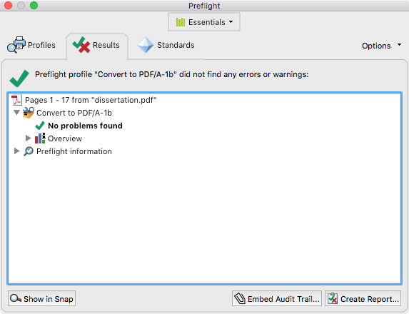

A Minimal LaTeX Dissertation Template (for the Johns Hopkins University)
========================================================================
{:.no_toc}

**Pre-requisites:** [LaTeX](https://www.latex-project.org).  
[Download the LaTeX source](dissertation.tex). [See the generated PDF](dissertation.pdf).

Table of Contents
=================
{:.no_toc}

1. TOC
{:toc}

Abstract
========

You want to write your dissertation in [LaTeX](https://www.latex-project.org)—that may not be the best idea (see [§ Appendix: My Approach to LaTeX](#appendix-my-approach-to-latex)), but you may have a good reason to do it anyway—and you must follow the formatting guidelines of your university. In this article I provide a LaTeX template to get you started and a tutorial explaining the decisions and the implementation details.

I study at the Johns Hopkins University, so this article is based on the [Johns Hopkins University Library Formatting Guidelines for Electronic Theses & Dissertations (ETD)](https://www.library.jhu.edu/library-services/electronic-theses-dissertations/formatting-guidelines-checklist/). If you’re at the Johns Hopkins University, you’ll be glad to know that I showed the template in this article to the Library and they extra-officially approved it. But you may continue reading even if you’re somewhere else, because formatting guidelines tend to be similar in every place so this template may serve as the starting point for your own, and also because you may learn some LaTeX along the way.

I had to come up with this template because the Johns Hopkins University Library doesn’t support LaTeX and doesn’t provide an official template. They do refer to this [unofficial template by Brian Weitzner](https://github.com/weitzner/jhu-thesis-template) and looking around I also found some variations on it, for example, [Keisuke Sakaguchi’s version](https://github.com/keisks/jhu-thesis-template-nlp) which fixes formatting issues and adds support for citations in the style of the *Association for Computational Linguistics* (ACL).

But these templates didn’t work for me and I advise you against them.

You can’t just use these templates as black-boxes; you must read the formatting guidelines and ensure that your dissertation follows them yourself. The templates can help with the requirements related to form, but they can’t help with those related to content, for example, what sections to include, how long these sections should be, and so forth. Also, you may need something that the templates don’t support, for example, citations in the style of a particular research area. And the templates may be out-of-date.

Unfortunately, you can’t use these templates as white-boxes either. They weren’t designed for being used that way, and like LaTeX itself, they can be obscure and full of historical baggage (their changelogs include patches that are almost ten years old).

So I started the template in this article from scratch following a different philosophy:

- **Optimize for Writer Happiness.** Keep it simple, prefer plain LaTeX, and avoid shiny new things that distract from writing. A happy writer is writing, not fiddling with LaTeX.
- **Keep a Single File.** In the spirit of keeping things simple, the whole template is a single file. You will appreciate this if your LaTeX editor doesn’t include a file browser, for example, [TeXShop](https://pages.uoregon.edu/koch/texshop/). (See [§ Appendix: My Approach to LaTeX](#appendix-my-approach-to-latex) for my recommendation on a LaTeX editor which *does* include a file browser.)
- **Show the Work.** This template is a white-box that you must understand and adapt. Every line in the template is explained in this article.

Compiling
=========

You may follow along this article by [downloading the LaTeX source](dissertation.tex) or by copying the listings one by one. You may compile the LaTeX source with the help of your LaTeX editor, or on the command-line with the usual LaTeX routine:

<figure markdown="1">
```console
$ pdflatex dissertation.tex
$ bibtex dissertation
$ pdflatex dissertation.tex
$ pdflatex dissertation.tex
```
<figcaption markdown="1">
The multiple passes correct the citations and the (forward) cross-references.
</figcaption>
</figure>

Document Class
==============

We use the `book` document class from plain LaTeX:

<figure markdown="1">
<figcaption markdown="1">
`dissertation.tex`
</figcaption>
```latex
\documentclass[12pt, oneside]{book}
```
</figure>

The `book` document class by itself already conforms to several of the Formatting Guidelines:

- Consistent font throughout the dissertation.
- Consistent heading styles.
- Roman numerals (i, ii, iii, iv, …) for page numbers on the front matter and Arabic numerals (1, 2, 3, 4, …) for page numbers on the rest of the dissertation.
- Font size differing by two points between body and footnotes.

We use the `12pt` option to increase the body font size from the default 10pt to 12pt. This is optional, because the Formatting Guidelines would allow the default 10pt, but a bigger font results in shorter lines, which [are more comfortable to read](https://practicaltypography.com/line-length.html). Perhaps a better approach would have been to increase the margins instead of the font size, but the Formatting Guidelines disallows this (see [§ Margins](#margins)).

We use the `oneside` option so that all pages are treated the same. Without this option, facing pages would have different margins to accommodate for binding, and chapters would start only on a right-hand side page, which could result in undesired blank pages.

External Files
==============

We want to **Keep a Single File** (see our philosophy in the introduction of this article), but there are tools that expect other files to exist. Most notably, [BibTeX](http://www.bibtex.org) (which we use to [manage citations](#bibliography)) expects a `.bib` file, and the [`pdfx` package](https://ctan.org/pkg/pdfx) (which we use to [generate a PDF/A](#pdfa)) expects a `.xmpdata` file.

To work with these tools and still follow our philosophy, we declare external files embedded in the LaTeX source. When LaTeX processes the source, it creates the files in the filesystem with the contents we provide. Plain LaTeX is capable of doing this with the `filecontents` and `filecontents*` environments, for example:

<figure markdown="1">
<figcaption markdown="1">
An example of the `filecontents*` environment. **Don’t include in `dissertation.tex`.**
</figcaption>
```latex
\begin{filecontents*}{external-file.txt}
The contents of the external file.
\end{filecontents*}
```
</figure>

Upon encountering the snippet above, LaTeX creates a file called `external-file.txt` with the text “`The contents of the external file.`”.

The difference between `filecontents` and `filecontents*` is that a file created with `filecontents` also includes a preamble with an explanation of how it was created, while a file created with `filecontents*` doesn’t, which is what we want in most cases.

But the `filecontents` and `filecontents*` environments provided by plain LaTeX have two issues. First, if a file with the given name already exists, then it isn’t overwritten. Second, the `filecontents` and `filecontents*` environments can only appear in the preamble, which is the part of the LaTeX source before `\begin{document}`.

We want the external files to be overwritten and updated when we modify the LaTeX source, and we want to declare external files from anywhere in the LaTeX source, so we use the [`filecontents` package](https://ctan.org/pkg/filecontents) to redefine the `filecontents` and `filecontents*` environments and fix these issues:

```latex
\usepackage{filecontents}
```

PDF/A
=====

The Formatting Guidelines specify that you must provide a PDF/A, which is a special kind of PDF meant for archival. A PDF/A is special in two ways: first, it includes metadata useful for indexing and searching, for example, the title and author, a table of contents, a mapping between glyphs in the dissertation and their corresponding Unicode code points, and so forth; and second, a PDF/A is self-contained. This second requirement means that we can’t use extended PDF features, for example, compression, embedded audio, embedded movies, and JavaScript; and it also means that we must embed everything necessary to reproduce the dissertation in the future, for example, the fonts.

We use the `pdfx` package to produce a PDF/A:

<figure markdown="1">
```latex
\begin{filecontents*}{\jobname.xmpdata}
\Title{!!Title!!}
\Author{!!Author!!}
\Language{en-US}
\Keywords{!!Keyword 1!!\sep !!Keyword 2!!\sep !!Keyword 3!!\sep ...}
\Subject{!!Abstract!!}
\end{filecontents*}
\usepackage[a-1b]{pdfx}
\hypersetup{hidelinks, bookmarksnumbered}
\usepackage{tocbibind}
```
<figcaption markdown="1">
The `!!` delimit placeholders which you must replace.
</figcaption>
</figure>

First, we must provide the metadata that `pdfx` can’t extract from the dissertation automatically, including title, author, language, keywords, and subject (abstract). The `pdfx` package can’t extract these metadata automatically even though they may appear elsewhere in the dissertation, because it can’t predict where they are. But `pdfx` extracts most other metadata required by a PDF/A automatically, for example, a table of contents, and glyph mappings. You may want to specify other metadata fields (see the [`pdfx` package documentation](http://mirrors.ctan.org/macros/latex/contrib/pdfx/pdfx.pdf)).

The `pdfx` package expects the metadata that you provide to be in an [external file](#external-files), so we use the `filecontents*` environment. The name of the file must be the same as the name of the LaTeX source, and the extension must be `.xmpdata`. We write `\jobname` instead of hard-coding the name `dissertation` (our template is called `dissertation.tex`) so we won’t have to change this line if we rename the LaTeX source.

If a metadata field contains multiple values, for example, the keywords field, and maybe even author field, then the multiple values must be separated by `\sep`.

We use the `a-1b` option when requiring the `pdfx` package to indicate which kind of PDF/A we want. There are many variants of PDF/A, and we choose `a-1b` because it’s less strict than most others, and because it’s the one mentioned in the Formatting Guidelines.

The last two lines in the snippet above are optional, but they are good practice.

The line starting with `\hypersetup` configures the [`hyperref` package](https://ctan.org/pkg/hyperref) that was included by `pdfx`. The `hyperref` package has several responsibilities. First, it makes some parts of the dissertation clickable, for example, entries in the [table of contents](#table-of-contents-1), references and [citations](#bibliography). Second, it maps PDF pages to dissertation pages, for example, PDF page 1 maps to dissertation page i. Third, it adds bookmarks corresponding to the table of contents that you can see on the left-column in most PDF viewers.

<figure markdown="1">
{:width="315" height="357"}
<figcaption markdown="1">
A PDF viewer showing some results of using the `hyperref` package: on the top, the page number appears as i instead of 1; and on the left, the table of contents appears as bookmarks.
</figcaption>
</figure>

We use the `hidelinks` option with `\hypersetup` so `hyperref` doesn’t change the appearance of the clickable areas—without this option `hyperref` would outline them with colored boxes.

We use the `bookmarksnumbered` option with `\hypersetup` so `hyperref` includes the chapter and section numbers in the bookmarks corresponding to the table of contents.

Finally, we include the [`tocbibind` package](https://ctan.org/pkg/tocbibind) for the bibliography to be listed in the table of contents.

PDA/A Validation
----------------

The `pdfx` package produces a PDF which declares itself as PDF/A but it may still violate some PDF/A rules, for example, `pdfx` doesn’t check whether the images in the dissertation include any transparency, which is disallowed by PDF/A. So before you submit your dissertation to the library, validate it with the **Preflight** feature in [Adobe Acrobat DC](https://acrobat.adobe.com/).

You must use the paid version (Adobe Acrobat DC) because the free version ([Adobe Acrobat Reader DC](https://get.adobe.com/reader/)) doesn’t include **Preflight** and can’t validate a PDF/A. Other tools for PDF/A validation do exist, and some of them are even free, but you their results may be inconsistent, so use Adobe Acrobat DC which is the industry standard.

When using **Preflight**, select the profile called **Convert to PDF/A-1b**. You may also use **Preflight** to fix small issues in the PDF/A.

Could you forego this entire section and use **Preflight** to convert a regular PDF produced by LaTeX into a PDF/A? Not really, because the resulting PDF/A would [include low-quality metadata](https://www.mathstat.dal.ca/~selinger/pdfa/); it would only follow the *letter* of the PDF/A requirements, not their *spirit*.

The PDF/A produced by the template is this article passes the **Preflight** validation and includes high-quality metadata:

<figure markdown="1">
{:width="287" height="220"}
<figcaption markdown="1">
The **Preflight** feature in Adobe Acrobat DC validating the PDF/A generated by the template in this article.
</figcaption>
</figure>

<figure markdown="1">
{:width="306" height="294"}
<figcaption markdown="1">
The **Properties** window in Adobe Acrobat DC showing the high-quality metadata.
</figcaption>
</figure>

Margins
=======

We set the margins with the [`geometry` package](https://ctan.org/pkg/geometry):

```latex
\usepackage[top = 1in, right = 1in, bottom = 1in, left = 1.5in]{geometry}
```

According to the Formatting Guidelines, the top, right, and bottom margins must be 1\" each, but the left margin may be either 1\" or 1.5\". A left margin of 1\" is appropriate if you distribute your dissertation digitally only, while a left margin of 1.5\" is appropriate if you print your dissertation as well, because it leaves more space for the binding. I recommend a left margin of 1.5\" even if you don’t plan on printing your dissertation because it results in shorter lines that are more comfortable to read, as discussed in [§ Document Class](#document-class).

Line Spacing
============

We use the [`setspace` package](https://ctan.org/pkg/setspace) to set double spacing in the body text, as specified by the Formatting Guidelines to allow for readers to write comments inline:

```latex
\usepackage[doublespacing]{setspace}
```

The `setspace` package follows the Formatting Guidelines and doesn’t set double spacing in some parts of the dissertation that don’t need it, for example, the footnotes.

Page Style
==========

We use the `plain` page style, which follows the Formatting Guidelines and includes page numbers centralized in the bottom margin:

```latex
\pagestyle{plain}
```

As a side-effect, the `plain` page style also removes the default headers in the [`book` document class](#document-class), which include the current chapter and other information. If you want these headers, or want more control over headers and footers in general, see the [`fancyhdr` package](https://ctan.org/pkg/fancyhdr).

Begin Document
==============

We begin the dissertation body and declare the start of the front matter, which switches page numbers to Roman numerals and prevents chapters from being numbered:

```latex
\begin{document}

\frontmatter
```

Title Page
==========

The first page in the dissertation is the Title Page:

```latex
\begin{center}
  \begin{singlespace}
    \vspace*{0.5in}

    \textbf{\uppercase{!!Title!!}}

    \vspace*{1in}

    by
    
    !!Author!!

    \vspace*{1.5in}

    A dissertation submitted to Johns Hopkins University\\in conformity with the requirements for the degree of Doctor of Philosophy

    \vspace*{0.5in}

    Baltimore, Maryland
    
    !!Month!!, !!Year!!
  \end{singlespace}
\end{center}

\thispagestyle{empty}
\clearpage
```

We use the `center` environment to centralize the text and the `singlespace` environment to disable [double spacing](#line-spacing) for the Title Page.

**Fun Fact:** The Formatting Guidelines specify that certain parts of the Title Page should be single spaced, and then goes on to provide an example in which these parts are double spaced.

We use `\vspace*` to add the vertical spaces specified in the Formatting Guidelines. Regular `\vspace`s without the `*` would not work in some places because LaTeX could choose to discard them, for example, at the top of the page. This first `\vspace*` is also special because it combines with the [top margin](#margins): the 0.5\" space plus the 1\" top margin add to a total of 1.5\", as specified in the Formatting Guidelines.

For the title, we combine `\textbf` (bold) and `\uppercase`. The Formatting Guidelines specify that the title must be uppercase, and making it bold is optional, but looks good.

In the statement (“A dissertation submitted […]”), we use `\\` to force a line break before a preposition, preventing an awkward line break elsewhere. Do the same to your dissertation title if necessary.

The date must correspond to when you submit the dissertation to the library.

We use the `empty` page style for the Title Page. The Title Page still counts toward the page count (the next page is page ii) but the page number isn’t printed at the bottom.

Finally, we insert a page break with `\clearpage`. This is optional, because the [next page](#abstract-and-preface) is the beginning of a chapter, which already inserts a page break in the [`book` document class](#document-class). But it’s a good measure that signals to the reader of the LaTeX source that the Title Page is over, and it prevents issues if you change the next page such that it doesn’t insert a page break, for example, to write a dedication.

We could have included a copyright notice in the Title Page, but we didn’t because it’s optional and copyright holds even without it.

We couldn’t use the default strategy for making title pages in LaTeX with `\title`, `\author`, `\date` and `\maketitle`, because the format would’ve been incorrect and the Title Page wouldn’t have counted toward the page count. This last issue is also the reason why we couldn’t use the `titlepage` environment.

Abstract and Preface
====================

The abstract is a regular chapter, and the preface in this template is only **Acknowledgements**, which is just another regular chapter:

```latex
\chapter{Abstract}

\begin{itemize}
  \item A statement of the problem or theory.
  \item Procedure or methods.
  \item Results.
  \item Conclusions.
  \item Not more than 350 words.
\end{itemize}

\paragraph{Readers:}

!!Name 1!! (advisor); !!Name 2!!; !!Name 3!!.

\chapter{Acknowledgements}
```

Table of Contents
=================

We use the regular LaTeX Table of Contents, List of Tables and List of Figures:

```latex
\tableofcontents
\listoftables
\listoffigures
```

Main Matter
===========

We declare the beginning of the main matter. This resets the page numbers, which are counted with Arabic numbers for the rest of the dissertation. Also, chapters in the main matter are numbered. The main matter starts with an introduction, continues with regular chapters for the body of the dissertation, and ends on an appendix with more chapters:

```latex
\mainmatter

\chapter{Introduction}

Example of citation: \cite{REMOVE-ME}

\chapter{!!Sample Chapter!!}

\appendix

\chapter{!!Sample Appendix!!}
```

Back Matter
===========

After the [appendices](#main-matter), we declare the beginning of the back matter:

```latex
\backmatter
```

Chapters in the back matter aren’t numbered.

Bibliography
============

We manage the bibliography with BibTeX. BibTeX expects the bibliography database to be declared in a `.bib` file, but we want to follow the principle of **Keeping a Single File**, so we define the bibliography database as an [external file](#external-files):

```latex
\begin{filecontents*}{\jobname.bib}
@inproceedings{REMOVE-ME,
  title = {!!Sample Citation!!},
} 
\end{filecontents*}
```

We name the file after the current `\jobname` instead of hard-coding the name `dissertation`, as [we did previously when defining the metadata for PDF/A](#pdfa).

Next, we set the `plain` bibliography style, which uses numbers for citations:

```latex
\bibliographystyle{plain}
```

Finally, we include the bibliography, which refers to the file we created above:

```latex
\bibliography{\jobname}
```

Biography
=========

The last item in your dissertation must be a short biographical sketch, which we include as a regular chapter, and then we end the document:

```latex
\chapter{Biography}

\begin{itemize}
  \item Date and location of birth.
  \item Salient facts of academic training and experience in teaching and research.
\end{itemize}

\end{document}
```

Appendix: My Approach to LaTeX
==============================

Avoid LaTeX
-----------

LaTeX is old and full of quirks, its ecosystem is fragmented so its packages often conflict, its documentation is hard to navigate, and its learning curve is steep and may not be worth the benefits.

LaTeX supporters will tell you that LaTeX documents look better than the competition—particularly when it comes to mathematics—and that LaTeX allows you to focus on the content and forget about the design. I believe these arguments may have held when TeX was created over 40 years ago, but LaTeX supporters continue repeating them well over their expiration date. Word processors including [macOS Pages](https://www.apple.com/pages/) and [Microsoft Word](https://products.office.com/en-us/word) can produce stunning documents, and the equation editor in Pages even supports LaTeX input. Also, word processors have paragraph styles that separate content from design.

But I would go further and contend that separating content from design may be a bad idea to begin with, because content and design should inform each other. Also, writing in something that resembles a publishable document is more comfortable than in piles of LaTeX macros. And any time you may save from procrastinating on design you will loose from procrastinating on LaTeX—I know I have.

The only acceptable excuse to use LaTeX is *someone made me*. LaTeX is the *lingua franca* of some academic circles: your collaborators may use LaTeX, or you may need to submit to a venue that only provides LaTeX templates or that only accepts LaTeX submissions.

When LaTeX is inevitable, treat it as a necessary evil, and keep things simple and boring. Avoid shiny new things that end up being time sinks, for example, [`memoir`](https://ctan.org/pkg/memoir), [KOMA-Script](https://ctan.org/pkg/koma-script), [ConTeXt](https://wiki.contextgarden.net/Main_Page), [TikZ](https://ctan.org/pkg/pgf), [PGFPlots](http://pgfplots.sourceforge.net), [Beamer](https://ctan.org/pkg/beamer), [BibLaTeX](https://ctan.org/pkg/biblatex), and [Biber](http://biblatex-biber.sourceforge.net). I spent hundreds of hours reading the manuals for these tools, and I learned that it’s better to stick with the tried-and-true parts of the LaTeX ecosystem. For one thing, this makes it easier to find help online—and with LaTeX you will need all the help you can get!

It may be tempting to use these tools because they allow you to stay in LaTeX for most of the document, including the figures. The notion of producing figures programmatically can be enticing, and the promise is that the resulting document will look more consistent. This is a trap. In the long run, it tends to be less productive, and the results tend to not look as good. Instead of drawing illustrations and diagrams in TikZ, use [Inkscape](https://inkscape.org)—it can even export to LaTeX. Instead of plotting graphs with PGFPlots, use [macOS Numbers](https://www.apple.com/numbers/) or [Excel](https://products.office.com/en-us/excel). Just pay attention to the details like fonts and sizes, and the resulting document will look consistent. If you need mathematical formulas in these other programs, use [LaTeXiT](https://www.chachatelier.fr/latexit/).

And above all, *avoid Beamer*! Prefer [macOS Keynote](https://www.apple.com/keynote/) or [PowerPoint](https://products.office.com/en-us/powerpoint). Beamer is even worse than PowerPoint in promoting the so-called [bad cognitive style of PowerPoint](https://www.edwardtufte.com/tufte/powerpoint), which is slides filled with bullet-points and chartjunk.

Finally, avoid programming in TeX. TeX is a *terrible* programming language! If your macros are non-trivial, write programs in a better programming language to output LaTeX for you, for example, [Pollen](https://pollenpub.com).

Live with LaTeX
---------------

First, install a big TeX distribution: [MacTeX](http://www.tug.org/mactex/) (macOS), [TeX Live](https://tug.org/texlive/) (Linux), or [MiKTeX](https://miktex.org) (Windows). These distributions are huge—several gigabytes in size—because they include everything you may ever need: different TeX engines, fonts, all packages in [CTAN](https://ctan.org) along with their documentation, and so forth. You may find other lighter distributions, but if you install them, you may be missing packages, and may fail to compile the LaTeX sources from your collaborators and the snippets you find on the web.

Next, update your TeX installation frequently. At the very least you must update the whole TeX distribution when a new version is released, which generally happens once a year. It’s also a good idea to update the CTAN packages every few months, for which you may use the [TeX Live Utility](https://amaxwell.github.io/tlutility/) (macOS) or the [TeX Live package manager](https://www.tug.org/texlive/tlmgr.html) (all platforms).

For writing, the TeX distributions may include a LaTeX editor, for example, MacTeX includes [TeXShop](https://pages.uoregon.edu/koch/texshop/). While these LaTeX editors work well and require no setup, I recommend stepping up to [Visual Studio Code](https://code.visualstudio.com) with the [LaTeX Workshop](https://marketplace.visualstudio.com/items?itemName=James-Yu.latex-workshop) extension, because it includes autocompletion, a file browser, [Git](https://git-scm.com) integration, and so forth. LaTeX supporters may prefer [Emacs](https://www.gnu.org/software/emacs/) with the [AUCTeX](https://www.gnu.org/software/auctex/) package, but I believe these are time sinks that you better avoid.

To learn LaTeX, read the parts of the [Wikibook](https://en.wikibooks.org/wiki/LaTeX) that may be relevant to you. I consider most other books to be too deep to be useful for beginners; this includes the official LaTeX documentation, by Leslie Lamport; *The LaTeX Companion*; and *The TeXbook*, by Donald E. Knuth.

To find a certain symbol, use [Detexify](http://detexify.kirelabs.org/classify.html). To open the documentation for a package on the command-line, use `texdoc`. In particular, `texdoc latex2e` is a good quick LaTeX reference. To manage citations, use [Zotero](https://www.zotero.org) and export to BibTeX.

Next Level: Unicode and Different Fonts
---------------------------------------

The only fancy LaTeX feature that I allow myself to use is a different TeX engine: [LuaTex](http://www.luatex.org). I use LuaTeX because I need to write my LaTeX source in Unicode, and I need to load fonts that support unusual Unicode code points, for example, `⇒`, `ℓ`, `⊥`, and so forth. The plain TeX engine is frozen and will never have anything beyond basic support for Unicode and modern fonts, a basic support which may break [PDF/A](#pdfa) compatibility.

If you have similar needs, or if you just want to use a font that isn’t Computer Modern—the default LaTeX font that is already overused in academia—start by switching from the plain TeX engine to LuaTeX. On the command-line this may be as simple as calling the `lulatex` executable instead of `pdflatex`. You can instruct LaTeX Workshop (and other LaTeX editors) to use LuaTeX by including the following snippet as the first lines in your LaTeX source:

<figure markdown="1">
```latex
% !TEX program = lualatex
% !BIB program = bibtex
```
<figcaption markdown="1">
When we select a different TeX engine we also have to be explicit about BibTeX being our bibliography manager.
</figcaption>
</figure>

With the LuaTeX engine you can use the [`fontspec`](https://ctan.org/pkg/fontspec) and [`unicode-math`](https://ctan.org/pkg/unicode-math) packages to select different fonts. For example, select a combination of [Charter](https://practicaltypography.com/charter.html) (serif), [`Iosevka`](http://typeof.net/Iosevka/) (monospaced) and [Asana Math](https://ctan.org/pkg/asana-math) (mathematics) by adding the following snippet to the LaTeX source preamble:

<figure markdown="1">
```latex
\usepackage{fontspec, unicode-math}
\setmainfont{Charter}[
  Path           = fonts/,
  UprightFont    = charter-regular.ttf,
  ItalicFont     = charter-italic.ttf,
  BoldFont       = charter-bold.ttf,
  BoldItalicFont = charter-bolditalic.ttf
]
\setmonofont{Iosevka}[
  Path           = fonts/,
  UprightFont    = iosevka-regular.ttf,
  ItalicFont     = iosevka-italic.ttf,
  BoldFont       = iosevka-bold.ttf,
  BoldItalicFont = iosevka-bolditalic.ttf
]
\setmathfont{Asana-Math.otf}
```
<figcaption markdown="1">
This snippet expects the fonts Charter and `Iosevka` to be available in a folder called `fonts/` along with the LaTeX source. Asana Math comes with the TeX distribution.
</figcaption>
</figure>

Charter is a good font choice that I borrowed from the [Racket documentation](https://docs.racket-lang.org), which was designed by a typographer, [Matthew Butterick](https://practicaltypography.com/about-matthew-butterick.html). `Iosevka` is a good font choice because it’s the only one that satisfies the following criteria: it’s monospaced; it’s aesthetically pleasing; it’s free; and it supports a wide variety of Unicode code points, which is necessary to typeset most of the code that I write. (You are reading a combination of Charter and `Iosevka` right now.) And Asana Math is the best match for Charter among the fonts supported by the `unicode-math` package.
