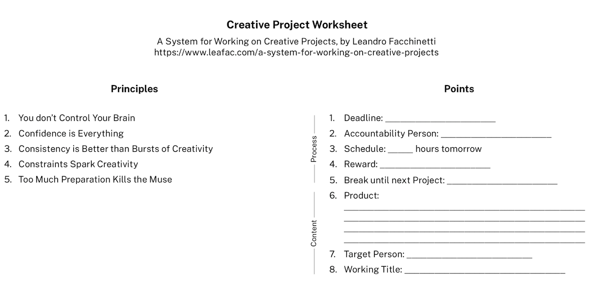

<!--
A System for Working on Creative Projects
=========================================

TODO: Video

Creative Project Worksheet
==========================

[{:width="600"}](creative-project-worksheet.pdf)

References
==========

References on how the brain works, which are the biological and philosophical foundations for this system:

- *Thinking, Fast and Slow*, by Daniel Kahneman. This book supports the idea that we aren’t in control of our minds as much as we’d like to believe. In particular, the *fast thinking* is mostly following habits.
- *The Power of Habit*, by Charles Duhigg. Another book along the same lines.
- *The Art of Explanation: Making your Ideas, Products, and Services Easier to Understand*, by Lee LeFever. The key point of this book is that we must strive to build confidence and feel successful. They talk about it in terms of explanation—an explanation must build confidence in the audience and make them feel successful—but I think it may also be directed at ourselves, as the explainers (or creative workers in general).
- *Wherever You Go, There You Are: Mindfulness Meditation in Everyday Life*, by Jon Kabat-Zinn. This is a book on meditation and mindfulness, which are practical things you may do to train your brain and develop good habits.

Creative people talking about their processes and giving advice:

- *Steal Like an Artist: 10 Things Nobody Told You About Being Creative*, by Austin Kleon. A candid and inspiring memoir on the life of a creative person in the form of advice.
- *Talking as Fast as I Can: From Gilmore Girls to Gilmore Girls (and Everything in Between)*, by Lauren Graham. I read this book because I like Gilmore Girls, but it surprised me by including the kind of writing advice that I needed at that moment. Check § Kitchen Timer, which introduces a variation of the more famous *Pomodoro Technique* that I found to be much simpler to follow and much more effective.
- *On Writing: A Memoir Of The Craft*, by Stephen King. At first glance, this is a book about writing fiction. But a closer look reveals insights about the creative process that are applicable in all media, for example, the idea of creating with the door closed, but editing with the door open, or the idea of creating with an ideal person in mind.
- *On Writing Well: The Classic Guide to Writing Nonfiction*, by William Zinsser. This is mostly a book about form in nonfiction writing, but the most interesting part of it for me is the ethical implications of writing: writing untruthfully isn’t only ineffective, it’s unethical. Again, some of the insights in this book are applicable to any form of creative endeavor.
- *The No Plot? No Problem! Novel-Writing Kit*, by Chris Baty. This is a book about the first phase of the creative process. It focuses mostly on getting rid of excuses not to create, lowering the barriers we build for ourselves, and getting to a first draft as quickly as possible—perhaps *too* quickly to be sustainable.

Transcript
==========
-->

Hi, I’m Leandro Facchinetti and this is *A System for Working on Creative Projects*.

Anyone can *start* a creative project—the hard part is *finishing* it. You may be writing, or recording music, or drawing, or developing software—whatever your project may be, you’ll face similar challenges when it comes to reaching that finish line.

In this video, I propose a *system* to help you get there. A system which helps you build confidence and feel successful. A system which reduces friction, so you get to work on your project a little bit every day. And a system which helps you decide when you’re done with the project.

Principles
----------

This system is based on five principles and is composed of eight points. Let’s start with the principles.

Principle 1: You don’t Control Your Brain
-----------------------------------------

You’d like to *think* that you’re in control, but you aren’t. Not really. A lot of what you do is purely out of habit.

I’m sure you’re familiar with this situation: you *want* to work on your creative project, but then you feel uninspired, or intimidated, or tired, or afraid, or overwhelmed, and you end up not working on the project, which makes you feel frustrated and creates a vicious cycle of procrastination.

I’ve been in there.

Many times.

I believe the solution isn’t to fight nature, but to embrace it, by creating a system that sort of tricks your brain into working on your project. It must become the comfortable, natural thing that you do without thinking—in other words: a habit.

But how do you build a habit? Well…

Principle 2: Confidence is Everything
-------------------------------------

If you feel confident that you can do something, you’ll do it more often, more easily, and better.

Everything in a system for working on creative projects must be in service of building your confidence.

And a big part of building confidence is feeling successful, which is a surprisingly easy thing to do: just set a goal, and reach that goal.

The real trick here is that *you* get to set your goal, not anybody else. So be smart about how you set your goals to make sure that you can always reach them.

Some goals are based on content, for example, to write a thousand words. While other goals based on behavior, for example, to write for an hour.

I believe that goals based on behavior are much better than goals based on content. Sometimes it’s hard to write a thousand words, but an hour will always pass.

With goals based on behavior, you succeed more often, you become more confident, and you return to your project more frequently, which brings us to:

Principle 3: Consistency is Better than Bursts of Creativity
------------------------------------------------------------

Confidence decays fast. You must work on your creative project every day to keep it alive. Even if it’s just for a couple of minutes.

In fact, I think that maybe working just a little may be better than working too much. Productivity can’t keep up for long, and you don’t want to get tired, which would reduce your confidence.

Remember that working on creative projects is a life-long journey, not a sprint.

Now, you may be thinking: “If I’m only going to work on my project for a little bit, how can I get anything done?”

Well, just think of time as another constraint:

Principle 4: Constraints Spark Creativity
-----------------------------------------

Abundance is intimidating.

Avoid having too much time, or too many tools, or too big a budget, because these things demand too much from you. Nothing you create will be up to the expectations set by abundance—not the first time around, anyway.

You may even spark creativity with artificial constraints: What can you do with only one brush, or only thirty minutes?

In particular, probably the most important constraint is in how much time you spend *preparing*, because of:

Principle 5: Too Much Preparation Kills the Muse
------------------------------------------------

Preparation is important, but too much of it is worse than too little.

You don’t want to have the time to start idealizing the final production too much. First because it would be hard to meet these expectations, and also because it’s kind of boring to just follow a plan. It leaves little space for *creativity* in what was supposed to be a *creative* project—it starts to feel too much like *work*.

So start early. For a big, ambitious project, like a novel, one week of preparation should be more than enough before you start to write.

Okay. These principles are great, but how do you turn them into action?

Points
------

That’s where the eight points of the system come in. Write down your answers to these points, because they may become useful further down the line in case you try to sabotage yourself. But don’t spend more than a few minutes in each point. Remember that *Too Much Preparation Kills the Muse*.

Point 1: Deadline
-----------------

A deadline is *the* ingredient that separates the projects that ship from those that go in the drawer.

A good deadline is short: one week, or two at most. If your project is too big for this time frame, just break it apart in smaller pieces.

After you set a deadline, you may not change it. But there’s a trick: you may change the expected output. If a deadline is approaching and you’re far from where you expected to be, all you have to do is to adjust the expectations and you’ll succeed no matter what.

This may seem self-indulgent, but the idea behind a deadline is not to get you stressed out or to punish you. The idea is to make you feel that you accomplished something, to make you feel successful, and to build your confidence.

So if necessary, practice self-compassion, adapt expectations, and keep moving forward.

Point 2: Accountability Person
------------------------------

Find a person, share with her your answers to the eight points we’re talking about here, and ask her to check in with you every day.

Your accountability person isn’t there to give you feedback on your project, or to push you into working more. She’s only there to check whether you’re behaving as promised; if you’re following your schedule.

Speaking of which:

Point 3: Schedule
-----------------

Never mind long-term schedules, they usually don’t work and just induce anxiety. Instead, each day, plan the hours for the next day.

One hour of work on your project is a good amount. Four hours is probably the maximum. But as I mentioned before, even ten minutes is fine.

If one day you fail to put in the hours, schedule *less* time for the next day, not more.

You can’t make up for lost time—life doesn’t work that way. Instead, focus on making it easy to satisfy your goals and build your confidence moving forward.

The main point of the schedule isn’t even to tell for how long you should *work* on the project, but for how long *not* to. Once you’re done with the time you scheduled, you may silence that inner voice nagging you to work more. After all, guilt and confidence don’t go well together.

If you plan on working for longer than one hour, break that time into shorter sessions. Breaks clean the ear. You may wish to take a break when things aren’t going well, but resist that temptation if the session isn’t over yet. Against all intuition, I think that breaks are more effective when you’re being *productive*, because you it leaves you *wanting* to go back and finish whatever you are doing: Is there a better feeling?

And speaking of good feelings:

Point 4: Reward
---------------

If you follow your schedule, you’re successful, and you must reward yourself for it. The reward may be a night out, a desert, a new dress—the point is to celebrate and to be grateful for the effort that you put into your project.

Rewards make you feel good, build your confidence, and give you the energy you need to move on to the next project. But before you go there:

Point 5: Break until Next Project
---------------------------------

Besides the small breaks between working sessions, it’s also important to take longer breaks between projects, so think about it right now: How long is the break going to be? How are you going to enjoy it?

Content
-------

Everything I talked about up to this point is about the *process*, because I believe that you should focus more on the *process* than on the *content*. But content is important too, so let’s end with some considerations about it.

Point 6: Product
----------------

Are you going to work on a video, a podcast, a book?

You must have a clear product in mind, so you’ll know when you’re done.

Write down one or two sentences that you may use to describe your project to someone else. And about that someone else:

Point 7: Target Person
----------------------

Find one person who represents your target audience and keep that person in mind while you work on your project.

That’s one person, not a group of people.

If your target person can also be your accountability person, all the better: two for the price of one.

But even if you don’t know anyone who could represent your target audience, just make one up. Come up with a name and a brief description: What does this person know? What does she like? Why will she be interest in your project?

A target person serves two purposes. First, she helps you focus: you don’t shift perspectives and lose track of what you’re doing. Second, she reminds you that someone cares about your project.

And finally:

Point 8: Working Title
----------------------

It must be the first title that comes to your mind. Descriptive names are best, for example, “A System for Working on Creative Projects.” There’s nothing creative about this title, right? The working title may be silly, but you may change it later, so don’t worry too much about it.

A working title makes your project feel real, and it helps you talk about it with other people.

And that’s it. That’s our whole system for working on creative projects. It’s simple and effective, and it helps you reach that finish line.

Make sure you check the description below. A lot of I talked about in this video is based on books that I read and techniques that I tried, and I give you a list of my favorites in the description.

Also, the description includes a worksheet to help you remember the five principles and the eight points of the system. Every time you start working on a new creative project, take a few minutes to fill out one of these sheets. You’ll be glad you did.

Now go create something amazing. Thanks for watching.
