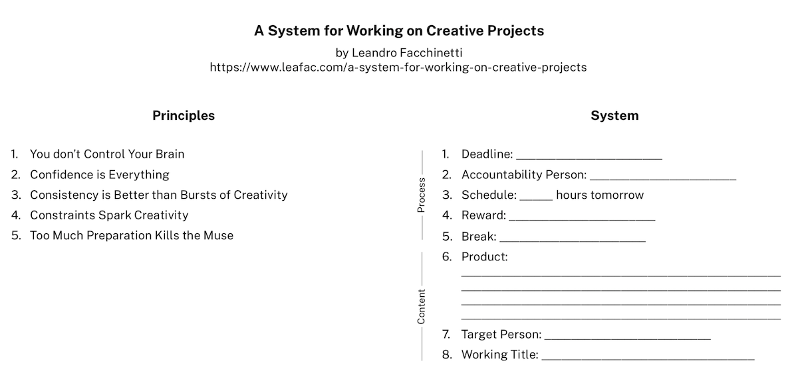

Checklist
=========

[{:width="600" height="286"}](a-system-for-working-on-creative-projects.pdf)

References
==========

References on how the brain works, which are the biological and philosophical foundations for this system:

- *Thinking, Fast and Slow*, by Daniel Kahneman.
- *The Power of Habit*, by Charles Duhigg.
- *The Art of Explanation: Making your Ideas, Products, and Services Easier to Understand*, by Lee LeFever.
- *Wherever You Go, There You Are: Mindfulness Meditation in Everyday Life*, by Jon Kabat-Zinn.

Creative people talking about their processes and giving advice:

- *Steal Like an Artist: 10 Things Nobody Told You About Being Creative*, by Austin Kleon.
- *Talking as Fast as I Can: From Gilmore Girls to Gilmore Girls (and Everything in Between)*, by Lauren Graham. I read this book because I like Gilmore Girls, but it surprised me by including the kind of advice for writers I needed at the moment. Check § Kitchen Timer, which introduces a technique that’s working well for me. It’s an adaptation of the more famous *Pomodoro Technique* that is much simpler to follow and much more effective (at least, it has been for me).
- *On Writing: A Memoir Of The Craft*, by Stephen King.
- *On Writing Well: The Classic Guide to Writing Nonfiction*, by William Zinsser.
- *The No Plot? No Problem! Novel-Writing Kit*, by Chris Baty.

Transcript
==========

Hi, I’m Leandro Facchinetti and this is *A System for Working on Creative Projects*.

Anyone can start a creative project; the hard part is completing it. You may be writing, recording music, drawing, developing software… whatever your project may be, you’ll face similar challenges when it comes to reaching that finish line.

In this video I propose a *system* to help you get there. A system which helps you build confidence and feel successful. A system which reduces friction, so you work on your project a little bit every day. And a system which helps you decide when you’re done with the project.

This system is based on five principles and is composed of eight points. Let’s start with the principles.

Principle 1: You don’t Control Your Brain
-----------------------------------------

You’d like to think that you’re in charge, but you aren’t. Not really. A lot of what you do is purely out of habit.

You may *wish* to work on your project, but then you feel uninspired, intimidated, tired, afraid, and you end up not working on it. Then you feel frustrated, a frustration that takes you even further away from the project.

The problem is that you can’t always decide what to do. Your brain already decided for you.

So instead of fighting nature, you must follow a system which sort of tricks your brain into working on your project. Doing it must become the comfortable, natural thing that you do without thinking; in other words: a habit.

But what should you take in account when developing such a system?

Principle 2: Confidence is Everything
-------------------------------------

If you feel confident that you can do something, you’ll do it more often, more easily, and better.

Everything in a system for working on creative projects must be in service of building your confidence.

A big part of building confidence is feeling successful. And to feel successful, all you have to do is to set a goal, and reach the goal.

Some people set goals based on content, for instance, writing a thousand words every day. Some people set goals based on behavior, for instance, writing for an hour every day.

I believe goals based on behavior are better than goals based on content. You may struggle to write a thousand words, but an hour will always pass. With goals based on behavior, you’ll succeed more often, become more confident, and return to your project more frequently, which brings us to:

Principle 3: Consistency is Better than Bursts of Creativity
------------------------------------------------------------

Confidence decays fast. To keep it alive, you must work on your creative project often. Every day, even if it’s just for a couple of minutes. You can always carve five or ten minutes, even out of busy schedule.

In fact, I think working only a little may be better than working too much. Productivity can’t keep up for long and you risk getting tired, which would reduce your confidence.

Remember that working on creative projects is a life-long journey, not a sprint.

Hmmm, but if you work on your project only a little every day, how can you get anything done?

Well, just think of time as another constraint:

Principle 4: Constraints Spark Creativity
-----------------------------------------

Abundance is intimidating.

So avoid having too much time, or too many tools, or too big a budget, because they demand too much from you.

You may even think of artificial constraints: what can you do with only one brush, or only thirty minutes?

In particular, I invite you to constrain the time you spend *preparing*, because of:

Principle 5: Too Much Preparation Kills the Muse
------------------------------------------------

Preparation is important, but too much preparation is worse than too little.

The more you prepare, the more you idealize the final product. When you start working, you find that you can’t meet your expectations.

Also, it’s kind of boring to just follow a plan. It leaves little space for *creativity* in what was supposed to be a *creative* project—it starts to feel like *work*.

This reduces your confidence, and because you aren’t in control of your brain, you stop working on your project.

So start early, before you have a chance to doubt yourself. For a big, ambitious project, like a novel, one week of preparation should be more than enough before you set out to write.

* * *

OK, so these principles are great, but how do you turn them into action?

That’s where the system comes in. It’s composed of eight points, and you must not spend more than a few minutes in each point—a few hours at most. Remember that *Too Much Preparation Kills the Muse*.

And write down your answers. They will help you later if try to sabotage the project.

Point 1: Deadline
-----------------

A deadline is *the* ingredient that separates the projects that ship from those that go in the drawer.

A good deadline is short: one week; two at most. If your project is too big for this time frame, break it apart in smaller pieces.

After you set a deadline, you may not change it. But there’s a trick: you may change the expected output. If a deadline is approaching and you’re far from where you expected to be, all you have to do is to adjust the expectations and you’ll succeed no matter what.

This may seem self-indulgent, but the idea behind a deadline is not to get you stressed or to punish you; it is to make you feel successful and build your confidence.

Practice self-compassion, adapt expectations if necessary, and keep moving forward.

Point 2: Accountability Person
------------------------------

Find a person, share with her your answers to these eight points we’re talking about here, and ask her to check in with you every day.

Your accountability person doesn’t have to give you feedback on your project, or push you into working more. She only needs to ask if you’re behaving like you promised; if you’re following the schedule.

Speaking of which:

Point 3: Schedule
-----------------

Each day, you say how much time you’re dedicating to the project the next day. One to three hours is a good target, but even ten minutes is fine.

If you fail to follow that plan in one day, schedule *less* time for the next day, not more.

You can’t make up for lost time; life doesn’t work that way. Instead, you must make it easy to satisfy your goals abd build your confidence.

The main point of the schedule isn’t even to tell for how long you should *work* on the project, but for how long *not* to. Once you’re done with the time you scheduled, you may silence that inner voice nagging you to work more. Guilt and confidence don’t go well together.

And remember to add plenty of breaks between working sessions, which shouldn’t last more than one hour each. Breaks clean the ear. In particular, take breaks if things are going well and you’re being productive. You’ll end up feeling you *need* to go back and finish what you were doing: is there a better feeling?

And speaking of good feelings:

Point 4: Reward
---------------

If you follow your schedule every day until the deadline, you’re successful, and you must reward yourself for it. The reward maybe a night out, a desert, a new dress… The point is to celebrate and be grateful for the effort you put into your project.

Rewards make you feel good, build your confidence, and give you energy to move on to the next project. But before you go there:

Point 5: Break
--------------

Besides the small breaks between working sessions, schedule a longer break between your current project and the next one. How long will your downtime be after the deadline? How will you enjoy this period?

* * *

Everything we talked about thus far is about the *process*. Let’s end with three points about the *content*.

Point 6: Product
----------------

Are you going to work on a video, a podcast, a book?

You must have a clear product in mind, so you’ll know when you’re done.

Write down one or two sentences you may use to describe your project to someone else. And about that someone else:

Point 7: Target Person
----------------------

Find one person you know who represents your target audience. While you work on your project, keep that person in mind.

This is one person, not a group of people.

If your target person can also be your accountability person, all the better: two for the price of one.

If you don’t know a person who could represent your target audience, make one up. Give the character a name and a brief description: What does she know? What does she like? Why will she take interest in your project?

A target person serves two purposes. First, she helps you focus; you don’t shift perspectives and lose track of what you’re doing. Second, she reminds you that someone cares about your project.

Point 8: Working Title
----------------------

It must be the first title that comes your mind. It may be silly, but you can change it later, so don’t worry about it too much. A working title makes your project feel real, and it helps you talk about it with other people.

Descriptive names are better at this point, for example, the working title for this video is "A System for Working on Creative Project." Nothing creative about this title!

* * *

And that’s it. This is a simple and effective system for working on creative projects and reaching the finish line.

Make sure you check the description below. A lot of I talked about in this video is based on books I read and techniques I tried, and give you a list of my favorites in the description.

Also, I include a checklist to help you remember the five principles and the eight points of the system. Every time you’re starting a creative project, take a few minutes to fill one of these sheets out. You’ll be glad you did.

Thanks for watching and now go create something amazing.
