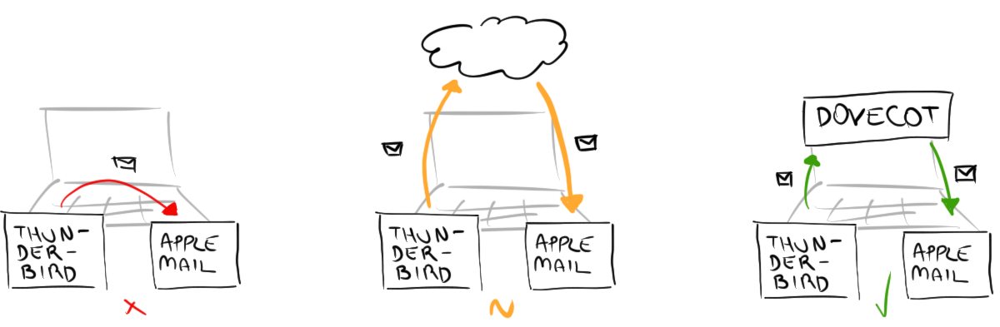

<aside markdown="1">
**Pre-requisites:** Familiarity with the command-line.
</aside>

We switch email clients from time to time, and when we do, we need to migrate the local email history from one application to the other. This may seem easy, because email clients generally include migration assistants and store emails in standard formats, for example, `.eml` and `.mbox`. But recently I was migrating from [Thunderbird](https://www.mozilla.org/en-US/thunderbird/) to [Apple Mail](https://support.apple.com/mail) and these tools failed: they either lost emails, or concatenated all emails together, or created a new mailbox for each email.

Email migration should be easy, yet I suffered from all these ridiculous problems, so I developed the ultimate solution: setting up a local email server. An email server is the common denominator between otherwise incompatible email clients, but common email servers (for example, [iCloud](https://www.icloud.com) and [Gmail](https://www.google.com/gmail/)) are impractical for email migration. While simpler to use, these email servers would require uploading the whole local email history only to re-download it in a new email client. With a local email server we accelerate an email migration that could take days to a few hours.

<figure markdown="1">
{:width="600" height="197"}
<figcaption markdown="1">
**Left:** Migrating the local email history using the migration assistant fails.  
**Center:** Migrating using common email servers (for example, iCloud and Gmail) succeeds, but is impractical.  
**Right:** Our solution, using a local email server (Dovecot), works best.
</figcaption>
</figure>

Our technique on a high level:

1. Install and configure a local email server.
2. Connect both the old and the new email clients to the local email server.
3. Transfer the local email history from the old email client to the local email server.
4. Transfer the local email history from the local email server to the new email client.
5. Stop and uninstall the local email server.

Setup
=====

**Backup your local email history. You might lose emails if the migration fails.**

* * *

First, install the local email server, [Dovecot](https://www.dovecot.org). For example, in [macOS](https://www.apple.com/macos/), Dovecot is available via [Homebrew](https://brew.sh):

```console
$ brew install dovecot
```

Create a directory to hold the local email server mailbox:<label class="margin-note"><input type="checkbox"><span markdown="1">See the [appendix](#appendix-dovecot-configuration) for more details on `dovecot.conf`.</span></label>

```console
$ mkdir <mailbox>
```

Configure Dovecot by replacing the `<placeholders>` on the following template:

<div class="code-block" markdown="1">
`/usr/local/etc/dovecot/dovecot.conf`<label class="margin-note"><input type="checkbox"><span markdown="1">The path to `dovecot.conf` depends on the installation. For macOS and Homebrew, the appropriate path is `/usr/local/etc/dovecot/dovecot.conf`. Another path appropriate for many installations is `/etc/dovecot/dovecot.conf`.</span></label>

```configuation
protocols = imap

default_login_user = <user>
default_internal_user = <user>

userdb {
  driver = static
  args = uid=<user> gid=<group>
}

passdb {
  driver = static
  args = password=<password>
}

mail_uid = <user>
mail_gid = <group>
mail_location = maildir:<mailbox>

namespace inbox {
  inbox = yes
}

log_path = /dev/stderr
auth_verbose = yes
auth_verbose_passwords = yes
auth_debug = yes
auth_debug_passwords = yes
mail_debug = yes
verbose_ssl = yes
```
</div>

- `<user>` and `<group>`: Refer to `id(1)`. For example, on my machine

  ```console
  $ id
  uid=501(leafac) gid=20(staff) [...]
  ```

  so `<user>` is `leafac` and `<group>` is `staff`.

- `<password>`: An arbitrary password.

- `<mailbox>`: The local email server mailbox created above.

Migrate
=======

Start the local email server:

<aside markdown="1">
- `ulimit -n`: Dovecot needs to open more than the default limit of 256 files.  
- `sudo`: Dovecot needs to bind to a network port below 1024. Specifically, port 143, for IMAP.  
- `/usr/local/sbin/dovecot`: Path to the `dovecot(1)` executable installed via Homebrew. Another common path is `/usr/sbin/dovecot`.  
- `-F`: Run Dovecot in the foreground, instead of as a daemon. Stop it with `Ctrl + C`.
</aside>

```console
$ ulimit -n 1024 && sudo /usr/local/sbin/dovecot -F
```

Confirm that the local email server is running by inspecting the startup log messages and the contents of the `<mailbox>`. Dovecot must have created its administration files and directories, otherwise review the steps thus far.

* * *

Connect the email clients (for example, Thunderbird and Apple Mail) to the local email server using the following settings:<label class="margin-note"><input type="checkbox"><span markdown="1">An email client may insist having a server to send emails (SMTP). Let this part of the configuration fail or reuse the settings from another account. Also, ignore warnings about insecure connections. We have setup Dovecot insecurely on purpose because it is simpler and sufficient—the email server should only be available to the local machine.</span></label>

<aside markdown="1">
If you change Dovecot’s configuration (`dovecot.conf`), restart it or run the following command on a separate terminal:

```console
$ sudo doveadm reload
```
</aside>

| Email Address | `<user>@localhost` |
| Server | `localhost` |
| Protocol | IMAP |
| Port | 143 |
| User | `<user>` |
| Password | `<password>` |

On the old email client, move emails from the local folders to the local email server. Then, on the new email client, move emails from the local email server to the local folders. Finally, close the email clients for them to commit pending transactions and check the `<mailbox>`, which should only contain empty directories and Dovecot’s administration files.

Teardown
========

After the migration is complete, remove the connection configuration for the local email server in the email clients. Then, stop the server by killing the process with `Ctrl + C` or by running the following command on a separate terminal:

```console
$ sudo doveadm stop
```

Remove Dovecot’s configuration and `<mailbox>`, and uninstall it:

```console
$ rm /usr/local/etc/dovecot/dovecot.conf
$ rm -rf <mailbox>
$ brew uninstall dovecot
```

Appendix: Dovecot Configuration
===============================

<aside markdown="1">
Refer to [Dovecot’s documentation](https://www.dovecot.org/documentation.html) for more details.
</aside>

Dovecot supports many kinds of services, for example, the IMAP and POP3 email server protocols. In our local email server, we only want the IMAP service:

```configuration
protocols = imap
```

Dovecot supports multiple users and stores a database of their credentials. We use the simplest possible setting, with a single user whose credentials are hard-coded in the configuration file:

```configuration
default_login_user = <user>
default_internal_user = <user>

userdb {
  driver = static
  args = uid=<user> gid=<group>
}

passdb {
  driver = static
  args = password=<password>
}
```

When Dovecot has identified the user, it needs to find the corresponding mailbox. Again, we hard-code the location in the configuration file:

```configuration
mail_uid = <user>
mail_gid = <group>
mail_location = maildir:<mailbox>

namespace inbox {
  inbox = yes
}
```

Finally, we enable the most verbose level of logging and change the log path to `/dev/stderr` so we see log entries on the console when Dovecot runs in the foreground:

```configuration
log_path = /dev/stderr
auth_verbose = yes
auth_verbose_passwords = yes
auth_debug = yes
auth_debug_passwords = yes
mail_debug = yes
verbose_ssl = yes
```
