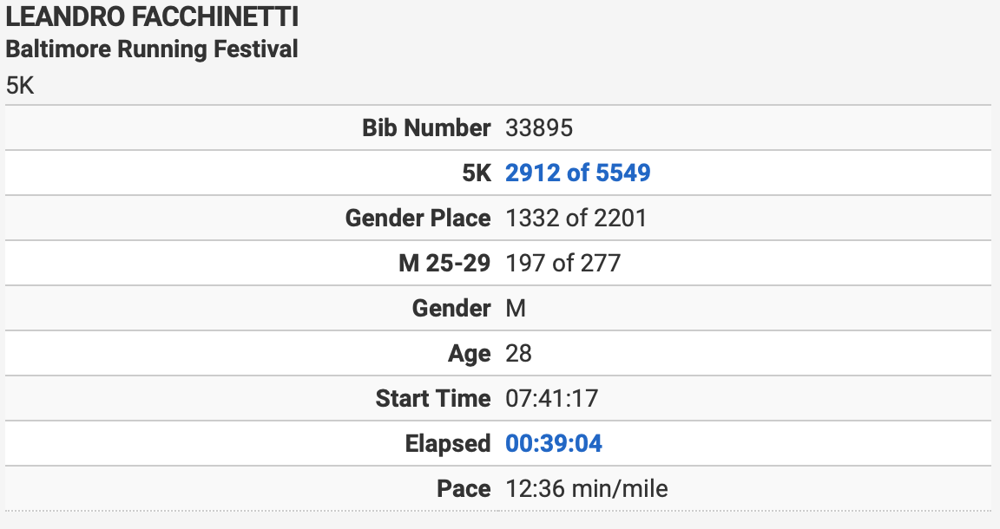
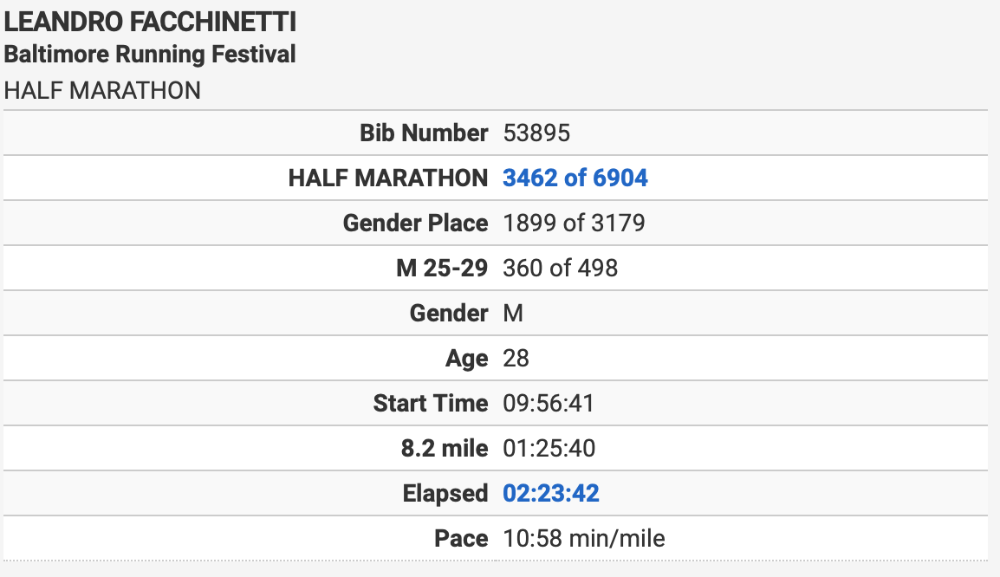
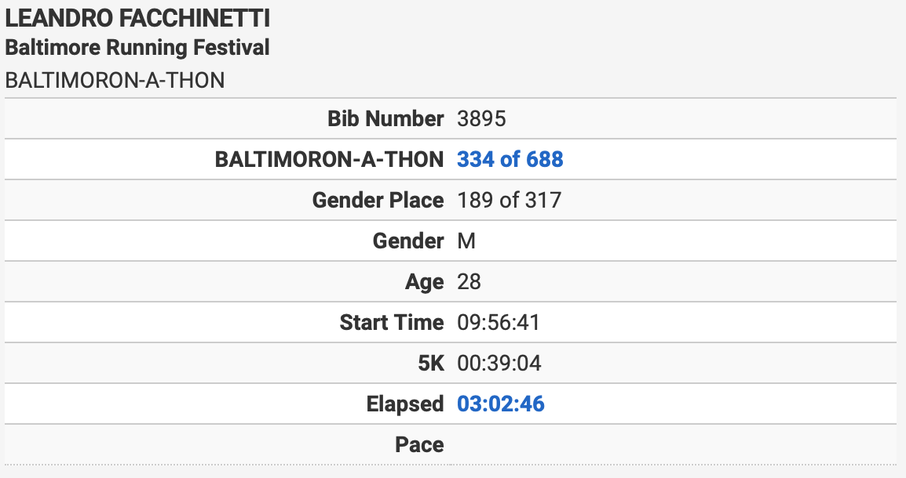

<figure markdown="1">
{:width="300"}
</figure>

I’m a PhD candidate in Computer Science, at [The Programming Languages Laboratory](https://pl.cs.jhu.edu), at the [Johns Hopkins University](https://jhu.edu), advised by [Dr. Scott Smith](https://www.cs.jhu.edu/~scott/).

I’m interested in writing & reading, music & video production, running, mindfulness, minimalism, and veganism.

I live in Baltimore, Maryland, United States.

# News

**2019-10:** I ran on [Baltimore Running Festival](https://www.thebaltimoremarathon.com). I ran a 5K followed by a half-marathon, in the so-called Baltimoron-a-thon.

See my Times

{:width="576"}

{:width="577"}

{:width="577"}

**2019-09:** I started teaching [Object-Oriented Software Engineering](https://www.jhu-oose.com) at the Johns Hopkins University.

**2019-07:** My paper [_Higher-order Demand-driven Program Analysis_](https://dl.acm.org/citation.cfm?id=3310340) was published on the ACM Transactions on Programming Languages and Systems (TOPLAS).

**2019-06:** I made public the repository in which I’m working on my dissertation: [Yocto-CFA](https://github.com/leafac/yocto-cfa).

# Articles

[A Minimal LaTeX Dissertation Template (for the Johns Hopkins University)](/a-minimal-latex-dissertation-template-for-the-johns-hopkins-university)

[Understanding the Type of `call/cc`](/understanding-the-type-of-call-cc)

[Playing the Game with PLT Redex](/playing-the-game-with-plt-redex)

[Email Migration: The Ultimate Solution to a Ridiculous Problem](/email-migration)

# [Songs](/songs)

# Contact

<me@leafac.com> · <leandro@jhu.edu>

# [Curriculum Vitae](/curriculum-vitae)
