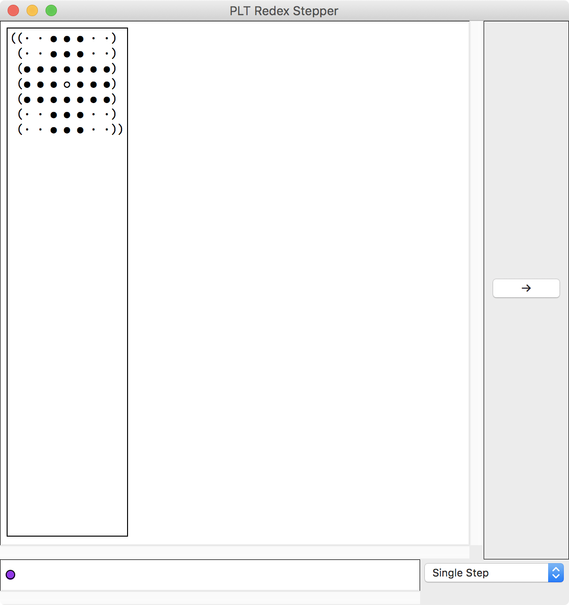
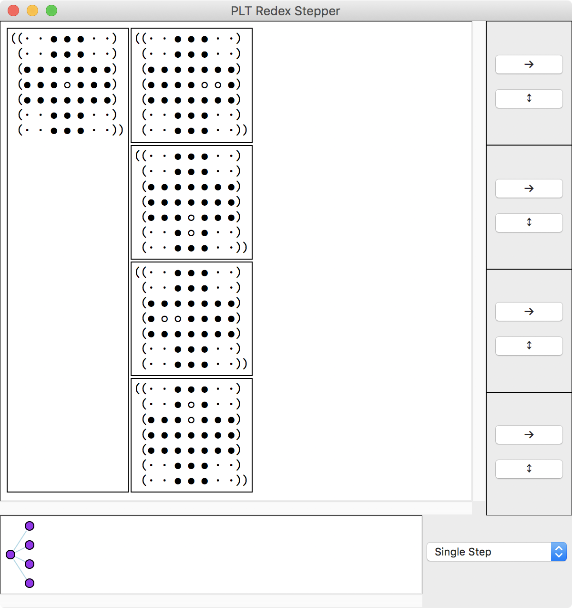
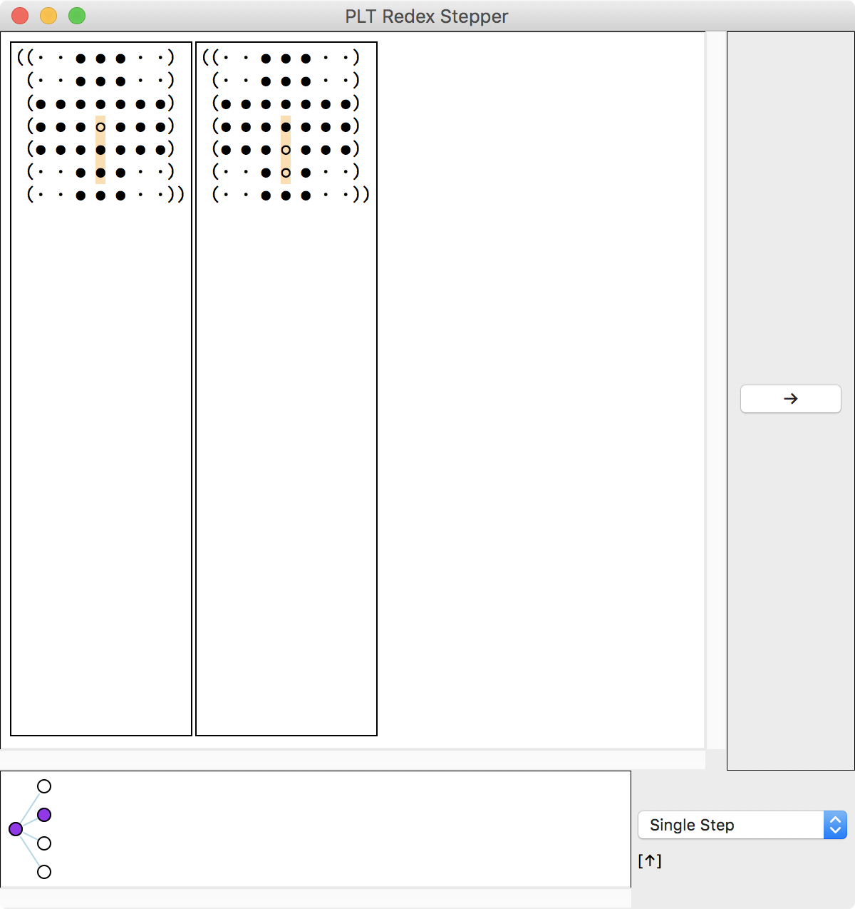
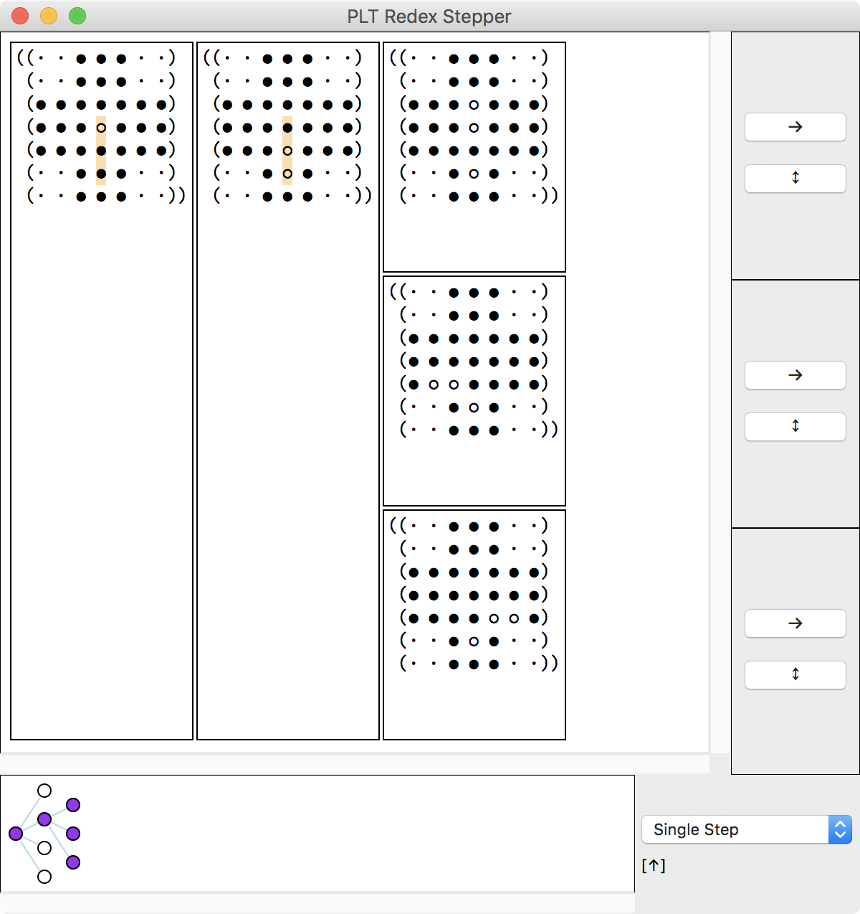
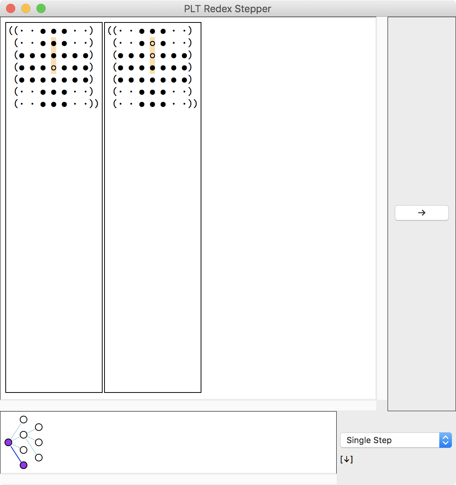
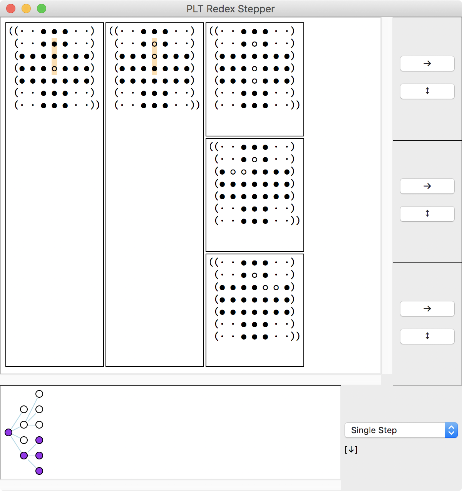
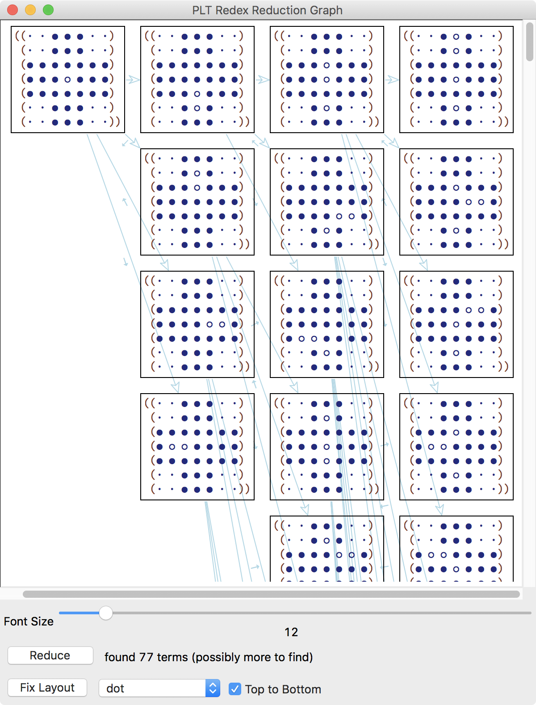
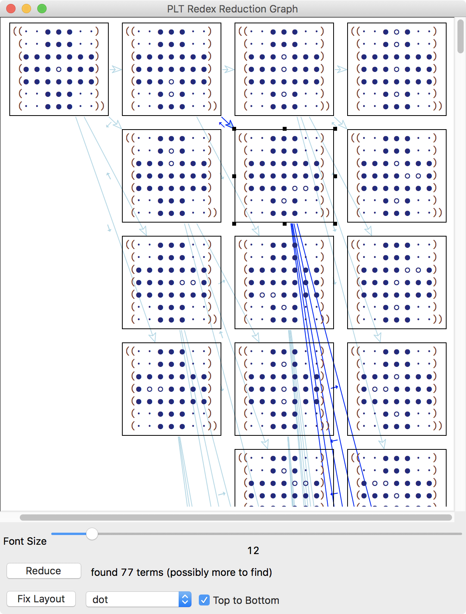

Playing the Game with PLT Redex
===============================
{:.no_toc}

**Pre-requisites:** Functional programming with pattern matching, and the basics of [Racket](https://docs.racket-lang.org/quick/index.html).  
Download the [code](playing-the-game-with-plt-redex.zip) and follow along in [DrRacket](https://racket-lang.org).

Table of Contents
=================
{:.no_toc}

1. TOC
{:toc}

Abstract
========

[PLT Redex](https://redex.racket-lang.org/) is a tool for modeling programming languages, operational semantics, type systems, program analyses, and so forth. It is designed after the notation established by research papers, and the existing [educational material](#related-work) for PLT Redex targets experienced programming-language researchers. But when I started to learn PLT Redex, I was new to the field, so I struggled *both* with the research papers *and* with the education material. Through the struggle, I noticed that this was a two-way street: reading papers helped me to understand PLT Redex, but perhaps more importantly, understanding PLT Redex helped me to read papers. I became more fluent in the notation, and could implement the theory in the papers more easily. PLT Redex was lowering the cost of experimenting, and supporting the most effective kind of reading: *active* reading.

<figure>

<figcaption markdown="1">
The virtuous cycle between knowing PLT Redex and reading papers.
</figcaption>
</figure>

With time, I realized that there is no *magic* in PLT Redex—it is just functional programming with pattern matching. I wish someone had told me that without bringing up Greek letters and jargon, and this is what I want to do to fellow programmers who are trying to break into programming-language theory. I write this article from the other side of the bump hoping to smooth the path for those that follow.

We will (ab)use PLT Redex to play a game of [Peg Solitaire](https://en.wikipedia.org/wiki/Peg_solitaire). Through this simple board game we will explore functional programming, pattern matching, contract verification, nondeterministic computation, visualization, typesetting, test generation, and so forth. This is a fun exercise of repurposing a tool for a task beyond its intended design, and it is a first step toward the virtuous cycle between knowing PLT Redex and reading papers.

We begin with [the minimum to go from nothing to playing the game as quickly as possible](#introduction). We then start over and redo everything, going into more detail. We model Peg Solitaire elements (for example, pegs and boards) as [terms](#terms) and [match them against patterns](#pattern-matching). We formalize the notion of which terms represent Peg Solitaire elements with a [language](#languages) and define [metafunctions](#metafunctions) on this language. We model moves and the winning condition in Peg Solitaire with forms capable of nondeterministic computation: [reduction relations](#reduction-relations), [predicate relations](#predicate-relations), and [judgment forms](#judgment-forms). We play the game with the [visualization tools](#visualization). We glance at [other features](#other-features), including test generation and typesetting. Finally, we discuss [limitations](#limitations) and [related work](#related-work), and [conclude](#conclusion).


Introduction
============

Peg Solitaire is a single-player board game that starts with the following board (in the most common American version, which is the version we’ll use in this article):

<figure markdown="1">
<figcaption markdown="1">
Initial Board
</figcaption>
```
    ● ● ●
    ● ● ●
● ● ● ● ● ● ●
● ● ● ○ ● ● ●
● ● ● ● ● ● ●
    ● ● ●
    ● ● ●


●  Peg
○  Space
```
</figure>

With each move, a peg can jump over one of its four immediate neighbors and land on a space. The neighbor peg that was jumped over is removed from the board. For example, the following are the four possible starting moves:

<figure markdown="1">
<figcaption markdown="1">
Examples of Valid Moves (Starting Moves)
</figcaption>
<pre>
    ● ● ●             ● ● ●
    ● <ins>●</ins> ●             ● ○ ●
● ● ● <del>●</del> ● ● ●     ● ● ● <del>○</del> ● ● ●
● ● ● ○ ● ● ●  ➡  ● ● ● <ins>●</ins> ● ● ●
● ● ● ● ● ● ●     ● ● ● ● ● ● ●
    ● ● ●             ● ● ●
    ● ● ●             ● ● ●

    ● ● ●             ● ● ●
    ● ● ●             ● ● ●
● ● ● ● ● ● ●     ● ● ● ● ● ● ●
● ● ● ○ <del>●</del> <ins>●</ins> ●  ➡  ● ● ● <ins>●</ins> <del>○</del> ○ ●
● ● ● ● ● ● ●     ● ● ● ● ● ● ●
    ● ● ●             ● ● ●
    ● ● ●             ● ● ●

    ● ● ●             ● ● ●
    ● ● ●             ● ● ●
● ● ● ● ● ● ●     ● ● ● ● ● ● ●
● ● ● ○ ● ● ●  ➡  ● ● ● <ins>●</ins> ● ● ●
● ● ● <del>●</del> ● ● ●     ● ● ● <del>○</del> ● ● ●
    ● <ins>●</ins> ●             ● ○ ●
    ● ● ●             ● ● ●

    ● ● ●             ● ● ●
    ● ● ●             ● ● ●
● ● ● ● ● ● ●     ● ● ● ● ● ● ●
● <ins>●</ins> <del>●</del> ○ ● ● ●  ➡  ● ○ <del>○</del> <ins>●</ins> ● ● ●
● ● ● ● ● ● ●     ● ● ● ● ● ● ●
    ● ● ●             ● ● ●
    ● ● ●             ● ● ●


<ins>●</ins> jumps over <del>●</del>
</pre>
</figure>

The following are examples of *invalid moves*:

- A peg cannot jump diagonally:

  <pre>
      ○ ○ ○             ○ ○ ○
      ○ ○ ○             ○ ○ ○
  ○ <ins>●</ins> ○ ○ ○ ○ ○  ✗  ○ ○ ○ ○ ○ ○ ○
  ○ ○ <del>●</del> ○ ○ ○ ○  ➡  ○ ○ <del>○</del> ○ ○ ○ ○
  ○ ○ ○ ○ ○ ○ ○     ○ ○ ○ <ins>●</ins> ○ ○ ○
      ○ ○ ○             ○ ○ ○
      ○ ○ ○             ○ ○ ○
  </pre>

- A peg cannot jump beyond its neighbor:

  <pre>
      ○ ○ ○             ○ ○ ○
      ○ ○ ○             ○ ○ ○
  ○ ○ ○ ○ ○ ○ ○  ✗  ○ ○ ○ ○ ○ ○ ○
  ○ <ins>●</ins> <del>●</del> ○ ○ ○ ○  ➡  ○ ○ <del>○</del> ○ <ins>●</ins> ○ ○
  ○ ○ ○ ○ ○ ○ ○     ○ ○ ○ ○ ○ ○ ○
      ○ ○ ○             ○ ○ ○
      ○ ○ ○             ○ ○ ○
  </pre>

- A peg cannot jump over multiple neighbors:

  <pre>
      ○ ○ ○             ○ ○ ○
      ○ ○ ○             ○ ○ ○
  ○ ○ ○ ○ ○ ○ ○  ✗  ○ ○ ○ ○ ○ ○ ○
  ○ <ins>●</ins> <del>●</del> <del>●</del> ○ ○ ○  ➡  ○ ○ <del>○</del> <del>○</del> <ins>●</ins> ○ ○
  ○ ○ ○ ○ ○ ○ ○     ○ ○ ○ ○ ○ ○ ○
      ○ ○ ○             ○ ○ ○
      ○ ○ ○             ○ ○ ○
  </pre>

The goal of Peg Solitaire is to leave a single peg on the board, for example:

<figure markdown="1">
<figcaption markdown="1">
Example of Winning Board
</figcaption>
```
    ○ ○ ○
    ○ ○ ○
○ ○ ○ ○ ○ ○ ○
○ ○ ○ ● ○ ○ ○
○ ○ ○ ○ ○ ○ ○
    ○ ○ ○
    ○ ○ ○
```
</figure>

The following is an example of a lost game in which two pegs remain on the board, but they are not neighbors, so there are no moves left:

<figure markdown="1">
<figcaption markdown="1">
Example of Losing Board
</figcaption>
```
    ○ ○ ○
    ○ ○ ○
○ ○ ○ ● ○ ○ ○
○ ○ ○ ○ ○ ○ ○
○ ○ ○ ○ ○ ● ○
    ○ ○ ○
    ○ ○ ○
```
</figure>

Prototype
---------

Our first implementation is the bare minimum to play the game. Over the course of the next sections we revisit the corners we cut and dive deeper into each topic.

We start by requiring PLT Redex:

<figure markdown="1">
<figcaption markdown="1">
`introduction.rkt`
</figcaption>
```racket-no-highlight
#lang racket
(require redex)
```
</figure>

Most PLT Redex forms work over [languages](#languages), so we define a language for Peg Solitaire:

```racket-no-highlight
(define-language peg-solitaire)
```

The `peg-solitaire` language is analog to a programming language, for example, Racket or Ruby. Programs and program fragments in these programming languages are called [*terms*](#terms), for example, the following are terms in Racket:

<figure markdown="1">
<figcaption markdown="1">
Example of Term: Complete Program
</figcaption>
```racket-no-highlight
(define favorite-number 5)
```
</figure>

<figure markdown="1">
<figcaption markdown="1">
Example of Term: Fragment of Program Above (which also happens to be a complete Racket program)
</figcaption>
```racket-no-highlight
5
```
</figure>

In the `peg-solitaire` language, however, terms are not programs and program fragments, but Peg Solitaire entities, for example, pegs and boards. From PLT Redex’s perspective, programs are data structures, and we abuse this notion to represent Peg Solitaire entities. (The idea that programs are data structures isn’t unique to PLT Redex; it’s shared by any program that works on other programs, for example, compilers, interpreters, linters, and so forth.) The definition of the `peg-solitaire` language above does not specify the language shape—it does not define which terms represent which Peg Solitaire entities—but it suffices for our prototype (we revisit it in a [later section](#languages)).

Terms in PLT Redex can be any S-expression, including identifiers (symbols), numbers, strings, lists, and so forth. We represent a Peg Solitaire board with a list of lists of positions, each of which may be symbols representing pegs, spaces, and paddings:

<figure markdown="1">
```racket-no-highlight
(define-term initial-board
  ([· · ● ● ● · ·]
   [· · ● ● ● · ·]
   [● ● ● ● ● ● ●]
   [● ● ● ○ ● ● ●]
   [● ● ● ● ● ● ●]
   [· · ● ● ● · ·]
   [· · ● ● ● · ·]))


;; ●  Peg
;; ○  Space
;; ·  Padding
```
<figcaption markdown="1">
The delimiters `()` and `[]` are equivalent in Racket, so we delimit rows with `[]` to improve readability. A padding is represented by a middle dot (`·`), not by a regular dot (`.`).
</figcaption>
</figure>

PLT Redex does not check that the `initial-board` is in the `peg-solitaire` language, so the listing above works despite the definition of the `peg-solitaire` language not specifying what constitutes a board.

To model how a player moves pegs on the board, we use a PLT Redex form called [`reduction-relation`](https://docs.racket-lang.org/redex/The_Redex_Reference.html#%28form._%28%28lib._redex%2Freduction-semantics..rkt%29._reduction-relation%29%29) to define the `⇨` [reduction relation](#reduction-relations). A reduction relation is similar to a function, except that it is *nondeterministic*, possibly returning multiple outputs. We choose to define `⇨` as a reduction relation instead of a regular function because there might be multiple moves for a given input board. We start to define `⇨` as a reduction relation that operates on the `peg-solitaire` language:

<figure markdown="1">
```racket-no-highlight
(define
  ⇨
  (reduction-relation
   peg-solitaire
   ___))
```
<figcaption markdown="1">
Throughout this article, `___` is a placeholder that stands for code we are yet to write.
</figcaption>
</figure>

We then provide one clause for each kind of possible move. For example, for a peg to jump over its right neighbor, we must find a sequence `● ● ○` on the board, and that sequence turns into `○ ○ ●` after the move, while the rest of the board remains the same. We write this as a `reduction-relation` as follows:

```racket-no-highlight
(--> (any_1
      ...
      [any_2 ... ● ● ○ any_3 ...]
      any_4
      ...)
     (any_1
      ...
      [any_2 ... ○ ○ ● any_3 ...]
      any_4
      ...)
     "→")
```

In the listing above, the `-->` form represents one kind of possible move. The first sub-form is a pattern against which the input board is matched, the second sub-form is the template with which to generate the output, and the third sub-form is the name of this kind of move, `→`. The several `any_<n>` preserve the rest of the board around the moved pegs.

We define the other kinds of moves similarly. The following is the complete definition of `⇨`:

```racket-no-highlight
(define
  ⇨
  (reduction-relation
   peg-solitaire

   (--> (any_1
         ...
         [any_2 ... ● ● ○ any_3 ...]
         any_4
         ...)
        (any_1
         ...
         [any_2 ... ○ ○ ● any_3 ...]
         any_4
         ...)
        "→")

   (--> (any_1
         ...
         [any_2 ... ○ ● ● any_3 ...]
         any_4
         ...)
        (any_1
         ...
         [any_2 ... ● ○ ○ any_3 ...]
         any_4
         ...)
        "←")

   (--> (any_1
         ...
         [any_2 ..._n ● any_3 ...]
         [any_4 ..._n ● any_5 ...]
         [any_6 ..._n ○ any_7 ...]
         any_8
         ...)
        (any_1
         ...
         [any_2 ...   ○ any_3 ...]
         [any_4 ...   ○ any_5 ...]
         [any_6 ...   ● any_7 ...]
         any_8
         ...)
        "↓")

   (--> (any_1
         ...
         [any_2 ..._n ○ any_3 ...]
         [any_4 ..._n ● any_5 ...]
         [any_6 ..._n ● any_7 ...]
         any_8
         ...)
        (any_1
         ...
         [any_2 ...   ● any_3 ...]
         [any_4 ...   ○ any_5 ...]
         [any_6 ...   ○ any_7 ...]
         any_8
         ...)
        "↑")))
```

Playing
-------

PLT Redex features [visualization](#visualization) tools, including a [`stepper`](https://docs.racket-lang.org/redex/The_Redex_Reference.html#%28def._%28%28lib._redex%2Fgui..rkt%29._stepper%29%29), which we use to play Peg Solitaire:

```racket-no-highlight
(stepper ⇨ (term initial-board))
```

<figure markdown="1">
{:width="600"}
<figcaption markdown="1">
Playing Peg Solitaire with PLT Redex’s stepper. The main pane shows the board over time, with pegs that changed on the last move highlighted. The bottom pane shows in purple the path we have taken, and white nodes are alternative paths with different moves, for example, jumping right instead of left.
</figcaption>
</figure>

On the following sections we revisit each step of modeling Peg Solitaire in PLT Redex in more detail, starting with [terms](#terms).

Terms
=====

At a high level, PLT Redex is a tool for manipulating and visualizing S-expressions (identifiers, numbers, strings, lists, and so forth), which PLT Redex calls *terms*. In programming languages, terms represent programs and program fragments, types, machine states, and so forth. In Peg Solitaire, terms represent pegs, boards, and so forth. We use the [`term`](https://docs.racket-lang.org/redex/The_Redex_Reference.html#%28form._%28%28lib._redex%2Freduction-semantics..rkt%29._term%29%29) form to construct terms from Racket values, for example:

<figure markdown="1">
<figcaption markdown="1">
`terms.rkt`
</figcaption>
```racket-no-highlight
#lang racket
(require redex)

(test-equal (term 0)
            0)
(test-equal (term "a")
            "a")
(test-equal (term a)
            'a)
```
<figcaption markdown="1">
PLT Redex includes a testing framework with the [`(test-equal e₁ e₂)`](https://docs.racket-lang.org/redex/The_Redex_Reference.html#%28form._%28%28lib._redex%2Freduction-semantics..rkt%29._test-equal%29%29) form, which we use to indicate that `e₁` evaluates to `e₂`.
</figcaption>
</figure>

We represent pegs with `●` and spaces with `○`:

```racket-no-highlight
(test-equal (term ●)
            '●)
(test-equal (term ○)
            '○)
```

We can group pegs and spaces together in lists:

```racket-no-highlight
(test-equal (term (● ● ○))
            '(● ● ○))
```

We can assign terms to names in PLT Redex with the [`define-term`](https://docs.racket-lang.org/redex/The_Redex_Reference.html#%28form._%28%28lib._redex%2Freduction-semantics..rkt%29._define-term%29%29) form. We can then refer to these names in other terms:

```racket-no-highlight
(define-term a-peg ●)
(test-equal (term a-peg)
            '●)
```

We represent a Peg Solitaire board as a list of rows; a row as a list of positions; and a position as either a peg (`●`), a space (`○`) or a padding (`·`). We choose this representation because it is visually appealing, but it is not the only possibility. For example, we could represent pegs as 1s and spaces as 0s, in which case the whole board would be a just a (binary) number. The following are examples of boards:

<figure markdown="1">
```racket-no-highlight
(define-term example-board-1
  ([· · ● ● ● · ·]
   [· · ● ● ○ · ·]
   [● ○ ● ○ ● ● ●]
   [● ● ● ○ ○ ○ ●]
   [● ○ ● ● ● ● ●]
   [· · ● ○ ● · ·]
   [· · ● ● ● · ·]))

(define-term example-board-2
  ([· · ● ○ ● · ·]
   [· · ● ● ○ · ·]
   [● ○ ● ○ ● ● ●]
   [● ● ● ○ ○ ○ ●]
   [● ○ ● ● ○ ● ●]
   [· · ● ○ ● · ·]
   [· · ○ ● ● · ·]))
```
<figcaption markdown="1">
The delimiters `()` and `[]` are equivalent in Racket, so we delimit rows with `[]` to improve readability. A padding is represented by a middle dot (`·`), not by a regular dot (`.`).
</figcaption>
</figure>

The following is the initial board:

```racket-no-highlight
(define-term initial-board
  ([· · ● ● ● · ·]
   [· · ● ● ● · ·]
   [● ● ● ● ● ● ●]
   [● ● ● ○ ● ● ●]
   [● ● ● ● ● ● ●]
   [· · ● ● ● · ·]
   [· · ● ● ● · ·]))
```

And the following is an example of a winning board:

```racket-no-highlight
(define-term example-winning-board
  ([· · ○ ○ ○ · ·]
   [· · ○ ○ ○ · ·]
   [○ ○ ○ ○ ○ ○ ○]
   [○ ○ ○ ● ○ ○ ○]
   [○ ○ ○ ○ ○ ○ ○]
   [· · ○ ○ ○ · ·]
   [· · ○ ○ ○ · ·]))
```

We will use these boards for testing in later sections, so we [`provide`](https://docs.racket-lang.org/guide/module-provide.html) them here:

```racket-no-highlight
(provide example-board-1 example-board-2
         initial-board example-winning-board)
```

Next, we explore the most common operation on terms, [pattern matching](#pattern-matching).

Pattern Matching
================

Pattern matching is the foundation of all the PLT Redex forms we will explore in the later sections. Pattern matching has two purposes: to verify whether a term matches a pattern, and to assign names to the parts that were matched. To experiment with pattern matching, we must first define a language, but to define a language we must first understand pattern matching. We solve this conundrum the same way we solved it in the [Introduction](#introduction): by defining a dummy empty language, which we will revisit in the [next section](#languages):

<figure markdown="1">
<figcaption markdown="1">
`pattern-matching.rkt`
</figcaption>
```racket-no-highlight
#lang racket
(require redex "terms.rkt")

(define-language peg-solitaire)
```
</figure>

We verify whether a term matches a pattern with the [`redex-match?`](https://docs.racket-lang.org/redex/The_Redex_Reference.html#%28form._%28%28lib._redex%2Freduction-semantics..rkt%29._redex-match~3f%29%29) form:

```racket-no-highlight
(redex-match? <language> <pattern> <term>)
```

The simplest kind of pattern is a literal term, for example:

```racket-no-highlight
(test-equal (redex-match? peg-solitaire ●
                          (term         ●))
            #t)
(test-equal (redex-match? peg-solitaire (● ● ○)
                          (term         (● ● ○)))
            #t)
```

For example, the listing above shows that the pattern `●` matches the term `(term ●)`.

The Underscore (`_`) and the `any` Patterns
-------------------------------------------

The [underscore pattern](https://docs.racket-lang.org/redex/The_Redex_Reference.html#%28tech.__%29) (`_`) means “anything” (similar to the dot (`.`) in regular expressions). For example:

```racket-no-highlight
(test-equal (redex-match? peg-solitaire _
                          (term         ●))
            #t)
(test-equal (redex-match? peg-solitaire (_ ● ○)
                          (term         (● ● ○)))
            #t)
(test-equal (redex-match? peg-solitaire (_ _ ○)
                          (term         (● ● ○)))
            #t)
(test-equal (redex-match? peg-solitaire (_ _ _)
                          (term         (● ● ○)))
            #t)
(test-equal (redex-match? peg-solitaire _
                          (term         (● ● ○)))
            #t)
```

In the listing above, the underscore pattern (`_`) can match either the elements in the list, or the whole list (last example). Another pattern that matches anything is the [`any`](https://docs.racket-lang.org/redex/The_Redex_Reference.html#%28tech._any%29) pattern, for example:

```racket-no-highlight
(test-equal (redex-match? peg-solitaire (any ● ○)
                          (term         (●   ● ○)))
            #t)
```

But the underscore pattern (`_`) and the `any` pattern are not equivalent, because only the latter introduces names. In the next sections we will explore forms in which patterns not only recognize terms, but also name the fragments that were matched, so we can use them to build other terms. These names are similar to the ones we defined with `define-term` in the [previous section](#terms), but they are available only within the forms containing the pattern.

We can observe the names a pattern introduces with the [`redex-match`](https://docs.racket-lang.org/redex/The_Redex_Reference.html#%28form._%28%28lib._redex%2Freduction-semantics..rkt%29._redex-match%29%29) form, which is similar to the `redex-match?` form but returns the introduced names instead of just whether the pattern matched or not:

<figure markdown="1">
```racket-no-highlight
> (redex-match peg-solitaire (_ ● ○)
               (term         (● ● ○)))
(list (match '()))

> (redex-match peg-solitaire (any ● ○)
               (term         (●   ● ○)))
(list (match (list (bind 'any '●))))
```
<figcaption markdown="1">
The `>` before a form denotes an interaction with the [REPL](https://docs.racket-lang.org/guide/intro.html#%28tech._repl%29), as opposed to a definition.
</figcaption>
</figure>

In the first interaction, no names are introduced, as indicated by the empty list `'()`, and in the second interaction the name `any` is associated with the matched fragment `●`. This is the output in more detail:

```racket-no-highlight
(list⁶ (match⁵ (list⁴ (bind³ 'any¹ '●²))))
```

1. `any`: The name in the pattern.
2. `●`: The term that was matched by `any`.
3. `bind`: The [binding data structure](https://docs.racket-lang.org/redex/The_Redex_Reference.html#%28def._%28%28lib._redex%2Freduction-semantics..rkt%29._bind%29%29) representing the association between the name and the term.
4. `list`: There might be multiple bindings in a pattern.
5. `match`: The [matching data structure](https://docs.racket-lang.org/redex/The_Redex_Reference.html#%28def._%28%28lib._redex%2Freduction-semantics..rkt%29._match~3f%29%29) representing one way to match the term with the pattern.
6. `list`: There might be multiple ways to match a term with a pattern.

Both the underscore (`_`) and the `any` patterns may appear multiple times in a pattern. When introducing the underscore pattern above, we saw that multiple uses of the underscore in the same pattern may match different fragments, for example, the pattern `(_ _ _)` matches the term `(● ● ○)`, so `_` corresponds to `●` *and* `○`. But the `any` pattern assigns a name to the fragment it matches, so if it appears multiple times in a pattern, it must match the same fragment every time, for example:

```racket-no-highlight
(test-equal (redex-match? peg-solitaire (any any ○)
                          (term         (●   ●   ○)))
            #t)
(test-equal (redex-match? peg-solitaire (any ●   any)
                          ;                      ≠
                          (term         (●   ●   ○)))
            #f)
```

The second pattern in the listing above does not match (note the `#f`) because the `any` name cannot be associated with `●` and `○` at the same time.

A pattern may include multiple `any`s that associate with different terms by adding a suffix, `any_<suffix>`, for example:

```racket-no-highlight
(test-equal (redex-match? peg-solitaire (any_1 any_2 any_3)
                          (term         (●     ●     ○)))
            #t)


> (redex-match peg-solitaire (any_1 any_2 any_3)
               (term         (●     ●     ○)))
(list (match (list (bind 'any_1 '●) (bind 'any_2 '●) (bind 'any_3 '○))))
```

Each `any_<suffix>` was associated with a different term.

We can require that the first and second list elements are the same, but allow the third to differ by using `any_1` twice, for example:

```racket-no-highlight
(test-equal (redex-match? peg-solitaire (any_1 any_1 any_2)
                          (term         (●     ●     ○)))
            #t)


> (redex-match peg-solitaire (any_1 any_1 any_2)
               (term         (●     ●     ○)))
(list (match (list (bind 'any_1 '●) (bind 'any_2 '○))))
```

Using different suffixes allows patterns to match different terms, but does not require them to be different, for example:

```racket-no-highlight
(test-equal (redex-match? peg-solitaire (any_1 any_1 any_2)
                          (term         (●     ●     ●)))
            #t)


> (redex-match peg-solitaire (any_1 any_1 any_2)
               (term         (●     ●     ●)))
(list (match (list (bind 'any_1 '●) (bind 'any_2 '●))))
```

The pattern does not match if the two occurrences of `any_1` are different, for example:

```racket-no-highlight
(test-equal (redex-match? peg-solitaire (any_1 any_1 any_2)
                          ;                    ≠
                          (term         (●     ○     ○)))
            #f)
```

Ellipses
--------

We can match a sequence of terms using [ellipsis](https://docs.racket-lang.org/redex/The_Redex_Reference.html#%28tech._pattern._sequence%29) (`...`), which means “zero or more of the previous pattern” (similar to the Kleene star (`*`) in regular expressions). For example:

```racket-no-highlight
(test-equal (redex-match? peg-solitaire (any ...)
                          (term         (● ● ○)))
            #t)


> (redex-match peg-solitaire (any ...)
               (term         (● ● ○)))
(list (match (list (bind 'any '(● ● ○)))))
```

In the listing above the name `any` was associated with the sequence `● ● ○`.

A pattern may match a term in multiple ways when it includes multiple ellipses, for example:

```racket-no-highlight
(test-equal (redex-match? peg-solitaire (any_1 ... any_2 ...)
                          (term         (● ● ○)))
            #t)


> (redex-match peg-solitaire (any_1 ... any_2 ...)
               (term         (● ● ○)))
(list
 (match (list (bind 'any_1 '()) (bind 'any_2 '(● ● ○))))
 (match (list (bind 'any_1 '(●)) (bind 'any_2 '(● ○))))
 (match (list (bind 'any_1 '(● ●)) (bind 'any_2 '(○))))
 (match (list (bind 'any_1 '(● ● ○)) (bind 'any_2 '()))))
```

Similar to how we suffixed `any`, we can suffix ellipses, `..._<suffix>`, constraining them to match sequences of the same length, for example:

```racket-no-highlight
(test-equal (redex-match? peg-solitaire (any_1 ..._n any_2 ..._n)
                          (term         (● ●         ○ ●)))
            #t)


> (redex-match peg-solitaire (any_1 ..._n any_2 ..._n)
               (term         (● ●         ○ ●)))
(list (match (list (bind 'any_1 '(● ●)) (bind 'any_2 '(○ ●)))))


(test-equal (redex-match? peg-solitaire (any_1 ..._n any_2 ..._n)
                          ;                ≠
                          (term         (● ● ○)))
            #f)
```

In the listing above, the first pattern matches because it can divide the term into two sequences of the same length and satisfy the `..._n` constraint. But the last pattern does not match because there is no way to divide a 3-element list into two sequences of the same length. Ellipses with different suffixes may match sequences of different lengths, for example:

```racket-no-highlight
(test-equal (redex-match? peg-solitaire (any_1 ..._n any_2 ..._m)
                          (term         (● ● ○)))
            #t)
```

In the listing above ellipses can match sequences of different lengths because they have different suffixes (which in this case is equivalent to not suffixing the ellipses).

Finally, we can nest ellipses, and they still mean “zero or more of the previous pattern,” even if this pattern contains ellipses itself. With this, we can define a pattern that matches the `initial-board` from the [previous section](#terms):

<figure markdown="1">
```racket-no-highlight
(test-equal (redex-match? peg-solitaire
                          ([· ... ● ... ○ ... ● ... · ...]
                           ...)
                          (term initial-board))
            #t)
```
<figcaption markdown="1">
This is not the *only* pattern that matches the `initial-board` (for example, the `any` pattern and the underscore pattern (`_`) match it as well), but it is a more strict pattern.
</figcaption>
</figure>

The pattern fragment `[· ... ● ... ○ ... ● ... · ...]` means “a sequence of zero or more paddings (`·`), followed by a sequence of zero or more pegs (`●`), followed by a sequence of zero or more spaces (`○`), followed by a sequence of zero or more pegs (`●`), followed by a sequence of zero or more paddings (`·`).” This matches a single row of the initial board, regardless of whether it is the first row, `[· · ● ● ● · ·]` (which includes paddings but no spaces), or the fourth row, `[● ● ● ○ ● ● ●]` (which includes a space but no paddings). The pattern fragment `([___] ...)` means “zero or more rows.”

Next, we use pattern matching to define the shape of terms that represent Peg Solitaire elements with a [language](#languages).

Languages
=========

A language defines patterns for terms and gives them names. In programming languages, a language determines which terms are programs and which are not. A language might also include extra machinery, for example, binding and type environments, stores, machine states, and so forth. This extra machinery is invisible to programmers, but is used by an interpreter or a type checker, for example. In general, if terms are data, then languages are the definitions of data structures. They provide names for the patterns we explored in the [previous section](#pattern-matching).

A language for Peg Solitaire must specify the patterns for terms that represent pegs, boards, and so forth. In the previous section, we defined a placeholder language called `peg-solitaire`, using the [`define-language`](https://docs.racket-lang.org/redex/The_Redex_Reference.html#%28form._%28%28lib._redex%2Freduction-semantics..rkt%29._define-language%29%29) form. The specification was empty, because we just wanted enough to allow us to explore pattern matching, so we revisit that language definition now to add names for patterns:

<figure markdown="1">
<figcaption markdown="1">
`languages.rkt`
</figcaption>
```racket-no-highlight
#lang racket
(require redex "terms.rkt")

(define-language peg-solitaire
  [board    ::= (row ...)]
  [row      ::= [position ...]]
  [position ::= peg space padding]
  [peg      ::= ●]
  [space    ::= ○]
  [padding  ::= ·])
```
<figcaption markdown="1">
The `define-language` form specifies a grammar in [BNF](http://matt.might.net/articles/grammars-bnf-ebnf/).
</figcaption>
</figure>

Each line `[<name> ::= <pattern> ...]` assigns a `<name>` to a `<pattern>`, and occurrences of other `<name>`s in `<pattern>` are interpreted accordingly, for example, the name `row` appears in the pattern for `board`. Patterns in the `define-language` form are the only ones in which multiple occurrences of a name can match different terms. For example, if a language includes the line `[pair ::= (position position)]` then `pair` would match the term `(● ○)`. To insist on the same term, suffix the names, for example, `[pair ::= (position_1 position_1)]`. The following is each line of the definition above in more detail:

- `[board    ::= (row ...)]`: A `board` is a list of zero or more `row`s.
- `[row      ::= [position ...]]`: A `row` is a list of zero or more `position`s.
- `[position ::= peg space padding]`: A `position` is either a `peg`, or a `space`, or a `padding`.
- `[peg      ::= ●]`: A `peg` is literally the term `●`. Similarly for `space` and `padding`.

We can use the pattern names (also know as *non-terminals*) when matching terms, for example:

```racket-no-highlight
(test-equal (redex-match? peg-solitaire peg
                          (term         ●))
            #t)
(test-equal (redex-match? peg-solitaire position
                          (term         ●))
            #t)
(test-equal (redex-match? peg-solitaire (peg ● ○)
                          (term         (●   ● ○)))
            #t)
(test-equal (redex-match? peg-solitaire (position ● ○)
                          (term         (●        ● ○)))
            #t)
(test-equal (redex-match? peg-solitaire (position position ○)
                          (term         (●        ●        ○)))
            #t)
```

Multiple occurrences of a name must match the same term, so the following does not match because `position` cannot be `●` and `○` at the same time:

```racket-no-highlight
(test-equal (redex-match? peg-solitaire (position position position)
                          ;                                ≠
                          (term         (●        ●        ○)))
            #f)
```

We can suffix the names to allow them to match to different terms:

```racket-no-highlight
(test-equal (redex-match? peg-solitaire (position_1 position_2 position_3)
                          (term         (●          ●          ○)))
            #t)
```

We can use the `peg-solitaire` language to match the [board examples](#terms):

```racket-no-highlight
(test-equal (redex-match? peg-solitaire board (term example-board-1))
            #t)
(test-equal (redex-match? peg-solitaire board (term example-board-2))
            #t)
(test-equal (redex-match? peg-solitaire board (term initial-board))
            #t)
(test-equal (redex-match? peg-solitaire board (term example-winning-board))
            #t)
```

Our language is too permissive, allowing `board` to match terms we consider ill-formed boards, for example:

```racket-no-highlight
(test-equal (redex-match? peg-solitaire board (term ([● ○]
                                                     [●])))
            #t)
```

The term above does not represent a Peg Solitaire board: it is too small and the rows have different sizes. Yet, the `board` pattern in the `peg-solitaire` language matches it. We could refine the language definition so that it would match *exactly* the terms that represent Peg Solitaire elements, but that would be more complicated and would fail to communicate our intent to our readers. The named patterns we introduced in `peg-solitaire` will serve well for the definitions in the following sections, so this simpler language specification suffices. We will proceed assuming all boards are well-formed, and in a few cases we will even use ill-formed boards on purpose to simplify tests. If more rigor was necessary, we could define a [predicate relation](#predicate-relations) that only holds for well-formed boards, and test the inputs to the forms we will define in later sections.

We will use the `peg-solitaire` language in later sections, so we `provide` it here:

```racket-no-highlight
(provide peg-solitaire)
```

Now that we have a language, we can operate on terms. On the next section, we cover the most familiar operation, the [metafunction](#metafunctions).

Metafunctions
=============

From all the PLT Redex forms for manipulating with terms, we begin with the metafunction because it is the most familiar—it is just a function on terms. We define a metafunction with the [`define-metafunction`](https://docs.racket-lang.org/redex/The_Redex_Reference.html#%28form._%28%28lib._redex%2Freduction-semantics..rkt%29._define-metafunction%29%29) form including [patterns](#pattern-matching) that match the input terms, and templates to compute the output terms:

```racket-no-highlight
(define-metafunction <language>
  <contract>
  [(<metafunction> <pattern> ...) <template>]
  ...)
```

- `<language>`: A language as defined in the [previous section](#languages).
- `<contract>`: A contract with patterns for the inputs and outputs of the metafunction. The contract is verified and an error may be raised if the metafunction is called with invalid inputs or produces an invalid output.
- `[(<metafunction> <pattern> ...) <template>]`: A metafunction clause.
- `<metafunction>`: The metafunction name.
- `<pattern>`: Patterns against which the metafunction inputs are matched. Patterns are tried clause by clause in the order they are defined, and the first clause that matches is executed.
- `<template>`: A term that is the output of the metafunction. Names from the `<pattern>` are available in the `<template>`.

A metafunction is similar to [`define/match`](https://docs.racket-lang.org/reference/match.html#%28form._%28%28lib._racket%2Fmatch..rkt%29._define%2Fmatch%29%29) in that it compares the inputs to patterns and executes the first clause that matches. More generally, it is similar to forms for multi-way conditionals, for example, `case` and `cond`.

When we introduced patterns, we noted that they are to terms as regular expressions are to strings, and we used the `redex-match?` form to recognize terms the same way we can use regular expressions to match strings. Continuing that analogy, a metafunction is similar to a search-and-replace with regular expressions including capture groups.

In programming languages, metafunctions are the small utilities, for example, substituting variables for their values (a metafunction generally notated as `program-fragment[variable\value]`), and evaluating primitive operators (a metafunction generally named `δ`).

We define a metafunction to invert a `position`:

<figure markdown="1">
<figcaption markdown="1">
`metafunctions.rkt`
</figcaption>
```racket-no-highlight
#lang racket
(require redex "terms.rkt" "languages.rkt")

(define-metafunction peg-solitaire
  invert/position : position -> position
  [(invert/position peg) ○]
  [(invert/position space) ●]
  [(invert/position padding) padding])
```
<figcaption markdown="1">
This metafunction is only for demonstration—we will not use it for playing Peg Solitaire.
</figcaption>
</figure>

In the listing above, we define the `invert/position` metafunction for the `peg-solitaire` language. Its input and output are `position`s. The `invert/position` metafuction compares the input to each of the patterns in turn: `peg`, `space`, and `padding`. The first pattern that matches determines the metafunction output: `○`, `●`, and `·`, respectively. The last clause exemplifies how a name in the pattern (`padding`) is available in the template.

We use a metafunction by applying it on terms:

<figure markdown="1">
```racket-no-highlight
(test-equal (term (invert/position ●))
            (term ○))
(test-equal (term (invert/position ○))
            (term ●))
(test-equal (term (invert/position ·))
            (term ·))
```
<figcaption markdown="1">
We write `(term (invert/position ●))`, *not* `(invert/position (term ●))`.
</figcaption>
</figure>

We can call a metafunction from any place in which a term might appear, including the definition of another metafunction. To illustrate this, consider the following metafunction that inverts a whole board by calling `invert/position` on each `position`:

```racket-no-highlight
(define-metafunction peg-solitaire
  invert/board : board -> board
  [(invert/board ([position ...] ...))
   ([(invert/position position) ...] ...)])
```

The `invert/board` metafunction matches its input to the pattern `([position ...] ...)`, which represents boards. Its output is the result of calling `invert/position` on each `position`: the ellipses (`...`) after the metafunction call mean “map over the `position`s with the metafunction `invert/position`.” The following is an example of calling the `invert/board` metafunction with the [`initial-board`](#terms):

```racket-no-highlight
(test-equal (term (invert/board initial-board))
            (term ((· · ○ ○ ○ · ·)
                   (· · ○ ○ ○ · ·)
                   (○ ○ ○ ○ ○ ○ ○)
                   (○ ○ ○ ● ○ ○ ○)
                   (○ ○ ○ ○ ○ ○ ○)
                   (· · ○ ○ ○ · ·)
                   (· · ○ ○ ○ · ·))))
```

We defined two metafunctions in this section only for illustration—we do not use them to play the game. But the digression is over, because in the next section we cover [reduction relations](#reduction-relations), which we use to model Peg Solitaire moves.

Reduction Relations
===================

In functions, including [metafunctions](#metafunctions), each input relates to one output. When we enumerate a function, each input appears only once on the left column, for example:

<pre markdown="1">
<strong>position     (invert/position position)</strong>

    ●                     ○
    ○                     ●
    ·                     ·
</pre>

A function (or a method, a procedure, a routine, and so forth) is not a natural way to model moves in Peg Solitaire, because there might be multiple moves available for a given board. If functions were all we had, then we could encode our intent with a `⇨/function` that returned a *set* of output boards, for example:

<pre markdown="1">
<strong>        board                  (⇨/function board)</strong>

(term                         (set
 ([· · ● ● ● · ·]              (term
  [· · ● ● ● · ·]               ([· · ● ● ● · ·]
  [● ● ● ● ● ● ●]                [· · ● ● ● · ·]
  [● ● ● ○ ● ● ●]                [● ● ● ● ● ● ●]
  [● ● ● ● ● ● ●]                [● ○ ○ ● ● ● ●]
  [· · ● ● ● · ·]                [● ● ● ● ● ● ●]
  [· · ● ● ● · ·]))              [· · ● ● ● · ·]
                                 [· · ● ● ● · ·]))

                               (term
                                ([· · ● ● ● · ·]
                                 [· · ● ● ● · ·]
                                 [● ● ● ● ● ● ●]
                                 [● ● ● ● ○ ○ ●]
                                 [● ● ● ● ● ● ●]
                                 [· · ● ● ● · ·]
                                 [· · ● ● ● · ·]))

                               (term
                                ([· · ● ● ● · ·]
                                 [· · ● ○ ● · ·]
                                 [● ● ● ○ ● ● ●]
                                 [● ● ● ● ● ● ●]
                                 [● ● ● ● ● ● ●]
                                 [· · ● ● ● · ·]
                                 [· · ● ● ● · ·]))

                               (term
                                ([· · ● ● ● · ·]
                                 [· · ● ● ● · ·]
                                 [● ● ● ● ● ● ●]
                                 [● ● ● ● ● ● ●]
                                 [● ● ● ○ ● ● ●]
                                 [· · ● ○ ● · ·]
                                 [· · ● ● ● · ·])))

                       ⋮
</pre>

<figure>

<figcaption markdown="1">
On a fork on the road, when multiple clauses include patterns that match the input, a metafunction chooses the first path, while a reduction relation follows them all.
</figcaption>
</figure>

But a function is just a special case of *relation*, which may relate one input to multiple outputs. While all functions are relations, not all relations are functions. When we enumerate a relation that may not be a function, each input may appear on the left column multiple times. For example, we can define a relation called `⇨` to model moves in Peg Solitaire:

<pre markdown="1">
<strong>        board                       (⇨ board)</strong>

(term                          (term
 ([· · ● ● ● · ·]               ([· · ● ● ● · ·]
  [· · ● ● ● · ·]                [· · ● ● ● · ·]
  [● ● ● ● ● ● ●]                [● ● ● ● ● ● ●]
  [● ● ● ○ ● ● ●]                [● ○ ○ ● ● ● ●]
  [● ● ● ● ● ● ●]                [● ● ● ● ● ● ●]
  [· · ● ● ● · ·]                [· · ● ● ● · ·]
  [· · ● ● ● · ·]))              [· · ● ● ● · ·]))

(term                          (term
 ([· · ● ● ● · ·]               ([· · ● ● ● · ·]
  [· · ● ● ● · ·]                [· · ● ● ● · ·]
  [● ● ● ● ● ● ●]                [● ● ● ● ● ● ●]
  [● ● ● ○ ● ● ●]                [● ● ● ● ○ ○ ●]
  [● ● ● ● ● ● ●]                [● ● ● ● ● ● ●]
  [· · ● ● ● · ·]                [· · ● ● ● · ·]
  [· · ● ● ● · ·]))              [· · ● ● ● · ·]))

(term                          (term
 ([· · ● ● ● · ·]               ([· · ● ● ● · ·]
  [· · ● ● ● · ·]                [· · ● ○ ● · ·]
  [● ● ● ● ● ● ●]                [● ● ● ○ ● ● ●]
  [● ● ● ○ ● ● ●]                [● ● ● ● ● ● ●]
  [● ● ● ● ● ● ●]                [● ● ● ● ● ● ●]
  [· · ● ● ● · ·]                [· · ● ● ● · ·]
  [· · ● ● ● · ·]))              [· · ● ● ● · ·]))

(term                          (term
 ([· · ● ● ● · ·]               ([· · ● ● ● · ·]
  [· · ● ● ● · ·]                [· · ● ● ● · ·]
  [● ● ● ● ● ● ●]                [● ● ● ● ● ● ●]
  [● ● ● ○ ● ● ●]                [● ● ● ● ● ● ●]
  [● ● ● ● ● ● ●]                [● ● ● ○ ● ● ●]
  [· · ● ● ● · ·]                [· · ● ○ ● · ·]
  [· · ● ● ● · ·]))              [· · ● ● ● · ·]))

                       ⋮
</pre>

The `⇨` relation models moves in Peg Solitaire more straightforwardly than the `⇨/function` function. The listing above is similar to how we wrote our [examples in the game description](#introduction):

<pre>
    ● ● ●             ● ● ●
    ● <ins>●</ins> ●             ● ○ ●
● ● ● <del>●</del> ● ● ●     ● ● ● <del>○</del> ● ● ●
● ● ● ○ ● ● ●  ➡  ● ● ● <ins>●</ins> ● ● ●
● ● ● ● ● ● ●     ● ● ● ● ● ● ●
    ● ● ●             ● ● ●
    ● ● ●             ● ● ●

    ● ● ●             ● ● ●
    ● ● ●             ● ● ●
● ● ● ● ● ● ●     ● ● ● ● ● ● ●
● ● ● ○ <del>●</del> <ins>●</ins> ●  ➡  ● ● ● <ins>●</ins> <del>○</del> ○ ●
● ● ● ● ● ● ●     ● ● ● ● ● ● ●
    ● ● ●             ● ● ●
    ● ● ●             ● ● ●

    ● ● ●             ● ● ●
    ● ● ●             ● ● ●
● ● ● ● ● ● ●     ● ● ● ● ● ● ●
● ● ● ○ ● ● ●  ➡  ● ● ● <ins>●</ins> ● ● ●
● ● ● <del>●</del> ● ● ●     ● ● ● <del>○</del> ● ● ●
    ● <ins>●</ins> ●             ● ○ ●
    ● ● ●             ● ● ●

    ● ● ●             ● ● ●
    ● ● ●             ● ● ●
● ● ● ● ● ● ●     ● ● ● ● ● ● ●
● <ins>●</ins> <del>●</del> ○ ● ● ●  ➡  ● ○ <del>○</del> <ins>●</ins> ● ● ●
● ● ● ● ● ● ●     ● ● ● ● ● ● ●
    ● ● ●             ● ● ●
    ● ● ●             ● ● ●


<ins>●</ins> jumps over <del>●</del>
</pre>

Most programming languages only support functions, and when we use them, we have to resort to an encoding similar to `⇨/function`, but PLT Redex supports relations that may not be functions, so we can define the `⇨` relation directly. Among the different PLT Redex forms for defining relations, the first we encounter is [`reduction-relation`](https://docs.racket-lang.org/redex/The_Redex_Reference.html#%28form._%28%28lib._redex%2Freduction-semantics..rkt%29._reduction-relation%29%29):

```racket-no-highlight
(reduction-relation
  <language>
  #:domain <pattern>

  (--> <pattern> <template> <name>)
  ...)
```

- `<language>`: A language as defined [previously](#languages).
- `#:domain`: A contract pattern for the inputs and outputs of the reduction relation. The contract is verified and an error may be raised if the reduction relation is applied to an invalid input or produces an invalid output.
- `(--> <pattern> <template> <name>)`: A reduction relation clause.
- `<pattern>`: A pattern for the input.
- `<template>`: A template for the output.
- `<name>`: A name for the clause.

The `reduction-relation` form returns the reduction relation as a value, unlike the other forms we discussed so far that assign names, for example, `define-language` and `define-metafunction`. If we want to assign a name to a reduction relation, we need to use `define`:

```racket-no-highlight
(define <name>
  (reduction-relation ___))
```

The shape of the `reduction-relation` form is similar to that of `define-metafunction`: it is a series of clauses with patterns for the inputs and templates for the outputs. The difference between the two is in how they proceed when multiple clauses match the input: while a metafunction follows the definition order and chooses *the first* clause that matches, a relation chooses *all* clauses. We say metafunctions compute *deterministically*, because an input *determines* exactly one output, while relations may compute *nondeterministically*.

The `⇨` Reduction Relation
--------------------------

The `⇨` reduction relation has four clauses, one for each kind of move. The following is the clause for when a peg jumps over its neighbor on the right:

<figure markdown="1">
```racket-no-highlight
(--> (row_1
      ...
      [position_1 ... ● ● ○ position_2 ...]
      row_2
      ...)
     (row_1
      ...
      [position_1 ... ○ ○ ● position_2 ...]
      row_2
      ...)
     "→")
```
<figcaption markdown="1">
In the [Introduction](#introduction), we wrote this clause using `any` patterns, instead of `row` and `position`, because we had only defined a dummy empty [language](#languages).
</figcaption>
</figure>

In detail:

- `(row_1 ... [position_1 ... ● ● ○ position_2 ...] row_2 ...)`: The pattern to match against the input board. The pattern matches if the board includes a sequence `● ● ○` surrounded by any other `position`s and `row`s, to which we assign the names `position_<n>` and `row_<n>` so that we can reconstruct the board in the template.
- `(row_1 ... [position_1 ... ○ ○ ● position_2 ...] row_2 ...)`: The template to build the board after the move. It changes the sequence `● ● ○` into `○ ○ ●`, and reconstructs the surroundings with the names `position_<n>` and  `row_<n>`.
- `"→"`: The name of the clause.

The clause for when a peg jumps over its neighbor on the left is similar. The clauses for when a peg jumps over its neighbors on the top or bottom follow the same idea, but we must use named ellipses (`..._<suffix>`) to capture the surroundings involving multiple rows. The named ellipses align the sequence of interest (for example, `● ● ○`) in the same column, because it guarantees that the sequence is preceded by the same number of `position`s in each `row`. For example, the following is the rule for when a peg jumps over its neighbor on the bottom:

<figure markdown="1">
```racket-no-highlight
(--> (row_1
      ...
      [position_1 ..._n ● position_2 ...]
      [position_3 ..._n ● position_4 ...]
      [position_5 ..._n ○ position_6 ...]
      row_2
      ...)
     (row_1
      ...
      [position_1 ...   ○ position_2 ...]
      [position_3 ...   ○ position_4 ...]
      [position_5 ...   ● position_6 ...]
      row_2
      ...)
     "↓")
```
<figcaption markdown="1">
The ellipses `<suffix>`es (for example, `_n`) must only appear in the input pattern, not in the output template.
</figcaption>
</figure>

The named ellipses (`..._n`) only match sequences `position_1`, `position_3` and `position_5` of the same length, so the sequence `● ● ○` must appear in the same column. The clause for when a peg jumps over its neighbor on the top is similar, and with it we conclude the definition of `⇨`:

<figure markdown="1">
<figcaption markdown="1">
`reduction-relations.rkt`
</figcaption>
```racket-no-highlight
#lang racket
(require redex "terms.rkt" "languages.rkt")

(define
  ⇨
  (reduction-relation
   peg-solitaire
   #:domain board

   (--> (row_1
         ...
         [position_1 ... ● ● ○ position_2 ...]
         row_2
         ...)
        (row_1
         ...
         [position_1 ... ○ ○ ● position_2 ...]
         row_2
         ...)
        "→")

   (--> (row_1
         ...
         [position_1 ... ○ ● ● position_2 ...]
         row_2
         ...)
        (row_1
         ...
         [position_1 ... ● ○ ○ position_2 ...]
         row_2
         ...)
        "←")

   (--> (row_1
         ...
         [position_1 ..._n ● position_2 ...]
         [position_3 ..._n ● position_4 ...]
         [position_5 ..._n ○ position_6 ...]
         row_2
         ...)
        (row_1
         ...
         [position_1 ...   ○ position_2 ...]
         [position_3 ...   ○ position_4 ...]
         [position_5 ...   ● position_6 ...]
         row_2
         ...)
        "↓")

   (--> (row_1
         ...
         [position_1 ..._n ○ position_2 ...]
         [position_3 ..._n ● position_4 ...]
         [position_5 ..._n ● position_6 ...]
         row_2
         ...)
        (row_1
         ...
         [position_1 ...   ● position_2 ...]
         [position_3 ...   ○ position_4 ...]
         [position_5 ...   ○ position_6 ...]
         row_2
         ...)
        "↑")))
```
</figure>

We can test the `⇨` reduction relation with the [`test-->`](https://docs.racket-lang.org/redex/The_Redex_Reference.html#%28form._%28%28lib._redex%2Freduction-semantics..rkt%29._test--~3e%29%29) form:

```racket-no-highlight
(test--> ⇨ (term initial-board)
         (term
          ([· · ● ● ● · ·]
           [· · ● ● ● · ·]
           [● ● ● ● ● ● ●]
           [● ○ ○ ● ● ● ●]
           [● ● ● ● ● ● ●]
           [· · ● ● ● · ·]
           [· · ● ● ● · ·]))

         (term
          ([· · ● ● ● · ·]
           [· · ● ● ● · ·]
           [● ● ● ● ● ● ●]
           [● ● ● ● ○ ○ ●]
           [● ● ● ● ● ● ●]
           [· · ● ● ● · ·]
           [· · ● ● ● · ·]))

         (term
          ([· · ● ● ● · ·]
           [· · ● ○ ● · ·]
           [● ● ● ○ ● ● ●]
           [● ● ● ● ● ● ●]
           [● ● ● ● ● ● ●]
           [· · ● ● ● · ·]
           [· · ● ● ● · ·]))

         (term
          ([· · ● ● ● · ·]
           [· · ● ● ● · ·]
           [● ● ● ● ● ● ●]
           [● ● ● ● ● ● ●]
           [● ● ● ○ ● ● ●]
           [· · ● ○ ● · ·]
           [· · ● ● ● · ·])))
```

We can also query the `⇨` reduction relation with the [`apply-reduction-relation`](https://docs.racket-lang.org/redex/The_Redex_Reference.html#%28def._%28%28lib._redex%2Freduction-semantics..rkt%29._apply-reduction-relation%29%29) form. The `apply-reduction-relation` form returns a list representing a set of outputs, similar to the `⇨/function` encoding we mentioned above. This is a compromise because PLT Redex has to output an S-expression, which does not include forms for nondeterministic values or sets. We can turn the returned list into a Racket [`set`](https://docs.racket-lang.org/reference/sets.html) with [`list->set`](https://docs.racket-lang.org/reference/sets.html#%28def._%28%28lib._racket%2Fset..rkt%29._list-~3eset%29%29), so the following test is equivalent to the previous one:

```racket-no-highlight
(test-equal (list->set (apply-reduction-relation ⇨ (term initial-board)))
            (set
             (term
              ([· · ● ● ● · ·]
               [· · ● ● ● · ·]
               [● ● ● ● ● ● ●]
               [● ○ ○ ● ● ● ●]
               [● ● ● ● ● ● ●]
               [· · ● ● ● · ·]
               [· · ● ● ● · ·]))

             (term
              ([· · ● ● ● · ·]
               [· · ● ● ● · ·]
               [● ● ● ● ● ● ●]
               [● ● ● ● ○ ○ ●]
               [● ● ● ● ● ● ●]
               [· · ● ● ● · ·]
               [· · ● ● ● · ·]))

             (term
              ([· · ● ● ● · ·]
               [· · ● ○ ● · ·]
               [● ● ● ○ ● ● ●]
               [● ● ● ● ● ● ●]
               [● ● ● ● ● ● ●]
               [· · ● ● ● · ·]
               [· · ● ● ● · ·]))

             (term
              ([· · ● ● ● · ·]
               [· · ● ● ● · ·]
               [● ● ● ● ● ● ●]
               [● ● ● ● ● ● ●]
               [● ● ● ○ ● ● ●]
               [· · ● ○ ● · ·]
               [· · ● ● ● · ·]))))
```

If we use `apply-reduction-relation` repeatedly, feeding one output of an application as the input to the next—something called the *transitive closure* of the reduction relation—then we can use `⇨` relation to compute all possible Peg Solitaire boards. PLT Redex comes with the [`apply-reduction-relation*`](https://docs.racket-lang.org/redex/The_Redex_Reference.html#%28def._%28%28lib._redex%2Freduction-semantics..rkt%29._apply-reduction-relation%2A%29%29) form for this purpose. Unfortunately, there are too many possible boards, so the computation does not terminate in reasonable time:

```racket-no-highlight
> (apply-reduction-relation* ⇨ (term initial-board))
; Runs for too long
```

But we can test `apply-reduction-relation*` on a fragment of the board with a single row, for which the outputs are tractable:

```racket-no-highlight
(test-equal
 (list->set
  (apply-reduction-relation* #:all? #t ⇨ (term ([● ● ● ○ ● ● ●]))))
 (set
  (term ((● ● ● ● ○ ○ ●)))

  (term ((● ● ○ ○ ● ○ ●)))

  (term ((○ ○ ● ○ ● ○ ●)))

  (term ((● ○ ○ ● ● ● ●)))

  (term ((● ○ ● ○ ○ ● ●)))

  (term ((● ○ ● ○ ● ○ ○)))))
```

We can also query just the *final* boards, from which we cannot move further, by omitting the `#:all?` argument:

```racket-no-highlight
(test-equal
 (list->set (apply-reduction-relation* ⇨ (term ([● ● ● ○ ● ● ●]))))
 (set
  (term ((○ ○ ● ○ ● ○ ●)))

  (term ((● ○ ● ○ ● ○ ○)))))
```

The `⇨` relation is enough to play Peg Solitaire using [PLT Redex visualization tools](#visualization), and we will need it in later sections:

```racket-no-highlight
(provide ⇨)
```

But before we return to this and play Peg Solitaire, we explore in the following sections a few other PLT Redex forms for relations that may not be functions, starting with [predicate relations](#predicate-relations).

Predicate Relations
===================

When we looked at [reduction relations](#reduction-relations), we were interested in transforming terms. We defined clauses with patterns to match against inputs, and templates to produce outputs. But in some cases we are only interested in whether the inputs satisfy certain conditions, for example, whether a board is a winning board—that is, whether [it contains a single peg](#introduction). If we were to define that as a reduction relation, then the output templates would be booleans. For this special case, PLT Redex provides the [`define-relation`](https://docs.racket-lang.org/redex/The_Redex_Reference.html#%28form._%28%28lib._redex%2Freduction-semantics..rkt%29._define-relation%29%29) form to define *predicate relations*:

```racket-no-highlight
(define-relation <language>
  <contract>
  [(<relation> <pattern> ...)])
```

- `<language>`: A language as defined [previously](#languages).
- `<contract>`: A contract with a pattern for the inputs of the predicate relation. The contract is verified and an error may be raised if the predicate relation is queried with invalid inputs.
- `[(<relation> <pattern> ...)]`: A predicate relation clause.
- `<relation>`: The predicate relation name.
- `<pattern>`: Pattern against which the predicate relation inputs are compared. If the patterns match, then the predicate relation holds.

Predicate relations typically check whether a program is well formed, whether a type is a subtype of another type, and so forth. We define a predicate relation to check whether a board is a winning board:

<figure markdown="1">
<figcaption markdown="1">
`predicate-relations.rkt`
</figcaption>
```racket-no-highlight
#lang racket
(require redex "terms.rkt" "languages.rkt")

(define-relation peg-solitaire
  winning-board? ⊆ board
  [(winning-board? ([· ... ○ ... · ...]
                    ...
                    [· ... ○ ... ● ○ ... · ...]
                    [· ... ○ ... · ...]
                    ...))])
```
</figure>

The contract `winning-board? ⊆ board` says that the `winning-board?` predicate relation is only defined over boards—it would not make sense to ask this question about terms that are not boards. We use the symbol for subsetting (`⊆`) because only *some* boards are winning boards.

The pattern in the predicate relation clause in more detail:

- `[· ... ○ ... · ...] ...`: Any number of rows without a peg.
- `[· ... ○ ... ● ○ ... · ...]`: A row with a single peg.
- `[· ... ○ ... · ...] ...`: More rows without a peg.

We query the predicate relation by applying it, similar to a [metafunction](#metafunctions):

```racket-no-highlight
(test-equal (term (winning-board? example-board-1))
            #f)
(test-equal (term (winning-board? example-board-2))
            #f)
(test-equal (term (winning-board? initial-board))
            #f)
(test-equal (term (winning-board? example-winning-board))
            #t)
```

The predicate relation only holds for the `example-winning-board`.

We will use the predicate relation `winning-board?` in a [later section](#limitations) when trying to use our model to win Peg Solitaire:

```racket-no-highlight
(provide winning-board?)
```

Next, we cover the most general form of relations that may not be functions: [judgment forms](#judgment-forms).

Judgment Forms
==============

Both [reduction relations](#reduction-relations) and [predicate relations](#predicate-relations) are special forms of *relations*. A reduction relation has one input term and one output term, and a predicate relation only has inputs terms, but in general a relation may have any number of input terms and output terms.

It would be more mathematically accurate to not think of terms in a relation as inputs or outputs, but we make this compromise to make it easier to *compute* with out definitions.

We can define relations in PLT Redex with [`define-judgment-form`](https://docs.racket-lang.org/redex/The_Redex_Reference.html#%28form._%28%28lib._redex%2Freduction-semantics..rkt%29._define-judgment-form%29%29):

```racket-no-highlight
(define-judgment-form <language>
  #:mode (<judgment-form> <I/O> ...)
  #:contract (<judgment-form> <pattern> ...)

  [(<judgment-form> <pattern/template> ...)]
  ...)
```

- `<language>`: A language as defined [previously](#languages).
- `#:mode`: A judgment form may have multiple inputs and outputs, and they all appear as *arguments* to the form. The `#:mode` annotation distinguishes inputs (`I`) from outputs (`O`).
- `#:contract`: A contract with patterns for the arguments of the judgment form. The contract is verified and an error may be raised if the judgment form is queried with invalid inputs or produces invalid outputs.
- `[(<judgment-form> <pattern/template> ...)]`: A judgment form clause.
- `<judgment-form>`: The judgment form name.
- `<pattern/template>`: A pattern for an input or a template for an output.

We can recreate the `⇨` [reduction relation](#reduction-relations) and the `winning-board?` [predicate relation](#predicate-relations) in terms of judgment forms:

<figure markdown="1">
<figcaption markdown="1">
`judgment-forms.rkt`
</figcaption>
```racket-no-highlight
#lang racket
(require redex "terms.rkt" "languages.rkt")

(define-judgment-form peg-solitaire
  #:mode (⇨/judgment-form I O)
  #:contract (⇨/judgment-form board board)

  [(⇨/judgment-form (row_1
                     ...
                     [position_1 ... ● ● ○ position_2 ...]
                     row_2
                     ...)
                    (row_1
                     ...
                     [position_1 ... ○ ○ ● position_2 ...]
                     row_2
                     ...))
   "→"]

  [(⇨/judgment-form (row_1
                     ...
                     [position_1 ... ○ ● ● position_2 ...]
                     row_2
                     ...)
                    (row_1
                     ...
                     [position_1 ... ● ○ ○ position_2 ...]
                     row_2
                     ...))
   "←"]

  [(⇨/judgment-form (row_1
                     ...
                     [position_1 ..._n ● position_2 ...]
                     [position_3 ..._n ● position_4 ...]
                     [position_5 ..._n ○ position_6 ...]
                     row_2
                     ...)
                    (row_1
                     ...
                     [position_1 ...   ○ position_2 ...]
                     [position_3 ...   ○ position_4 ...]
                     [position_5 ...   ● position_6 ...]
                     row_2
                     ...))
   "↓"]

  [(⇨/judgment-form (row_1
                     ...
                     [position_1 ..._n ○ position_2 ...]
                     [position_3 ..._n ● position_4 ...]
                     [position_5 ..._n ● position_6 ...]
                     row_2
                     ...)
                    (row_1
                     ...
                     [position_1 ...   ● position_2 ...]
                     [position_3 ...   ○ position_4 ...]
                     [position_5 ...   ○ position_6 ...]
                     row_2
                     ...))
   "↑"])

(define-judgment-form peg-solitaire
  #:mode (winning-board?/judgment-form I)
  #:contract (winning-board?/judgment-form board)
  [(winning-board?/judgment-form ([· ... ○ ... · ...]
                                  ...
                                  [· ... ○ ... ● ○ ... · ...]
                                  [· ... ○ ... · ...]
                                  ...))])
```
</figure>

We can test whether a judgment holds with the [`test-judgment-holds`](https://docs.racket-lang.org/redex/The_Redex_Reference.html#%28form._%28%28lib._redex%2Freduction-semantics..rkt%29._test-judgment-holds%29%29) form:

```racket-no-highlight
(test-judgment-holds
 (⇨/judgment-form initial-board ([· · ● ● ● · ·]
                                 [· · ● ● ● · ·]
                                 [● ● ● ● ● ● ●]
                                 [● ○ ○ ● ● ● ●]
                                 [● ● ● ● ● ● ●]
                                 [· · ● ● ● · ·]
                                 [· · ● ● ● · ·])))

(test-judgment-holds
 (⇨/judgment-form initial-board ([· · ● ● ● · ·]
                                 [· · ● ● ● · ·]
                                 [● ● ● ● ● ● ●]
                                 [● ● ● ● ○ ○ ●]
                                 [● ● ● ● ● ● ●]
                                 [· · ● ● ● · ·]
                                 [· · ● ● ● · ·])))

(test-judgment-holds
 (⇨/judgment-form initial-board ([· · ● ● ● · ·]
                                 [· · ● ○ ● · ·]
                                 [● ● ● ○ ● ● ●]
                                 [● ● ● ● ● ● ●]
                                 [● ● ● ● ● ● ●]
                                 [· · ● ● ● · ·]
                                 [· · ● ● ● · ·])))

(test-judgment-holds
 (⇨/judgment-form initial-board ([· · ● ● ● · ·]
                                 [· · ● ● ● · ·]
                                 [● ● ● ● ● ● ●]
                                 [● ● ● ● ● ● ●]
                                 [● ● ● ○ ● ● ●]
                                 [· · ● ○ ● · ·]
                                 [· · ● ● ● · ·])))
```

We can also query a judgment form with the [`judgment-holds`](https://docs.racket-lang.org/redex/The_Redex_Reference.html#%28form._%28%28lib._redex%2Freduction-semantics..rkt%29._judgment-holds%29%29) form. The following listing includes tests for both `⇨/judgment-form` and `winning-board?/judgment-form`:

```racket-no-highlight
(test-equal
 (judgment-holds
  (⇨/judgment-form initial-board ([· · ● ● ● · ·]
                                  [· · ● ● ● · ·]
                                  [● ● ● ● ● ● ●]
                                  [● ○ ○ ● ● ● ●]
                                  [● ● ● ● ● ● ●]
                                  [· · ● ● ● · ·]
                                  [· · ● ● ● · ·])))
 #t)

(test-equal
 (judgment-holds
  (⇨/judgment-form initial-board ([· · ● ● ● · ·]
                                  [· · ● ● ● · ·]
                                  [● ● ● ● ● ● ●]
                                  [● ● ● ● ○ ○ ●]
                                  [● ● ● ● ● ● ●]
                                  [· · ● ● ● · ·]
                                  [· · ● ● ● · ·])))
 #t)

(test-equal
 (judgment-holds
  (⇨/judgment-form initial-board ([· · ● ● ● · ·]
                                  [· · ● ○ ● · ·]
                                  [● ● ● ○ ● ● ●]
                                  [● ● ● ● ● ● ●]
                                  [● ● ● ● ● ● ●]
                                  [· · ● ● ● · ·]
                                  [· · ● ● ● · ·])))
 #t)

(test-equal
 (judgment-holds
  (⇨/judgment-form initial-board ([· · ● ● ● · ·]
                                  [· · ● ● ● · ·]
                                  [● ● ● ● ● ● ●]
                                  [● ● ● ● ● ● ●]
                                  [● ● ● ○ ● ● ●]
                                  [· · ● ○ ● · ·]
                                  [· · ● ● ● · ·])))
 #t)

(test-equal
 (judgment-holds (winning-board?/judgment-form example-board-1))
 #f)
(test-equal
 (judgment-holds (winning-board?/judgment-form example-board-2))
 #f)
(test-equal
 (judgment-holds (winning-board?/judgment-form initial-board))
 #f)
(test-equal
 (judgment-holds (winning-board?/judgment-form example-winning-board))
 #t)
```

If we provide a pattern in an output position of the judgment form, then `judgment-holds` makes the names available in a template we provide as the second argument. The result becomes not only whether the relation holds, but the templates built from terms for which it hold. We can convert this resulting list into a set similar to how we did when testing [`apply-reduction-relation`](#reduction-relations):

```racket-no-highlight
(test-equal
 (list->set (judgment-holds (⇨/judgment-form initial-board board) board))
 (set
  (term
   ([· · ● ● ● · ·]
    [· · ● ● ● · ·]
    [● ● ● ● ● ● ●]
    [● ○ ○ ● ● ● ●]
    [● ● ● ● ● ● ●]
    [· · ● ● ● · ·]
    [· · ● ● ● · ·]))

  (term
   ([· · ● ● ● · ·]
    [· · ● ● ● · ·]
    [● ● ● ● ● ● ●]
    [● ● ● ● ○ ○ ●]
    [● ● ● ● ● ● ●]
    [· · ● ● ● · ·]
    [· · ● ● ● · ·]))

  (term
   ([· · ● ● ● · ·]
    [· · ● ○ ● · ·]
    [● ● ● ○ ● ● ●]
    [● ● ● ● ● ● ●]
    [● ● ● ● ● ● ●]
    [· · ● ● ● · ·]
    [· · ● ● ● · ·]))

  (term
   ([· · ● ● ● · ·]
    [· · ● ● ● · ·]
    [● ● ● ● ● ● ●]
    [● ● ● ● ● ● ●]
    [● ● ● ○ ● ● ●]
    [· · ● ○ ● · ·]
    [· · ● ● ● · ·]))))
```

Because `⇨/judgment-form` has mode `I O`, it behaves like a reduction relation, and we can query it with `apply-reduction-relation` and `apply-reduction-relation*` as well:

```racket-no-highlight
(test-equal
 (list->set (apply-reduction-relation ⇨/judgment-form (term initial-board)))
 (set
  (term
   ([· · ● ● ● · ·]
    [· · ● ● ● · ·]
    [● ● ● ● ● ● ●]
    [● ○ ○ ● ● ● ●]
    [● ● ● ● ● ● ●]
    [· · ● ● ● · ·]
    [· · ● ● ● · ·]))

  (term
   ([· · ● ● ● · ·]
    [· · ● ● ● · ·]
    [● ● ● ● ● ● ●]
    [● ● ● ● ○ ○ ●]
    [● ● ● ● ● ● ●]
    [· · ● ● ● · ·]
    [· · ● ● ● · ·]))

  (term
   ([· · ● ● ● · ·]
    [· · ● ○ ● · ·]
    [● ● ● ○ ● ● ●]
    [● ● ● ● ● ● ●]
    [● ● ● ● ● ● ●]
    [· · ● ● ● · ·]
    [· · ● ● ● · ·]))

  (term
   ([· · ● ● ● · ·]
    [· · ● ● ● · ·]
    [● ● ● ● ● ● ●]
    [● ● ● ● ● ● ●]
    [● ● ● ○ ● ● ●]
    [· · ● ○ ● · ·]
    [· · ● ● ● · ·]))))

(test-equal
 (list->set
  (apply-reduction-relation* ⇨/judgment-form (term ([● ● ● ○ ● ● ●]))))
 (set
  (term ((○ ○ ● ○ ● ○ ●)))

  (term ((● ○ ● ○ ● ○ ○)))))
```

When to Use the Different Forms
-------------------------------

At this point, we covered four different ways to operate on terms in PLT Redex: [metafunctions](#metafunctions), [reduction relations](#reduction-relations), [predicate relations](#predicate-relations) and [judgment forms](#judgment-forms). We could solve some of the same problems with more than one of these forms, so we need criteria to choose. It is particularly difficult to choose between a metafunction and a reduction relation when the reduction relation is deterministic. We could leverage the clause order and define a metafunction that is terser than its reduction relation counterpart, for example:

```racket-no-highlight
(define-metafunction L
  [(m <some-kind-of-term>) ___]
  [(m _) ___])

(define r
  (reduction-relation
   (--> <some-kind-of-term> ___)
   (--> <any-other-term> ___)))
```

In the listing above, we can rely on the clause order and use the underscore pattern (`_`) in the second clause of the metafunction `m` to only match terms that are not `<some-kind-of-term>`. When defining `r` as a reduction relation version of `m`, we have to write mutually exclusive clauses and be explicit about what constitutes `<any-other-term>` that is not `<some-kind-of-term>`. If we had used `_` instead of `<any-other-term>`, then the second clause in `r` would always match, even for `<some-kind-of-term>`.

This case arrises often when defining the semantics of a deterministic language, and we could be tempted by the terser definition to prefer a metafunction, resorting to reduction relations only when we need nondeterminism (for example, in `⇨` in Peg Solitaire). But it is a better practice to use reduction relations when defining semantics. First, because it follows the semantic framework on which PLT Redex is built (something called *reduction semantics*), and programming-language researchers expect semantics in this form. Second, because the clause order may hide ambiguities and leave semantic considerations implicit. Third, because it leaves the foundation ready for when it is necessary to introduce nondeterminism in the semantics.

Usually, metafunctions are the auxiliary utilities, for example, to substitute variables for values, calculate the result of primitive operations, and so forth. Reduction relations are better suited for defining semantics. They should *reduce* the terms in the language. The notion of a *reduced* term depends on the language and does not always correspond to a smaller term; in Peg Solitaire, for example, a reduced term is not a smaller board, but one with less pegs. It is also common to use the more general `define-judgment-form` instead of `reduction-relation` when the only difference would be the notation.

Next, we provide the judgment forms defined in this section and we are ready to play Peg Solitaire using PLT Redex [visualization tools](#visualization).

```racket-no-highlight
(provide ⇨/judgment-form winning-board?/judgment-form)
```

Visualization
=============

We use PLT Redex visualization tools to play Peg Solitaire. The `stepper` form runs either the `⇨` [reduction relation](#reduction-relations) or the `⇨/judgment-form` [judgment form](#judgment-forms) on the `initial-board`:

<figure markdown="1">
<figcaption markdown="1">
`visualization.rkt`
</figcaption>
```racket-no-highlight
#lang racket
(require redex "terms.rkt" "reduction-relations.rkt" "judgment-forms.rkt")


> (stepper ⇨ (term initial-board))
> (stepper ⇨/judgment-form (term initial-board))
```
<figcaption markdown="1">
The `stepper` form only works on judgment forms with mode `I O` (for example, `⇨/judgment-form`) or `O I`.
</figcaption>
</figure>

DrRacket opens the window below:

<figure markdown="1">
{:width="600"}
<figcaption markdown="1">
DrRacket showing the stepper. **Left:** The `initial-board`. **Right:** The button to make a move. **Bottom:** A graph showing the path we took while playing the game with only one node that represents the `initial-board`.
</figcaption>
</figure>

We click on the `→` button to make the first move:

<figure markdown="1">
{:width="600"}
<figcaption markdown="1">
The stepper shows the four possible initial moves on the main pane and on the graph at the bottom.
</figcaption>
</figure>

We select the second board by clicking on the `↕` button next to it:

<figure markdown="1">
{:width="600"}
<figcaption markdown="1">
The stepper highlights the differences between the `initial-board` and the board we chose. The graph at the bottom shows the path. On the bottom right, the stepper shows the clause we chose, `↑`.
</figcaption>
</figure>

We click on the `→` button to make the second move:

<figure markdown="1">
{:width="600"}
<figcaption markdown="1">
The stepper shows the three available moves.
</figcaption>
</figure>

We select the board on the bottom by clicking on the `↕` button next to it:

<figure markdown="1">
{:width="600"}
<figcaption markdown="1">
The game proceeds.
</figcaption>
</figure>

We can undo moves and try different paths by click on the nodes on the graph at the bottom:

<figure markdown="1">
{:width="600"}
<figcaption markdown="1">
We return to the beginning of the game and chose a different move by clicking on a node in the graph at the bottom. The stepper highlights the differences between the `initial-board` and our new current board.
</figcaption>
</figure>

We proceed with the game in this alternate path by clicking on `→`:

<figure markdown="1">
{:width="600"}
<figcaption markdown="1">
The next move in the alternate path. The graph at the bottom includes one node for every board we explored.
</figcaption>
</figure>

We accomplished our goal of playing Peg Solitaire by (ab)using PLT Redex.

Traces
------

We can explore Peg Solitaire further with the `traces` form, which accepts the same inputs as `stepper` and explores *all* possible moves:

```racket-no-highlight
> (traces ⇨ (term initial-board))
> (traces ⇨/judgment-form (term initial-board))
```

DrRacket opens the window below:

<figure markdown="1">
{:width="600"}
<figcaption markdown="1">
The tracer explores all possible moves up to a certain number of boards. This graph is the fully expanded version of the graph at the bottom of the `stepper` window. Click on **Reduce** to explore further.
</figcaption>
</figure>

<figure markdown="1">
{:width="600"}
<figcaption markdown="1">
When we click on a board, the tracer highlights the moves leading to it and those coming from it. The edges are labeled with the clause associated with the move.
</figcaption>
</figure>

We only explored a small fraction of PLT Redex, in the next section we cover [other features](#other-features).

Other Features
==============

In this section we give a high level view of a miscellanea of other PLT Redex features.

Conditions
----------

The forms for manipulating terms can do more than just pattern matching on the input terms to determine whether a clause contributes to the output. They can apply [metafunctions](#metafunctions) and [reduction relations](#reduction-relations), they can query [predicate relations](#predicate-relations) and [judgment forms](#judgment-forms), and they can perform arbitrary computations with the `side-condition` form. For example, the following predicate relation uses a `side-condition` form to check that the `board` has rows of matching length (ellipses with suffixes (`..._<suffix>`) would be a more straightforward way of achieving this same goal):

<figure markdown="1">
<figcaption markdown="1">
`other-features.rkt`
</figcaption>
```racket-no-highlight
#lang racket
(require redex "terms.rkt" "languages.rkt"
         "reduction-relations.rkt" "judgment-forms.rkt")


(define-relation peg-solitaire
  equal-length-rows? ⊆ board
  [(equal-length-rows? board)
   (side-condition
    (andmap (λ (row) (equal? (length row)
                             (length (first (term board)))))
            (term board)))])

(test-equal (term (equal-length-rows? initial-board))
            #t)
(test-equal (term (equal-length-rows? ([●]
                                       [●])))
            #t)
(test-equal (term (equal-length-rows? ([●]
                                       [● ●])))
            #f)
```
</figure>

Unquoting
---------

We can use arbitrary computations to define extra [conditions](#conditions) under which a clause contributes to the output, and we can also use arbitrary computations to define that output. We can *escape* from terms back to Racket with `unquote`, which is written with a comma (`,`), for example:

<figure markdown="1">
```racket-no-highlight
(test-equal (term (1 2 ,(+ 1 2)))
            '(1 2 3))
```
<figcaption markdown="1">
The `term` form is similar to the [quasiquote](https://docs.racket-lang.org/guide/qq.html), but it is aware of names defined with `define-term` as well as metafunctions, reduction relations and so forth.
</figcaption>
</figure>

In the listing above, the `,(+ 1 2)` form means “*escape* from the term back to Racket, compute `(+ 1 2)` and place the result here.”

[Previously](#terms), we used `define-term` to name terms, for example:

```racket-no-highlight
(define-term a-peg ●)
(test-equal (term a-peg)
            '●)
```

We can also assign terms to regular Racket names with `define`, for example:

```racket-no-highlight
(define a-space (term ○))
```

We access this name outside terms as usual:

```racket-no-highlight
(test-equal a-space
            '○)
```

In terms, we unquote to escape back to Racket and access the name, for example:

```racket-no-highlight
(test-equal (term ,a-space)
            '○)
```

The `define-term` form *is not* a shorthand for `(define ___ (term ___))` because names defined with `define-term` are only available in other terms, not directly in Racket. If we try to access in Racket a name defined with `define-term`, for example, `a-peg`, the result is a syntax error:

```racket-no-highlight
> a-peg
a-peg: illegal use of syntax in: a-peg
```

The converse also holds: names defined with `define` are only available directly in Racket, not in terms. Trying to access the name `a-space` defined with `define` in a term is not a syntax error, but does not produce the result you might expect:

```racket-no-highlight
(test-equal (term a-space)
            'a-space)
```

In the listing above, the `a-space` in `term` is interpreted as a symbol, not as a reference to the Racket variable `a-space`. This is a common pitfall, so *pay attention to the different contexts and do not mix Racket with terms*.

With `unquote` we can access names defined with `define` from within terms and mix them with names defined with `define-term`, for example:

```racket-no-highlight
(define-term a-peg ●)
(define a-space (term ○))
(test-equal (term (● a-peg ,a-space))
            '(● ● ○))
```

We can use the `term` form from within `unquote`:

```racket-no-highlight
(test-equal (term (● ,(term a-peg) ,a-space))
            '(● ● ○))
```

In the following example, we define a `count-●` metafunction to count how many pegs there are in a board by unquoting and relying on Racket’s functions for manipulating lists:

```racket-no-highlight
(define-metafunction peg-solitaire
  count-● : board -> integer
  [(count-● ([position ...] ...))
   ,(count (λ (position) (equal? position (term ●)))
           (term (position ... ...)))])

(test-equal (term (count-● initial-board)) 32)
```

The listing above matches the input board with the pattern `([position ...] ...)`, so the name `position` in the template refers to a list of lists of `position`s. We use the template `(position ... ...)` to *flatten* this list of lists. We then unquote and use Racket’s `count` to count how many `position`s are `equal?` to pegs (`●`).

In summary:

- Names defined with **`define`** are available in **Racket** but can be accessed in **terms** with **`unquote`**, for example, **`,peg`**.
- Names defined with **`define-term`** are available in **terms** but can be accessed in **Racket** with **`term`**, for example, **`(term space)`**.

Extensions and Holes
--------------------

We can define languages, metafunctions, judgment forms and so forth by extending existing definitions. In the following example, we extend the `peg-solitaire` [language](#languages) into the `Peg-Solitaire` language:

```racket-no-highlight
(define-extended-language Peg-Solitaire peg-solitaire
  [Board ::= (row ... hole row ...)])
```

The `Peg-Solitaire` language includes all names in `peg-solitaire` as well as the new name `Board`. It is equivalent to the following:

```racket-no-highlight
(define-language Peg-Solitaire
  [board    ::= (row ...)]
  [row      ::= [position ...]]
  [position ::= peg space padding]
  [peg      ::= ●]
  [space    ::= ○]
  [padding  ::= ·]
  [Board    ::= (row ... hole row ...)])
```

The name `Board` refers to pattern `(row ... hole row ...)`. A `hole` is a special pattern built into PLT Redex, similar to how `any` is a special pattern built into PLT Redex. A `Board` is a `board` with a missing `row`, the `hole`. We can match a board with the `in-hole` form, for example:

```racket-no-highlight
(test-equal (redex-match? Peg-Solitaire (in-hole Board row)
                          (term ([●]
                                 [○]
                                 [●])))
            #t)
```

The pattern `(in-hole Board row)` means “the `Board` is a `board` with a `row` missing.” This pattern matches the simplified input board in three ways:

```racket-no-highlight
> (redex-match Peg-Solitaire (in-hole Board row)
               (term ([●]
                      [○]
                      [●])))
(list
 (match (list (bind 'Board '((●) (○) hole)) (bind 'row '(●))))
 (match (list (bind 'Board '((●) hole (●))) (bind 'row '(○))))
 (match (list (bind 'Board '(hole (○) (●))) (bind 'row '(●)))))
```

The first match, for example, means the missing `row` in the `Board` is the last one.

With `Peg-Solitaire` and `Board`s with `hole`s, we can shorten the definition of the [`⇨` reduction relation](#reduction-relations). We define the `⇨/hole` reduction relation that extends `⇨` and replaces the `→` clause with a simpler definition using `in-hole`:

<figure markdown="1">
```racket-no-highlight
(define
  ⇨/hole
  (extend-reduction-relation
   ⇨
   Peg-Solitaire
   #:domain board

   (--> (in-hole Board [position_1 ... ● ● ○ position_2 ...])
        (in-hole Board [position_1 ... ○ ○ ● position_2 ...])
        "→")))
```
<figcaption markdown="1">
The `→` clause is *replaced* because we use the same name as the clause in the original `⇨` reduction relation. If we had used a different name, the new clause would be *added* to the extended reduction relation.
</figcaption>
</figure>

The `(in-hole Board [position_1 ... ● ● ○ position_2 ...])` in the input pattern matches a row including the `● ● ○` sequence. This saves us from having to repeat the surroundings by writing `(row_1 ... ___ row_2 ...)`. We cannot shorten the definition further by removing the `position_<n> ...` parts because a `hole` cannot match a sequence of `position`s, for example, `● ● ○`. The `(in-hole Board [position_1 ... ○ ○ ● position_2 ...])` in the template does the opposite, *plugging* the term `[position_1 ... ○ ○ ● position_2 ...]` in the `hole` we had left in `Board`.

The `⇨/hole` extended reduction relation works the same as the `⇨` original reduction relation:

```racket-no-highlight
(test-equal (list->set (apply-reduction-relation ⇨/hole
                                                 (term initial-board)))
            (set
             (term
              ([· · ● ● ● · ·]
               [· · ● ● ● · ·]
               [● ● ● ● ● ● ●]
               [● ○ ○ ● ● ● ●]
               [● ● ● ● ● ● ●]
               [· · ● ● ● · ·]
               [· · ● ● ● · ·]))

             (term
              ([· · ● ● ● · ·]
               [· · ● ● ● · ·]
               [● ● ● ● ● ● ●]
               [● ● ● ● ○ ○ ●]
               [● ● ● ● ● ● ●]
               [· · ● ● ● · ·]
               [· · ● ● ● · ·]))

             (term
              ([· · ● ● ● · ·]
               [· · ● ○ ● · ·]
               [● ● ● ○ ● ● ●]
               [● ● ● ● ● ● ●]
               [● ● ● ● ● ● ●]
               [· · ● ● ● · ·]
               [· · ● ● ● · ·]))

             (term
              ([· · ● ● ● · ·]
               [· · ● ● ● · ·]
               [● ● ● ● ● ● ●]
               [● ● ● ● ● ● ●]
               [● ● ● ○ ● ● ●]
               [· · ● ○ ● · ·]
               [· · ● ● ● · ·]))))
```

PLT Redex provides other more sophisticated forms for extending languages and reduction relations, for example, `define-union-language` creates a language by joining together the names for patterns from various languages, and `context-closure` defines a reduction relation based on another in a way that saves us from typing `(in-hole ___)` repeatedly, as we did in `⇨/hole`.

Checking
--------

All tests we have written thus far depend on examples we have written by hand, for example, `initial-board`, `example-board-1` and `example-board-2`. While these tests increase our confidence in our model, they do not suffice to check more sophisticated properties. For example, we may conjecture that boards have less pegs after every move, because we remove the peg that was jumped over. We may want to prove this proposition holds for all boards, but developing a formal proof can be time-consuming, so before we start we want to use our model to test the proposition on a variety of boards, particularly on boards we did not think of ourselves.

PLT Redex includes a tool to generate terms and check propositions. For example, the following listing checks the proposition above:

```racket-no-highlight
(redex-check
 peg-solitaire board
 (for/and ([board′ (in-list (apply-reduction-relation ⇨ (term board)))])
   (> (term (count-● board)) (term (count-● ,board′)))))
```

The `redex-check` form is working over the `peg-solitaire` language and generating terms that follow the definition of `board`. For each term it generates, it runs the predicate `(for/and ___)`, which asserts that the `board` includes more pegs than the `board′`s after one move. By default, PLT Redex will try this a 1000 times:

```racket-no-highlight
redex-check: .../playing-the-game-with-plt-redex/other-features.rkt:131
no counterexamples in 1000 attempts
```

If we check for an invalid property, for example, the *opposite* of the one above (using `<` instead of `>`), then `redex-check` outputs a counterexample:

```racket-no-highlight
> (redex-check
   peg-solitaire board
   (for/and ([board′ (in-list (apply-reduction-relation ⇨ (term board)))])
     (< (term (count-● board)) (term (count-● ,board′)))))

redex-check: .../playing-the-game-with-plt-redex/other-features.rkt:131
counterexample found after 125 attempts:
((○) (●) (●))
```

Typesetting
-----------

We can typeset the forms we defined thus far for including them in papers. This streamlines the writing process and prevents errors when translating our model to LaTeX. For example, the following is the typeset definition of `⇨/judgment-form`:

```racket-no-highlight
(render-judgment-form ⇨/judgment-form)
```

<figure markdown="1">

<figcaption markdown="1">
The `⇨/judgment-form` judgment form as automatically typeset by PLT Redex.
</figcaption>
</figure>

This default typesetting may be unsatisfactory, for example, we may wish that `⇨/judgment-form` is infix instead of prefix. PLT Redex offers forms to customize the typesetting.

Next, we cover the [limitations](#limitations) in PLT Redex.

Limitations
===========

In this section we explore several ways in which PLT Redex falls short.

Debugging
---------

When things go wrong while you are developing your model, PLT Redex generally has little more to say than “relation does not hold,” or “term does not match pattern.” It does not say *why*: which clauses it tried to match, why they failed, and so forth. We are left with rudimentary debugging techniques, for example, using the `redex-match?` form to check parts of terms and patterns, and using `side-condition`s to trace the execution of metafunctions and reduction relations.

The following listing exemplifies a typical debugging session investigating why a term is not a `board` by reducing terms and patterns:

<figure markdown="1">
<figcaption markdown="1">
`limitations.rkt`
</figcaption>
```racket-no-highlight
#lang racket
(require redex "terms.rkt" "languages.rkt"
         "reduction-relations.rkt" "predicate-relations.rkt"
         "judgment-forms.rkt")

(test-equal
 (redex-match? peg-solitaire board (term ([· ● ● ● ·]
                                          [· ● * ● ·])))
 #f)
(test-equal
 (redex-match? peg-solitaire (row ...) (term ([· ● ● ● ·]
                                              [· ● * ● ·])))
 #f)
(test-equal
 (redex-match? peg-solitaire row (term [· ● ● ● ·]))
 #t)
(test-equal
 (redex-match? peg-solitaire row (term [· ● * ● ·]))
 #f)
(test-equal
 (redex-match? peg-solitaire position (term *))
 #f)
```
</figure>

The term is not a `board` because `*` is not a `position`.

Performance
-----------

An executable model is not an implementation. PLT Redex is good for visualizing and understanding a model on relatively small inputs. It can scale to moderately sized inputs if we design patterns and relations carefully, but it can never replace a performance-tuned implementation. It has to check contracts, perform nondeterministic computations, and so forth—tasks that are computationally expensive.

As an example of a declarative definition that does not scale for being too naïve, consider the following function to find winning boards:

```racket-no-highlight
(define (winning-boards start-board)
  (filter (λ (board) (judgment-holds (winning-board? ,board)))
          (apply-reduction-relation* ⇨ start-board)))
```

The `winning-boards` function works by applying the [`⇨` reduction relation](#reduction-relations) to find all boards reachable by one or more moves starting from `start-board`. It then filters the winning boards among them with the [`winning-board?` predicate relation](#predicate-relations). This strategy is straightforward and works for small boards, for example:

```racket-no-highlight
(test-equal (winning-boards (term ([● ● ○ ●])))
            '(([○ ● ○ ○])))
```

But it does not scale to the [`initial-board`](#terms):

```racket-no-highlight
> (winning-boards (term initial-board))
; Runs for too long
```

Advanced Pattern Matching
-------------------------

All operations we have covered rely on terms *matching* patterns, but it is often useful to query whether a term *does not match* a pattern, and PLT Redex does not support it. One workaround is to [unquote](#unquoting), escape back to Racket and use the `redex-match?` form. For example, the following listing defines the `not-peg?` predicate relation, which holds for `position`s other than a `peg`:

```racket-no-highlight
(define-relation peg-solitaire
  not-peg? ⊆ position
  [(not-peg? position)
   ,(not (redex-match? peg-solitaire peg (term position)))])

(test-equal (term (not-peg? ●))
            #f)
(test-equal (term (not-peg? ○))
            #t)
(test-equal (term (not-peg? ·))
            #t)
```

Similarly, PLT Redex does not include patterns for data structures other than S-expressions, for example, hashes and sets. One workaround is the same as before, to `unquote`, but models that `unquote` too often quickly become unreadable. The best solution is to approximate these data structures using S-expressions, for example, hashes become association lists (lists of pairs) and sets become lists. The downside of this approach is that the model must provide utilities for manipulating these data structures (adding elements, looking up, and so forth) while guaranteeing the invariants, for example, that set elements are distinct.

Metaparameters
--------------

It is common for papers to include a series of definitions which rely on a parameter that remains the same, for example, a parameter that indicates how to allocate addresses. When the context is evident, papers often omit these parameters to improve readability. Because they are parameters in the guest language, we call them *metaparameters*. PLT Redex has no support for metaparameters: we must clutter the definitions by passing them around explicitly or resort to one of a few [other workarounds](https://groups.google.com/forum/#!topic/racket-users/cGRMPIoEZas), but they all have their downsides. Racket includes a feature to solve the issue, [parameters](https://docs.racket-lang.org/guide/parameterize.html), and we can use them with `unquote`, but then our definitions are no longer *pure*, they may output different results when given the same (explicit) inputs, so we must [turn off PLT Redex’s cache](https://docs.racket-lang.org/redex/The_Redex_Reference.html#%28def._%28%28lib._redex%2Freduction-semantics..rkt%29._caching-enabled~3f%29%29), aggravating the [performance issue](#performance).

Parallel Reduction
------------------

PLT Redex is unable to reduce on multiple [`hole`s](#extensions-and-holes) in a single step. We would have run into this limitation if we had chosen, for example, Conway’s Game of Life instead of Peg Solitaire. In each step of Conway’s Game of Life, all cells on the board change state (alive or dead) in parallel, but we could not model it with multiple `hole`s, we would have to opt for a less straightforward representation and serialize the step in a series of sub-steps.

Higher-Order Metafunctions
--------------------------

Metafunctions in PLT Redex are first-order: they cannot be passed as arguments, they cannot be a return value, they cannot be store in data structures, and so forth. This issue arises, for example, when trying to model a [*Continuation-Passing Style converter*](http://matt.might.net/articles/cps-conversion/). If higher-order functions are necessary, then we must `unquote` and use regular Racket functions.

Definition Extension Limitations
--------------------------------

Let `L` be a language, `m` a metafunction, `r` a reduction relation that uses `m`, and `L′`, `m′` and `r′` their respective extensions. The parts of `r′` that use `m` are not reinterpreted to use `m′` and range over `L′`. The only possible workarounds are to copy `r` into the definition fo `r′` and modify uses of `m` to `m′` or be careful in the definitions so that the issue does not occur. This is the approach taken in a paper that discusses this limitation, [*An Introduction to Redex with Abstracting Abstract Machines*](https://dvanhorn.github.io/redex-aam-tutorial/#%28part._.A_brief_aside_on_the_caveats_of_language_extensions%29).

Customized Typesetting
----------------------

PLT Redex includes many features to customize typesetting, but they can be hard to learn and have their shortcomings. For example, there is not way to change the arrangement of antecedents on a predicate relation—they always appear on the same line. Also, the paper size is fixed, and big definitions may not fit. In general, the figures require post-processing before they can appear on a paper: trimming, rearranging and so forth. I recommend [`pdfcrop`](http://pdfcrop.sourceforge.net) for simple trimming, [Inkscape](https://inkscape.org/) for more complex manipulation and [`pdf2svg`](http://www.cityinthesky.co.uk/opensource/pdf2svg/) for when the figure must appear on a web page.

Formal Proofs
-------------

PLT Redex is a lightweight modeling tool, not a theorem prover or a model checker. It can [check](#checking) propositions to increase your confidence in them with little effort, but if you need mechanized formal proofs, use tools like [Coq](https://coq.inria.fr).

At this point in our journey, we know enough to follow more advanced material on PLT Redex. In the next section, we list this [related work](#related-work).

Related Work
============

- [PLT Redex website](https://redex.racket-lang.org).
- [Reference manual](https://docs.racket-lang.org/redex/index.html).
- [*Semantics Engineering with PLT Redex*](https://mitpress.mit.edu/books/semantics-engineering-plt-redex), by Matthias Felleisen, Robert Bruce Findler, and Matthew Flatt. The book is outdated in parts, and does not cover all features, but the first part covers semantics and programming-language theory—which never grows old—and is one of the most comprehensive and accessible materials on those subjects.
- [*Run Your Research: On the Effectiveness of Lightweight Mechanization*](http://eecs.northwestern.edu/~robby/lightweight-metatheory/popl2012-kcdeffmrtf.pdf), by Casey Klein *et al*. A paper about PLT Redex development.
- [*PLT Redex FAQ*](https://prl.ccs.neu.edu/blog/2017/09/25/plt-redex-faq/), by Ben Greenman and Sam Caldwell.
- [*An Introduction to Redex with Abstracting Abstract Machines*](https://dvanhorn.github.io/redex-aam-tutorial/), by David Van Horn.
- PLT Redex Summer Schools: [2015](https://www.cs.utah.edu/~mflatt/plt-redex/), [2017](https://summer-school.racket-lang.org/2017/) [[notes](https://summer-school.racket-lang.org/2017/notes/)].
- Examples of research using PLT Redex: [`λ`<sub>JS</sub>](https://github.com/brownplt/LambdaS5) and [Abstracting Abstract Control](https://github.com/dvanhorn/aac).

Conclusion
==========

We covered the basics of PLT Redex without going into programming-language theory. Instead, we used it to model a game of [Peg Solitaire](#introduction). We used [terms](#terms) to represent elements in the game: boards, pegs, spaces and paddings. We used [patterns to match](#pattern-matching) those terms as the basis of several definitions:

- **[Languages](#languages):** Named patterns that specify which terms represent elements in Peg Solitaire and which do not.
- **[Metafunctions](#metafunctions):** Functions in the language of Peg Solitaire elements. They are deterministic: when faced with multiple choices (multiple clauses that match), a metafunction chooses *only one* path.
- **[Reduction Relations](#reduction-relations):** Similar to a metafunction, but works nondeterministically: when faced with multiple choices (multiple clauses that match), a judgment form chooses *all* paths. Can also be understood as a metafunction that returns a set of results.
- **[Predicate Relations](#predicate-relations):** Similar to a reduction relation that returns a single boolean indicating whether the predicate holds or not.
- **[Judgment Forms](#judgment-forms):** The most general form of relation, with arbitrarily many inputs and outputs.

With these definitions in place, we used PLT Redex [visualization](#visualization) tools to play Peg Solitaire. We then explored [other features](#other-features), including extra conditions for a clause to contribute to the output, unquoting, holes, testing and typesetting. We also discussed some [limitations](#limitations), including debugging, performance, and more advanced pattern matching; the lack of metaparameters, parallel reduction and higher-order metafunctions; how definition extensions do not reinterpret dependent definitions; how it can be difficult to customize typeset figures; and how PLT Redex is not appropriate for mechanized formal proofs.

You now know enough to read the more advanced material on PLT Redex, and understanding the tool will help you read papers in programming-language theory.

Acknowledgments
===============

Thanks to the following people for providing feedback on a preliminary version of this article: [P.C. Shyamshankar](https://cs.jhu.edu/~shyam/), [Scott Moore](https://www.thinkmoore.net/), [Allan Vital](https://www.allanvital.com/) and [Rafael da Silva Almeida](http://rafaelalmeida.net/).
