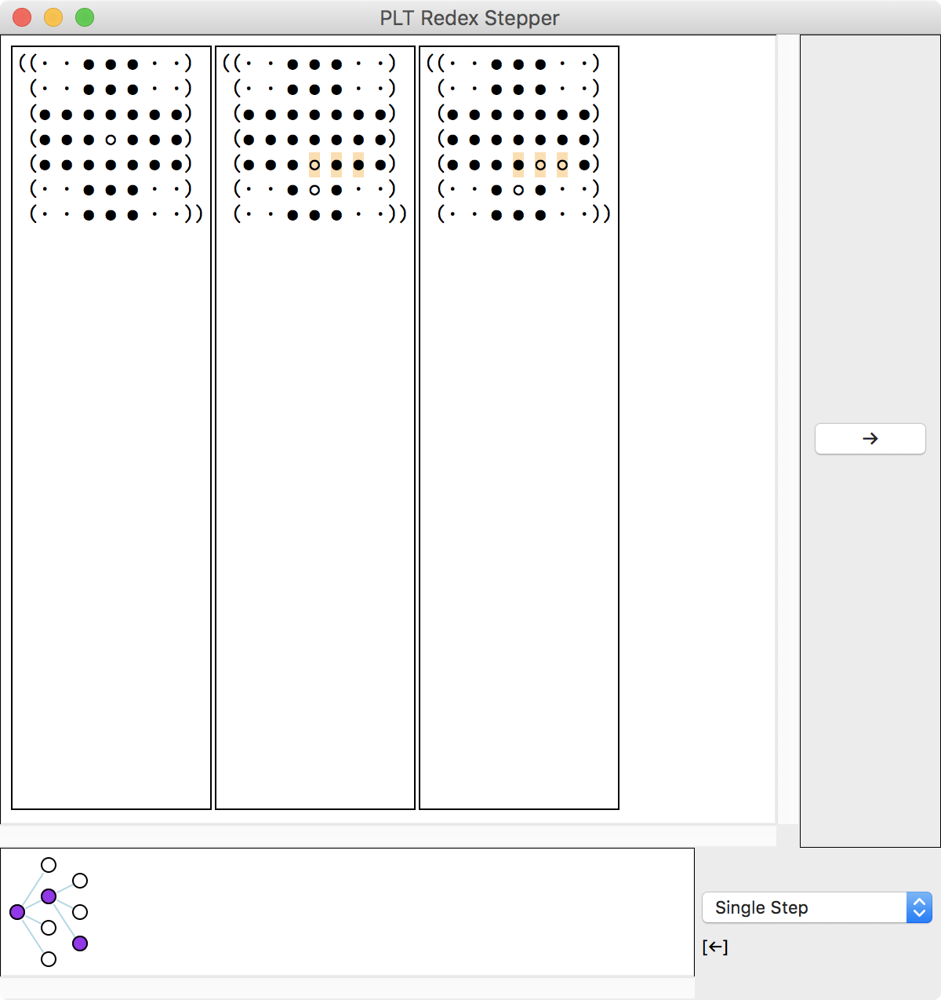

Peg Solitaire Rules
===================

Peg Solitaire is a single-player board game that starts with the following board (in the most common American version, which is the version we’ll use in this article):

<figure markdown="1">
<figcaption markdown="1">
Initial Board
</figcaption>
```
    ● ● ●
    ● ● ●
● ● ● ● ● ● ●
● ● ● ○ ● ● ●
● ● ● ● ● ● ●
    ● ● ●
    ● ● ●


●  Peg
○  Space
```
</figure>

With each move, a peg can jump over one of its four immediate neighbors and land on a space. The neighbor peg that was jumped over is removed from the board. For example, the following are the four possible starting moves:

<figure markdown="1">
<figcaption markdown="1">
Examples of Valid Moves (Starting Moves)
</figcaption>
<pre>
    ● ● ●             ● ● ●
    ● <ins>●</ins> ●             ● ○ ●
● ● ● <del>●</del> ● ● ●     ● ● ● <del>○</del> ● ● ●
● ● ● ○ ● ● ●  ➡  ● ● ● <ins>●</ins> ● ● ●
● ● ● ● ● ● ●     ● ● ● ● ● ● ●
    ● ● ●             ● ● ●
    ● ● ●             ● ● ●

    ● ● ●             ● ● ●
    ● ● ●             ● ● ●
● ● ● ● ● ● ●     ● ● ● ● ● ● ●
● ● ● ○ <del>●</del> <ins>●</ins> ●  ➡  ● ● ● <ins>●</ins> <del>○</del> ○ ●
● ● ● ● ● ● ●     ● ● ● ● ● ● ●
    ● ● ●             ● ● ●
    ● ● ●             ● ● ●

    ● ● ●             ● ● ●
    ● ● ●             ● ● ●
● ● ● ● ● ● ●     ● ● ● ● ● ● ●
● ● ● ○ ● ● ●  ➡  ● ● ● <ins>●</ins> ● ● ●
● ● ● <del>●</del> ● ● ●     ● ● ● <del>○</del> ● ● ●
    ● <ins>●</ins> ●             ● ○ ●
    ● ● ●             ● ● ●

    ● ● ●             ● ● ●
    ● ● ●             ● ● ●
● ● ● ● ● ● ●     ● ● ● ● ● ● ●
● <ins>●</ins> <del>●</del> ○ ● ● ●  ➡  ● ○ <del>○</del> <ins>●</ins> ● ● ●
● ● ● ● ● ● ●     ● ● ● ● ● ● ●
    ● ● ●             ● ● ●
    ● ● ●             ● ● ●


<ins>●</ins> jumps over <del>●</del>
</pre>
</figure>

The following are examples of *invalid moves*:

- A peg cannot jump diagonally:

  <pre>
      ○ ○ ○             ○ ○ ○
      ○ ○ ○             ○ ○ ○
  ○ <ins>●</ins> ○ ○ ○ ○ ○  ✗  ○ ○ ○ ○ ○ ○ ○
  ○ ○ <del>●</del> ○ ○ ○ ○  ➡  ○ ○ <del>○</del> ○ ○ ○ ○
  ○ ○ ○ ○ ○ ○ ○     ○ ○ ○ <ins>●</ins> ○ ○ ○
      ○ ○ ○             ○ ○ ○
      ○ ○ ○             ○ ○ ○
  </pre>

- A peg cannot jump beyond its neighbor:

  <pre>
      ○ ○ ○             ○ ○ ○
      ○ ○ ○             ○ ○ ○
  ○ ○ ○ ○ ○ ○ ○  ✗  ○ ○ ○ ○ ○ ○ ○
  ○ <ins>●</ins> <del>●</del> ○ ○ ○ ○  ➡  ○ ○ <del>○</del> ○ <ins>●</ins> ○ ○
  ○ ○ ○ ○ ○ ○ ○     ○ ○ ○ ○ ○ ○ ○
      ○ ○ ○             ○ ○ ○
      ○ ○ ○             ○ ○ ○
  </pre>

- A peg cannot jump over multiple neighbors:

  <pre>
      ○ ○ ○             ○ ○ ○
      ○ ○ ○             ○ ○ ○
  ○ ○ ○ ○ ○ ○ ○  ✗  ○ ○ ○ ○ ○ ○ ○
  ○ <ins>●</ins> <del>●</del> <del>●</del> ○ ○ ○  ➡  ○ ○ <del>○</del> <del>○</del> <ins>●</ins> ○ ○
  ○ ○ ○ ○ ○ ○ ○     ○ ○ ○ ○ ○ ○ ○
      ○ ○ ○             ○ ○ ○
      ○ ○ ○             ○ ○ ○
  </pre>

The goal of Peg Solitaire is to leave a single peg on the board, for example:

<figure markdown="1">
<figcaption markdown="1">
Example of Winning Board
</figcaption>
```
    ○ ○ ○
    ○ ○ ○
○ ○ ○ ○ ○ ○ ○
○ ○ ○ ● ○ ○ ○
○ ○ ○ ○ ○ ○ ○
    ○ ○ ○
    ○ ○ ○
```
</figure>

The following is an example of a lost game in which two pegs remain on the board, but they are not neighbors, so there are no moves left:

<figure markdown="1">
<figcaption markdown="1">
Example of Losing Board
</figcaption>
```
    ○ ○ ○
    ○ ○ ○
○ ○ ○ ● ○ ○ ○
○ ○ ○ ○ ○ ○ ○
○ ○ ○ ○ ○ ● ○
    ○ ○ ○
    ○ ○ ○
```
</figure>

Prototype
=========

Our first implementation is the bare minimum to play the game. Over the course of the next sections we revisit the corners we cut and dive deeper into each topic.

Setup
-----

We start by requiring PLT Redex:

<figure markdown="1">
<figcaption markdown="1">
`introduction.rkt`
</figcaption>
```racket
#lang racket
(require redex)
```
</figure>

Language and Terms
------------------

Most PLT Redex forms work over [languages](languages), so we define a language for Peg Solitaire:

```racket
(define-language peg-solitaire)
```

The `peg-solitaire` language is analog to a programming language, for example, Racket or Ruby. Programs and program fragments in these programming languages are called [*terms*](terms), for example, the following are terms in Racket:

<figure markdown="1">
<figcaption markdown="1">
Example of Term: Complete Program
</figcaption>
```racket
(define favorite-number 5)
```
</figure>

<figure markdown="1">
<figcaption markdown="1">
Example of Term: Fragment of Program Above (which also happens to be a complete Racket program)
</figcaption>
```racket
5
```
</figure>

In the `peg-solitaire` language, however, terms are not programs and program fragments, but Peg Solitaire entities, for example, pegs and boards. From PLT Redex’s perspective, programs are data structures, and we abuse this notion to represent Peg Solitaire entities. (The idea that programs are data structures isn’t unique to PLT Redex; it’s shared by any program that works on other programs, for example, compilers, interpreters, linters, and so forth.) The definition of the `peg-solitaire` language above does not specify the language shape—it does not define which terms represent which Peg Solitaire entities—but it suffices for our prototype (we revisit it in a [later section](languages)).

Terms in PLT Redex can be any S-expression, including identifiers (symbols), numbers, strings, lists, and so forth. We represent a Peg Solitaire board with a list of lists of positions, each of which may be symbols representing pegs, spaces, and paddings:

<figure markdown="1">
```racket
(define-term initial-board
  ([· · ● ● ● · ·]
   [· · ● ● ● · ·]
   [● ● ● ● ● ● ●]
   [● ● ● ○ ● ● ●]
   [● ● ● ● ● ● ●]
   [· · ● ● ● · ·]
   [· · ● ● ● · ·]))


;; ●  Peg
;; ○  Space
;; ·  Padding
```
<figcaption markdown="1">
The delimiters `()` and `[]` are equivalent in Racket, so we delimit rows with `[]` to improve readability. A padding is represented by a middle dot (`·`), not by a regular dot (`.`).
</figcaption>
</figure>

PLT Redex does not check that the `initial-board` is in the `peg-solitaire` language, so the listing above works despite the definition of the `peg-solitaire` language not specifying what constitutes a board.

Moves
-----

To model how a player moves pegs on the board, we use a PLT Redex form called [`reduction-relation`](https://docs.racket-lang.org/redex/The_Redex_Reference.html#%28form._%28%28lib._redex%2Freduction-semantics..rkt%29._reduction-relation%29%29) to define the `⇨` [reduction relation](reduction-relations). A reduction relation is similar to a function, except that it is *nondeterministic*, possibly returning multiple outputs. We choose to define `⇨` as a reduction relation instead of a regular function because there might be multiple moves for a given input board. We start to define `⇨` as a reduction relation that operates on the `peg-solitaire` language:

<figure markdown="1">
```racket
(define
  ⇨
  (reduction-relation
   peg-solitaire
   ___))
```
<figcaption markdown="1">
Throughout this article, `___` is a placeholder that stands for code we are yet to write.
</figcaption>
</figure>

We then provide one clause for each kind of possible move. For example, for a peg to jump over its right neighbor, we must find a sequence `● ● ○` on the board, and that sequence turns into `○ ○ ●` after the move, while the rest of the board remains the same. We write this as a `reduction-relation` as follows:

```racket
(--> (any_1
      ...
      [any_2 ... ● ● ○ any_3 ...]
      any_4
      ...)
     (any_1
      ...
      [any_2 ... ○ ○ ● any_3 ...]
      any_4
      ...)
     "→")
```

In the listing above, the `-->` form represents one kind of possible move. The first sub-form is a pattern against which the input board is matched, the second sub-form is the template with which to generate the output, and the third sub-form is the name of this kind of move, `→`. The several `any_<n>` preserve the rest of the board around the moved pegs.

We define the other kinds of moves similarly. The following is the complete definition of `⇨`:

```racket
(define
  ⇨
  (reduction-relation
   peg-solitaire

   (--> (any_1
         ...
         [any_2 ... ● ● ○ any_3 ...]
         any_4
         ...)
        (any_1
         ...
         [any_2 ... ○ ○ ● any_3 ...]
         any_4
         ...)
        "→")

   (--> (any_1
         ...
         [any_2 ... ○ ● ● any_3 ...]
         any_4
         ...)
        (any_1
         ...
         [any_2 ... ● ○ ○ any_3 ...]
         any_4
         ...)
        "←")

   (--> (any_1
         ...
         [any_2 ..._n ● any_3 ...]
         [any_4 ..._n ● any_5 ...]
         [any_6 ..._n ○ any_7 ...]
         any_8
         ...)
        (any_1
         ...
         [any_2 ...   ○ any_3 ...]
         [any_4 ...   ○ any_5 ...]
         [any_6 ...   ● any_7 ...]
         any_8
         ...)
        "↓")

   (--> (any_1
         ...
         [any_2 ..._n ○ any_3 ...]
         [any_4 ..._n ● any_5 ...]
         [any_6 ..._n ● any_7 ...]
         any_8
         ...)
        (any_1
         ...
         [any_2 ...   ● any_3 ...]
         [any_4 ...   ○ any_5 ...]
         [any_6 ...   ○ any_7 ...]
         any_8
         ...)
        "↑")))
```

Playing
=======

PLT Redex features [visualization](visualization) tools, including a [`stepper`](https://docs.racket-lang.org/redex/The_Redex_Reference.html#%28def._%28%28lib._redex%2Fgui..rkt%29._stepper%29%29), which we use to play Peg Solitaire:

```racket
(stepper ⇨ (term initial-board))
```

<figure markdown="1">
{:width="600"}
<figcaption markdown="1">
Playing Peg Solitaire with PLT Redex’s stepper. The main pane shows the board over time, with pegs that changed on the last move highlighted. The bottom pane shows in purple the path we have taken, and white nodes are alternative paths with different moves, for example, jumping right instead of left.
</figcaption>
</figure>

On the following sections we revisit each step of modeling Peg Solitaire in PLT Redex in more detail, starting with [terms](terms).
