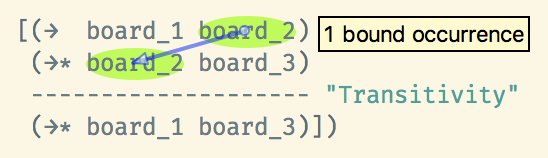
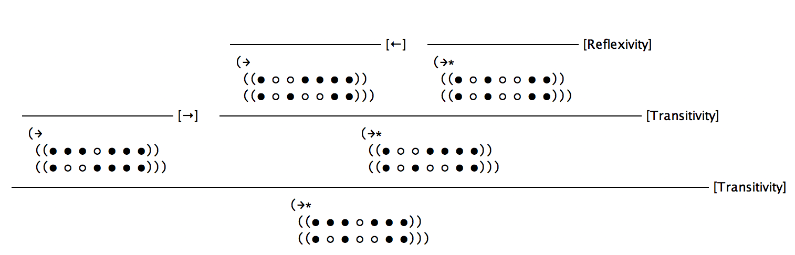

A judgment form is different from a [metafunction](metafunctions) in two ways: (1) it may have multiple outputs,<label class="margin-note"><input type="checkbox"><span markdown="1">Similar to a regular Racket function that returns `values`.</span></label> and (2) it is nondeterministic. A metafunction tries to match its inputs with each of the patterns in the definition clauses in order, and the first match *determines* the metafunction output. We say a metafunction is *deterministic*. A judgment form, on the other hand, tries to match its inputs with *all* the patterns in the definition clauses and outputs all cases that match. A judgment form is *nondeterministic*. Another way of interpreting this is that a judgment form is a metafunction that returns a set of outputs.

For example, consider both a metafunction and a judgment form that have the same patterns in their clauses: `(any ...)` and `any`. When the input is `(1 2 3)`, the metafunction matches the first clause and returns the output determined by it, and the judgment form matches *both* patterns and returns both outputs.

We define a judgment form with `define-judgment-form`:

<aside markdown="1">
The notation for judgment forms with a line separating conditions and conclusion is similar to the notation used for arithmetic in grade school:

```
  12
+ 30
----
  42
```
</aside>

```racket
(define-judgment-form <language>
  #:mode (<judgment-form> <I/O> ...)
  #:contract (<judgment-form> <pattern> ...)

  [<condition>
   ...
   ----------------------------------------
   (<judgment-form> <pattern/template> ...)]
  ...)
```

- `<language>`: A language as defined [previously](languages).
- `#:mode`: A judgment form may have multiple inputs and outputs. Syntactically, they all appear as *arguments* to the form. The `#:mode` annotation specifies which *arguments* are inputs (`I`) and which are outputs (`O`).<label class="margin-note"><input type="checkbox"><span markdown="1">Mathematically, a judgment form does not have inputs and outputs, because it is a *relation*, not a *function*. But by defining which arguments are inputs and outputs, we are specifying a *mode of operation*, which allows PLT Redex to run our definition.</span></label> Besides the declared outputs, every judgment form also has an implicit boolean output: whether the judgment holds or not.
- `#:contract`: A contract with patterns for the arguments of the judgment form. The contract is verified and an error may be raised when the judgment form is queried.
- `[<condition> ... --- (<judgment-form> <pattern/template> ...)]`: A judgment form clause.<label class="margin-note"><input type="checkbox"><span markdown="1">This notation with a bar separating conditions—sometimes called *antecedents*—and conclusion is common in papers and has a long tradition in formal logic.</span></label>
- `<condition>`: A condition under which the clause holds. For example, a condition may query another judgment form or [predicate relation](predicate-relations).
- `<judgment-form>`: The judgment form name.
- `<pattern/template>`: A pattern for an input argument or a template for an output pattern.

There are two ways to read a judgment form clause:

- **Logical**: “If `<condition>`s hold, then `(<judgment-form> <pattern/template> ...)` holds.”
- **Operational**: Start at the bottom of dashes, on `(<judgment-form> <pattern/template> ...)`, and match the judgment form inputs to the `<pattern>`s. If they match, then try to satisfy each `<condition>` over the dashes. Finally, output the `<template>`s.

The first reading is more mathematically correct, while the second is more intuitive<label class="margin-note"><input type="checkbox"><span markdown="1">To me, at least.</span></label> and useful when working in PLT Redex.

A Judgment Form for a Predicate Relation
========================================

In its simplest shape, a judgment form only has inputs and the implicit boolean output indicating whether the judgment holds or not. It is equivalent to a [predicate relation](predicate-relations), and we can rewrite `winning-board?` as a judgment form:

<div class="code-block" markdown="1">
`judgment-forms.rkt`
```racket
#lang racket
(require redex "terms.rkt" "languages.rkt")

(define-judgment-form peg-solitaire
  #:mode (winning-board?/judgment-form I)
  #:contract (winning-board?/judgment-form board)
  [(winning-board?/judgment-form ([· ... ○ ... · ...]
                                  ...
                                  [· ... ○ ... ● ○ ... · ...]
                                  [· ... ○ ... · ...]
                                  ...))])
```
</div>

The pattern that matches the input `board` in `winning-board?/judgment-form` is the same as in `winning-board?`. We query the judgment form with the `judgment-holds` form:

```racket
(test-equal (judgment-holds (winning-board?/judgment-form example-board-1))
            #f)
(test-equal (judgment-holds (winning-board?/judgment-form example-board-2))
            #f)
(test-equal (judgment-holds (winning-board?/judgment-form initial-board))
            #f)
(test-equal (judgment-holds (winning-board?/judgment-form example-winning-board))
            #t)
```

A Judgment Form for a Single Move
=================================

We define a `→` judgment form that represents a move in Peg Solitaire. The input is the current board, and the output is a board after the move:

```racket
(define-judgment-form peg-solitaire
  #:mode (→ I O)
  #:contract (→ board board)

  ___)
```

We define the judgment form with four clauses, one for each kind of possible move. For example, the following is the clause for when a peg jumps over its East neighbor:

```racket
[(→ (row_1
     ...
     [position_1 ... ● ● ○ position_2 ...]
     row_2
     ...)
    (row_1
     ...
     [position_1 ... ○ ○ ● position_2 ...]
     row_2
     ...))
 "→"]
```

In detail:

- `→`: The name of the judgment form.
- `(row_1 ... [position_1 ... ● ● ○ position_2 ...] row_2 ...)`: The pattern to match against the current input board. The pattern matches if the board includes a sequence `● ● ○` surrounded by anything else. We name the surroundings `row_<n> ...` and `position_<n> ...` to reconstruct it in the template.
- `(row_1 ... [position_1 ... ○ ○ ● position_2 ...] row_2 ...)`: The template to build the board after the move. It changes the sequence `● ● ○` into `○ ○ ●`, and reconstructs the surroundings with the names `row_<n> ...` and `position_<n> ...`.
- `"→"`: The name of the clause.

In this clause, there are no `<condition>s` or dashes—we will see them in a [later section](#a-judgment-form-for-an-arbitrary-number-of-moves). The clause for when a peg jumps over its West neighbor is similar.

The clauses for when a peg jumps over its North or South neighbors follow the same idea, but we must use named ellipses (`..._<suffix>`) to capture the surroundings, which involves multiple rows. The named ellipses guarantee the same number of `position`s to the left of the sequence in which we are interested, aligning the column. For example, the following is the rule for when a peg jumps over its South neighbor:<label class="margin-note"><input type="checkbox"><span markdown="1">The `<suffix>` is only necessary in the input pattern, not in the output template.</span></label>

```racket
[(→ (row_1
     ...
     [position_1 ..._n ● position_2 ...]
     [position_3 ..._n ● position_4 ...]
     [position_5 ..._n ○ position_6 ...]
     row_2
     ...)
    (row_1
     ...
     [position_1 ...   ○ position_2 ...]
     [position_3 ...   ○ position_4 ...]
     [position_5 ...   ● position_6 ...]
     row_2
     ...))
 "↓"]
```

The named ellipses (`..._n`) only match sequences `position_1`, `position_3` and `position_5` of the same length, so the sequence `● ● ○` must appear in the same column. The clause for when a peg jumps over its North neighbor is similar.

* * *

The following is the complete definition of `→`:

```racket
(define-judgment-form peg-solitaire
  #:mode (→ I O)
  #:contract (→ board board)

  [(→ (row_1
       ...
       [position_1 ... ● ● ○ position_2 ...]
       row_2
       ...)
      (row_1
       ...
       [position_1 ... ○ ○ ● position_2 ...]
       row_2
       ...))
   "→"]

  [(→ (row_1
       ...
       [position_1 ... ○ ● ● position_2 ...]
       row_2
       ...)
      (row_1
       ...
       [position_1 ... ● ○ ○ position_2 ...]
       row_2
       ...))
   "←"]

  [(→ (row_1
       ...
       [position_1 ..._n ● position_2 ...]
       [position_3 ..._n ● position_4 ...]
       [position_5 ..._n ○ position_6 ...]
       row_2
       ...)
      (row_1
       ...
       [position_1 ...   ○ position_2 ...]
       [position_3 ...   ○ position_4 ...]
       [position_5 ...   ● position_6 ...]
       row_2
       ...))
   "↓"]

  [(→ (row_1
       ...
       [position_1 ..._n ○ position_2 ...]
       [position_3 ..._n ● position_4 ...]
       [position_5 ..._n ● position_6 ...]
       row_2
       ...)
      (row_1
       ...
       [position_1 ...   ● position_2 ...]
       [position_3 ...   ○ position_4 ...]
       [position_5 ...   ○ position_6 ...]
       row_2
       ...))
   "↑"])
```

Querying the Judgment Form
==========================

We use the `→` judgment form to query whether a board can turn into another after a single move:

```racket
(test-equal
 (judgment-holds (→ ([· · ● ● ● · ·]
                     [· · ● ● ● · ·]
                     [● ● ● ● ● ● ●]
                     [● ● ● ○ ● ● ●]
                     [● ● ● ● ● ● ●]
                     [· · ● ● ● · ·]
                     [· · ● ● ● · ·])

                    ([· · ● ● ● · ·]
                     [· · ● ● ● · ·]
                     [● ● ● ● ● ● ●]
                     [● ○ ○ ● ● ● ●]
                     [● ● ● ● ● ● ●]
                     [· · ● ● ● · ·]
                     [· · ● ● ● · ·])))
 #t)

(test-equal
 (judgment-holds (→ ([· · ● ● ● · ·]
                     [· · ● ● ● · ·]
                     [● ● ● ● ● ● ●]
                     [● ● ● ○ ● ● ●]
                     [● ● ● ● ● ● ●]
                     [· · ● ● ● · ·]
                     [· · ● ● ● · ·])

                    ([· · ● ● ● · ·]
                     [· · ● ● ● · ·]
                     [● ● ● ● ● ● ●]
                     [● ● ● ● ○ ○ ●]
                     [● ● ● ● ● ● ●]
                     [· · ● ● ● · ·]
                     [· · ● ● ● · ·])))
 #t)

(test-equal
 (judgment-holds (→ ([· · ● ● ● · ·]
                     [· · ● ● ● · ·]
                     [● ● ● ● ● ● ●]
                     [● ● ● ○ ● ● ●]
                     [● ● ● ● ● ● ●]
                     [· · ● ● ● · ·]
                     [· · ● ● ● · ·])

                    ([· · ● ● ● · ·]
                     [· · ● ○ ● · ·]
                     [● ● ● ○ ● ● ●]
                     [● ● ● ● ● ● ●]
                     [● ● ● ● ● ● ●]
                     [· · ● ● ● · ·]
                     [· · ● ● ● · ·])))
 #t)

(test-equal
 (judgment-holds (→ ([· · ● ● ● · ·]
                     [· · ● ● ● · ·]
                     [● ● ● ● ● ● ●]
                     [● ● ● ○ ● ● ●]
                     [● ● ● ● ● ● ●]
                     [· · ● ● ● · ·]
                     [· · ● ● ● · ·])

                    ([· · ● ● ● · ·]
                     [· · ● ● ● · ·]
                     [● ● ● ● ● ● ●]
                     [● ● ● ● ● ● ●]
                     [● ● ● ○ ● ● ●]
                     [· · ● ○ ● · ·]
                     [· · ● ● ● · ·])))
 #t)
```

We also use the `→` judgment form to query all the possible ways we can move in a given board:

```racket
(test-equal (judgment-holds (→ initial-board board) board)
            '(([· · ● ● ● · ·]
               [· · ● ○ ● · ·]
               [● ● ● ○ ● ● ●]
               [● ● ● ● ● ● ●]
               [● ● ● ● ● ● ●]
               [· · ● ● ● · ·]
               [· · ● ● ● · ·])

              ([· · ● ● ● · ·]
               [· · ● ● ● · ·]
               [● ● ● ● ● ● ●]
               [● ○ ○ ● ● ● ●]
               [● ● ● ● ● ● ●]
               [· · ● ● ● · ·]
               [· · ● ● ● · ·])

              ([· · ● ● ● · ·]
               [· · ● ● ● · ·]
               [● ● ● ● ● ● ●]
               [● ● ● ● ○ ○ ●]
               [● ● ● ● ● ● ●]
               [· · ● ● ● · ·]
               [· · ● ● ● · ·])

              ([· · ● ● ● · ·]
               [· · ● ● ● · ·]
               [● ● ● ● ● ● ●]
               [● ● ● ● ● ● ●]
               [● ● ● ○ ● ● ●]
               [· · ● ○ ● · ·]
               [· · ● ● ● · ·])))
```

In the list above, we use the `judgment-holds` form to query the `→` with the `initial-board` and match the output with the `board` pattern. Then we query what are all the possible `board`s. PLT Redex tries to match the `initial-board` not only with the first clause in the `→` relation, but with all of them. In this case, they all match, so the output is not a single board, but four. This is an example of nondeteministic computation.<label class="margin-note"><input type="checkbox"><span markdown="1">We could define a judgment form that looks deterministic by designing clauses that are mutually exclusive. Many judgment forms in programming-language theory papers are designed this way.</span></label>

A Judgment Form for an Arbitrary Number of Moves
================================================

We use the `→` judgment form to define the `→*` judgment form that represents an arbitrary number of moves (zero or more).<label class="margin-note"><input type="checkbox"><span markdown="1">Mathematicians call this the *reflexive, transitive closure* of the `→` relation.</span></label> The input is the current board, and the outputs are all the possible boards we could reach by performing an arbitrary number of moves. There are two clauses in the `→*` judgment form:

- **Reflexivity**: A board can reach itself in zero moves.
- **Transitivity**: A board can reach another board by one move (`→`) plus an arbitrary number of moves (`→*`).

We use the more complete version of `define-jugment-form` with `<condition>`s to define these clauses:

```racket
(define-judgment-form peg-solitaire
  #:mode (→* I O)
  #:contract (→* board board)

  [---------------- "Reflexivity"
   (→* board board)]

  [(→  board_1 board_2)
   (→* board_2 board_3)
   -------------------- "Transitivity"
   (→* board_1 board_3)])
```

The **Reflexivity** clause has no `<condition>`s, but the **Transitivity** has two, one querying the `→` judgment form to produce `board_2`, and the other querying the `→*` judgment form itself to produce the final output `board_3`. We can read the **Transitive** clause using the techniques described above:

- **Logical**:

  ```racket
  [¹(→  board_1 board_2)
   ²(→* board_2 board_3)
   --------------------- "Transitivity"
   ³(→* board_1 board_3)])
  ```

  “If **1** and **2**, then **3**.”

- **Operational**:

  ```racket
  [⁴(⁵→   ⁶board_1  ⁷board_2)
   ⁸(⁹→* ¹⁰board_2 ¹¹board_3)
   -------------------------- "Transitivity"
   ¹(²→*  ³board_1 ¹²board_3)])
  ```

  1.  Start with the judgment form we are defining.
  2.  The judgment form’s name.
  3.  The judgment form’s input.
  4.  The first `<condition>` for the clause to hold.
  5.  The first judgment form we are querying in this clause.
  6.  The input to the first judgment form we are querying in this clause.
  7.  The output of the first judgment form we are querying in this clause.
  8.  The second `<condition>` for the clause to hold.
  9.  The second judgment form we are querying in this clause.
  10. The input to the second judgment form we are querying in this clause. The output of the query on the first `<condition>`, `board_2`, is the input to the second query.
  11. The output of the second judgment form we are querying in this clause.
  12. The output of this clause.

  DrRacket helps us read the clauses when we hover over a name by drawing arrows that represent data flow:

  <figure markdown="1">
    {:width="274"}
    <figcaption markdown="1">
    DrRacket shows the output of the first `<condition>`, `board_2`, as the input of the second `<condition>` in the **Transitivity** clause.
    </figcaption>
  </figure>

We test the `→*` judgment form with boards after 0, 1 and 2 moves:<label class="margin-note"><input type="checkbox"><span markdown="1">To keep the tests simple, we use only the center row instead of the whole board.</span></label>

```racket
(test-equal
 (judgment-holds (→* ([● ● ● ○ ● ● ●])
                     ([● ● ● ○ ● ● ●])))
 #t)

(test-equal
 (judgment-holds (→* ([● ● ● ○ ● ● ●])
                     ([● ○ ○ ● ● ● ●])))
 #t)

(test-equal
 (judgment-holds (→* ([● ● ● ○ ● ● ●])
                     ([● ○ ● ○ ○ ● ●])))
 #t)
```

Also, we can query the `→*` judgment form for all the possible boards after an arbitrary number of moves:<label class="margin-note"><input type="checkbox"><span markdown="1">The rows in the output are separated by new lines to highlight that they are different answers to the query, not part of a board.</span></label>

```racket
(test-equal
 (judgment-holds (→* ([● ● ● ○ ● ● ●]) board) board)
 '(((○ ○ ● ○ ● ○ ●))

   ((● ○ ○ ● ● ● ●))

   ((● ○ ● ○ ○ ● ●))

   ((● ○ ● ○ ● ○ ○))

   ((● ● ○ ○ ● ○ ●))

   ((● ● ● ○ ● ● ●))

   ((● ● ● ● ○ ○ ●))))
```

We can ask PLT Redex to justify why the judgment form holds for certain inputs, by rendering the derivations, for example:

```racket
(show-derivations (build-derivations (→* ([● ● ● ○ ● ● ●])
                                         ([● ○ ● ○ ○ ● ●]))))
```

<div class="full-width" markdown="1">
<figure markdown="1">
{:width="757"}
<figcaption markdown="1">
PLT Redex justifies why `→*` holds between boards `([● ● ● ○ ● ● ●])` and `([● ○ ● ○ ○ ● ●])` by using a combination of rules.
</figcaption>
</figure>
</div>

* * *

We will use the judgment forms in later sections:

```racket
(provide → →*)
```
